# 🌡️ Smart Road Watering System - Backend Architecture

[](https://www.typescriptlang.org/)
[](https://bun.sh/)
[]()
[](LICENSE)

**도로 살수 시스템을 위한 고성능 IoT 백엔드 아키텍처**

> 이 문서는 실무에서 설계하고 구현한 프로덕션 레벨 시스템의 아키텍처와 핵심 설계 패턴을 다룹니다.

---

## 📋 목차

- [프로젝트 개요](#-프로젝트-개요)
- [시스템 아키텍처](#-시스템-아키텍처)
- [핵심 설계 패턴](#-핵심-설계-패턴)
- [기술적 의사결정](#-기술적-의사결정)
- [보안 설계](#-보안-설계)

---

## 🎯 프로젝트 개요

### 비즈니스 문제

도시의 도로 표면 온도 상승과 미세먼지 문제를 해결하기 위한 **지능형 도로 살수 시스템**이 필요했습니다.

**요구사항:**
- PLC 장비를 통한 실시간 살수 제어
- 기상 데이터 기반 자동 살수 판단
- 다중 사이트 관리 (10+ 지역)
- 실시간 모니터링 및 알림
- 99.9% 가용성 보장

### 기술적 챌린지

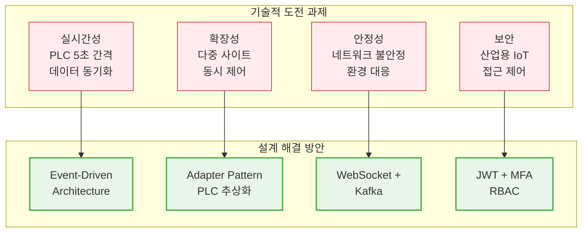

> **Note**: 구현 과정의 기술적 챌린지와 성능 최적화 경험은 [TECHNICAL_CHALLENGES.md](TECHNICAL_CHALLENGES.md)에서 확인하실 수 있습니다.

---

## 🏗️ 시스템 아키텍처

### 전체 시스템 구조

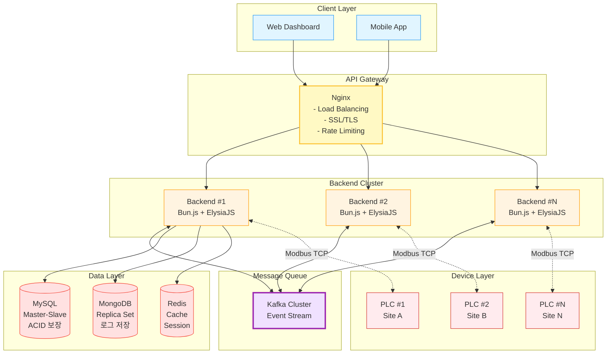

### 계층화된 구조 (Layered Architecture)

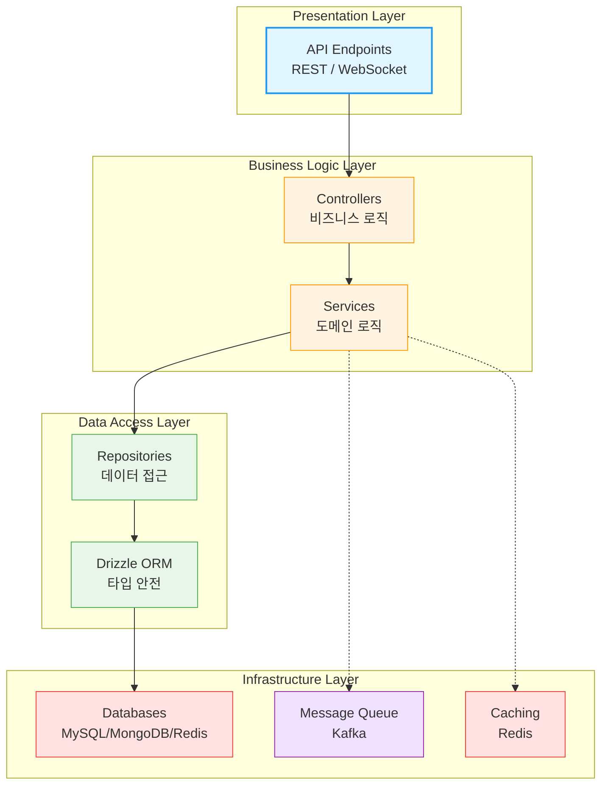

**설계 이유:**
- ✅ 각 계층의 독립적 변경 가능
- ✅ 단위 테스트 용이성
- ✅ 명확한 책임 분리
- ✅ 유지보수성 향상

### 마이크로서비스 지향 아키텍처

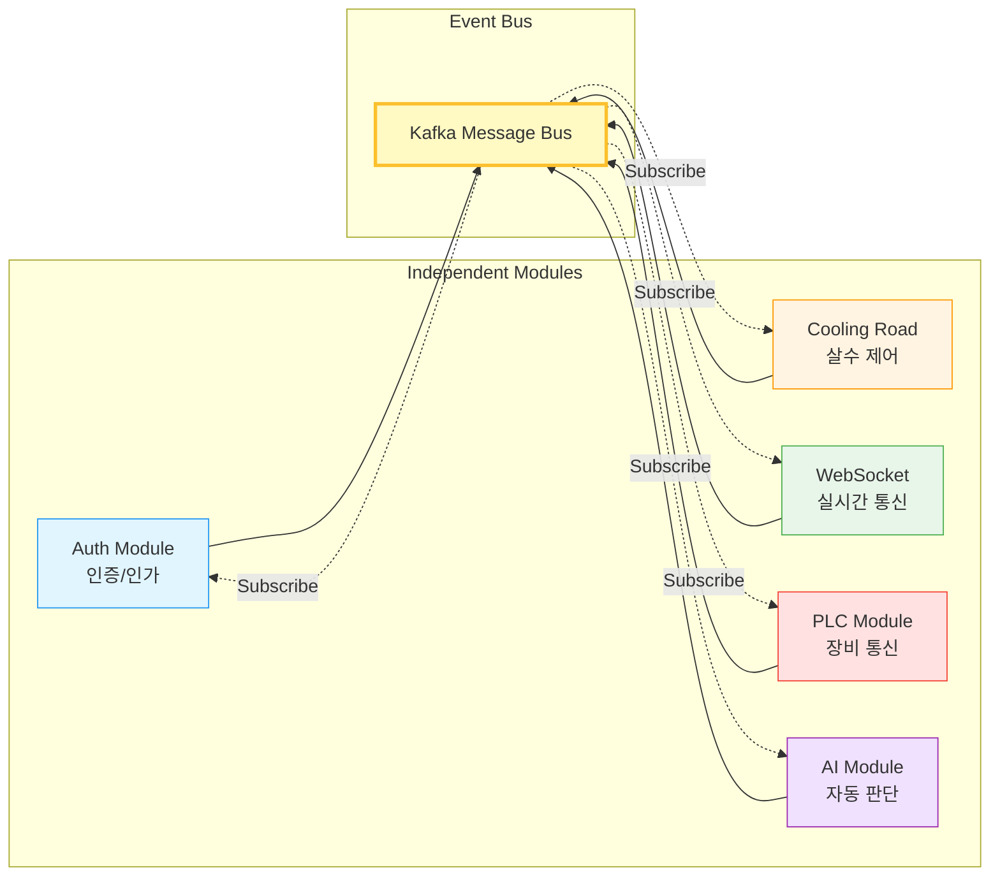

---

## 🎨 핵심 설계 패턴

### 1. Adapter Pattern - PLC 통신 추상화

**문제:** 
- 개발 환경에 실제 PLC 장비가 없어 테스트 불가
- 다양한 PLC 제조사별 프로토콜 차이
- 프로덕션/개발 환경 분리 필요

**해결책:**

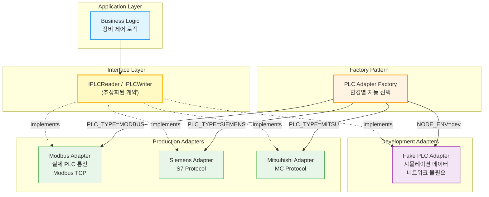

**구현 예시:**

```typescript
// 추상화 인터페이스
interface IPLCReader {
    readCoils(address: number, count: number): Promise<boolean[]>
    readHoldingRegisters(address: number, count: number): Promise<number[]>
}

interface IPLCWriter {
    writeCoils(address: number, data: boolean[]): Promise<void>
    writeHoldingRegisters(address: number, data: number[]): Promise<void>
}

// 실제 PLC 구현
class ModbusPLCAdapter implements IPLCReader, IPLCWriter {
    async readCoils(address: number, count: number): Promise<boolean[]> {
        const result = await this.connection.readCoils(address, count)
        return result.data
    }
}

// 테스트용 가짜 PLC
class FakePLCAdapter implements IPLCReader, IPLCWriter {
    async readCoils(address: number, count: number): Promise<boolean[]> {
        return Array.from({ length: count }, () => Math.random() > 0.5)
    }
}

// 팩토리 패턴
class PLCAdapterFactory {
    static create(config: PLCConfig): IPLCReader & IPLCWriter {
        if (config.mode === 'PRODUCTION') {
            return new ModbusPLCAdapter(config)
        } else {
            return new FakePLCAdapter()
        }
    }
}
```

**결과:**
- ✅ 환경 변수 하나로 실제/가짜 PLC 전환
- ✅ PLC 없이도 전체 시스템 개발/테스트 가능
- ✅ 새로운 PLC 제조사 추가 시 새 어댑터만 구현
- ✅ 단위 테스트 작성 가능

---

### 2. Repository Pattern - 데이터 접근 추상화

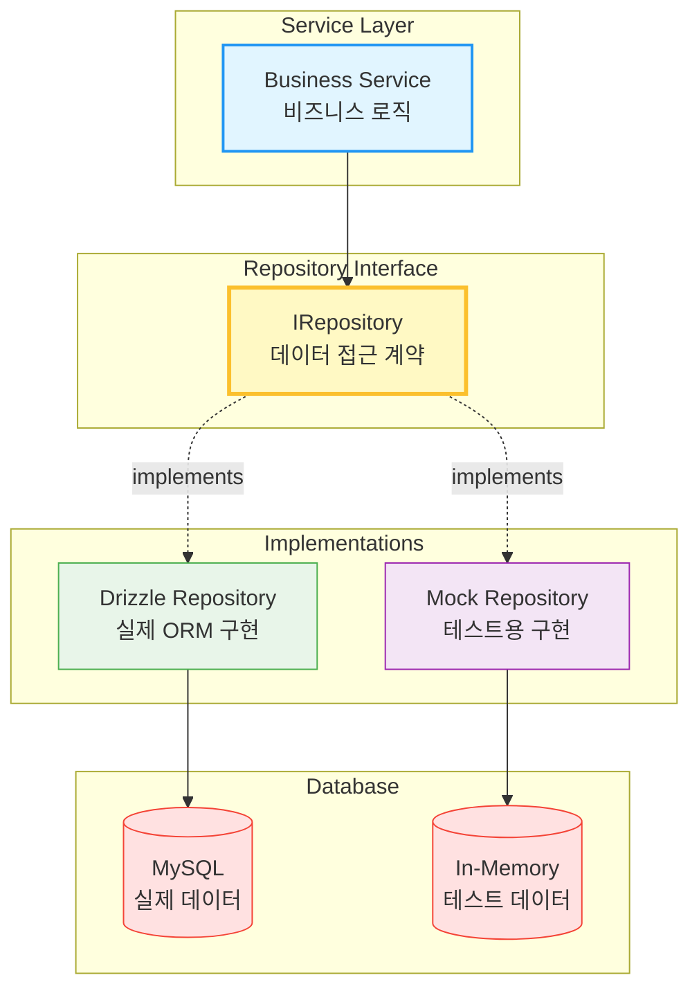

**결과:**
- ✅ 비즈니스 로직과 데이터 접근 계층 분리
- ✅ Mock 레포지토리로 단위 테스트 가능
- ✅ ORM 교체 시 레포지토리만 수정

---

### 3. Event-Driven Architecture - Kafka 메시지 큐

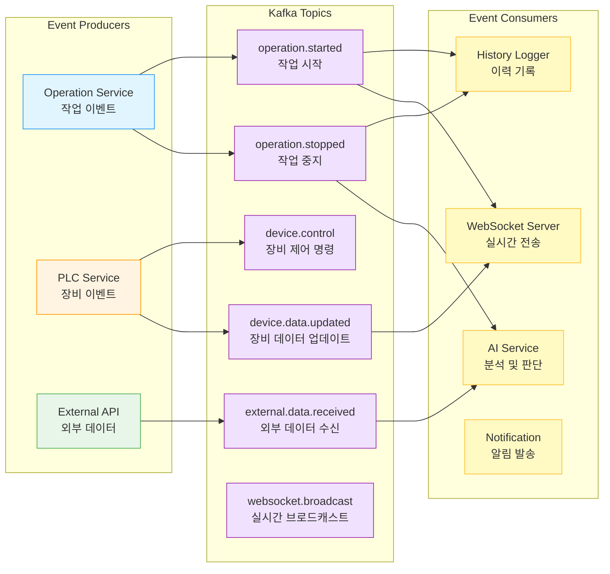

**결과:**
- ✅ 서비스 간 느슨한 결합
- ✅ 비동기 처리로 응답 속도 향상
- ✅ 이벤트 재처리 가능 (장애 복구)
- ✅ 새로운 구독자 추가 용이

---

### 4. Semaphore Pattern - 동시성 제어

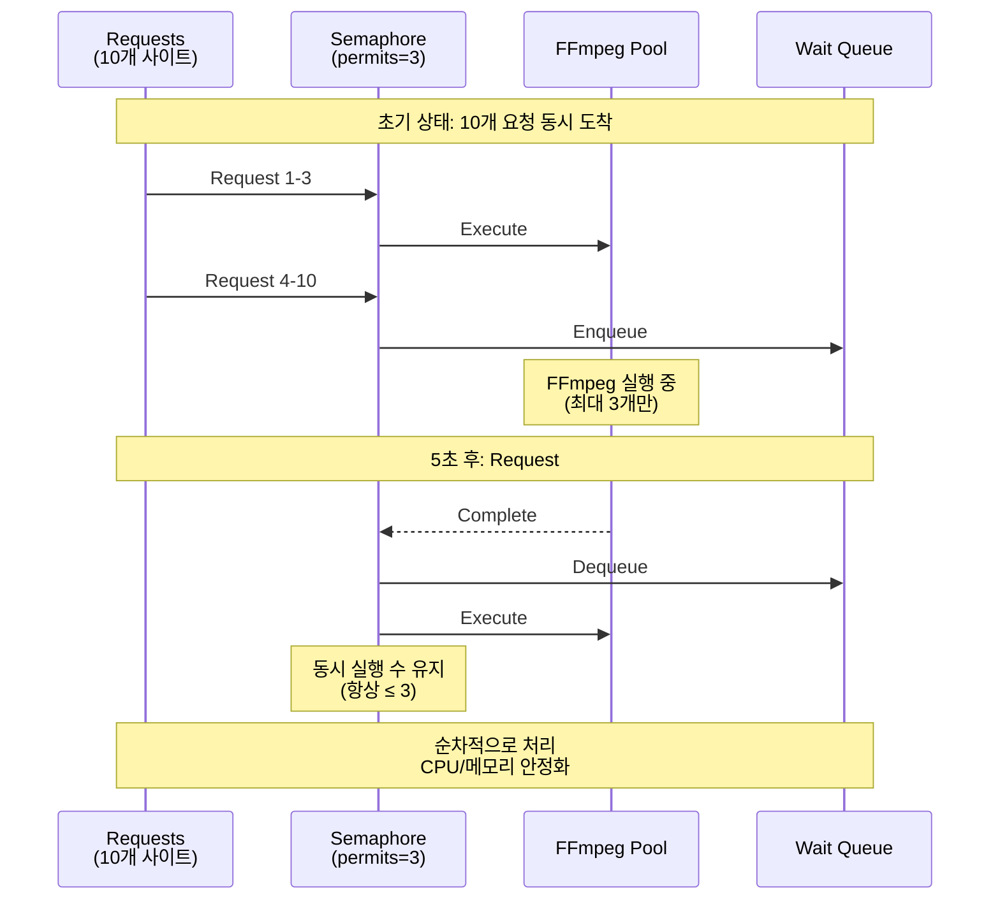

**결과:**
- ✅ CPU 사용률 100% → 35%
- ✅ 메모리 안정화 (OOM 에러 제거)
- ✅ 응답 시간 예측 가능

---

## 💡 기술적 의사결정

### 1. Bun.js를 선택한 이유

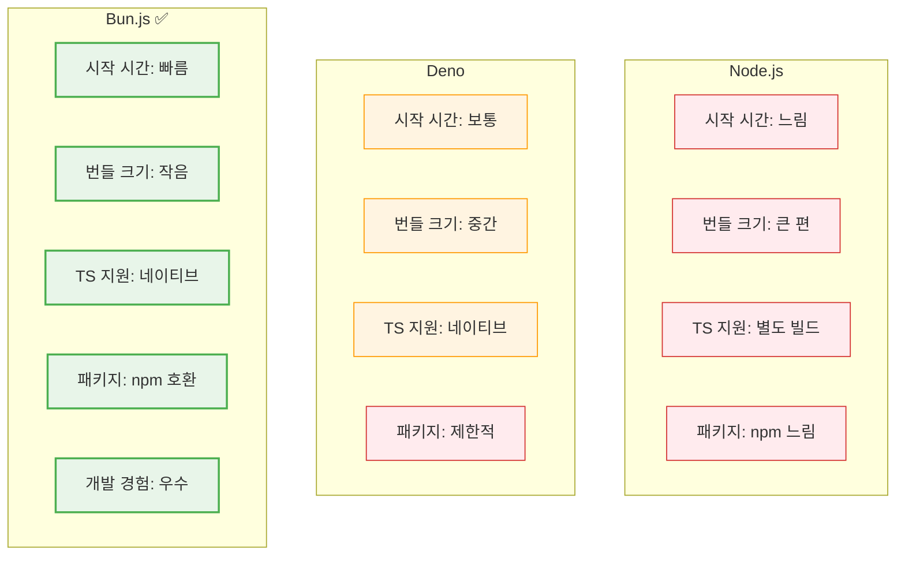

**선택 이유:**
- TypeScript 네이티브 지원으로 빌드 과정 불필요
- npm 생태계 완전 호환
- 빠른 개발 사이클 (Hot reload)
- 경량화된 런타임

---

### 2. Polyglot Persistence 전략

```mermaid
graph TB
    subgraph "MySQL - ACID 보장"
        M1[사용자/계정 정보]
        M2[리소스 정보]
        M3[작업 이력<br/>정규화된 데이터]
        M4[트랜잭션 필수]
    end
    
    subgraph "MongoDB - 유연한 스키마"
        MG1[시스템 로그]
        MG2[에러 로그]
        MG3[이벤트 히스토리]
        MG4[비정형 데이터]
    end
    
    subgraph "Redis - 빠른 읽기"
        R1[사용자 세션]
        R2[API 응답 캐시]
        R3[Rate Limiting]
        R4[실시간 카운터]
    end
    
    APP[Application]
    
    APP -->|CRUD| M1
    APP -->|CRUD| M2
    APP -->|Transaction| M3
    APP -->|Logging| MG1
    APP -->|Logging| MG2
    APP -->|Cache| R1
    APP -->|Cache| R2
    
    style M1 fill:#ffe1e1,stroke:#f44336
    style M2 fill:#ffe1e1,stroke:#f44336
    style M3 fill:#ffe1e1,stroke:#f44336
    style M4 fill:#ffe1e1,stroke:#f44336
    style MG1 fill:#e8f5e9,stroke:#4caf50
    style MG2 fill:#e8f5e9,stroke:#4caf50
    style MG3 fill:#e8f5e9,stroke:#4caf50
    style MG4 fill:#e8f5e9,stroke:#4caf50
    style R1 fill:#e1f5ff,stroke:#2196f3
    style R2 fill:#e1f5ff,stroke:#2196f3
    style R3 fill:#e1f5ff,stroke:#2196f3
    style R4 fill:#e1f5ff,stroke:#2196f3
    style APP fill:#f0e1ff,stroke:#9c27b0,stroke-width:3px
```

---

## 🔐 보안 설계

### 1. JWT + MFA 인증

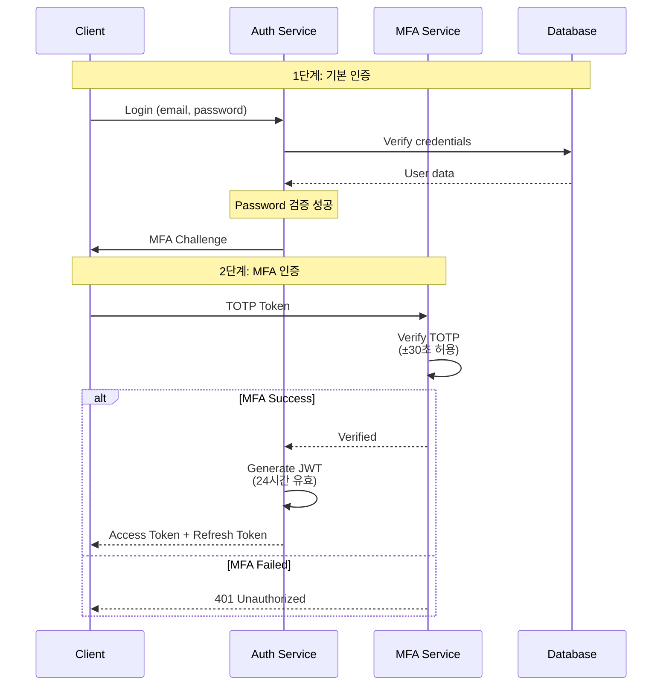

---

### 2. Rate Limiting

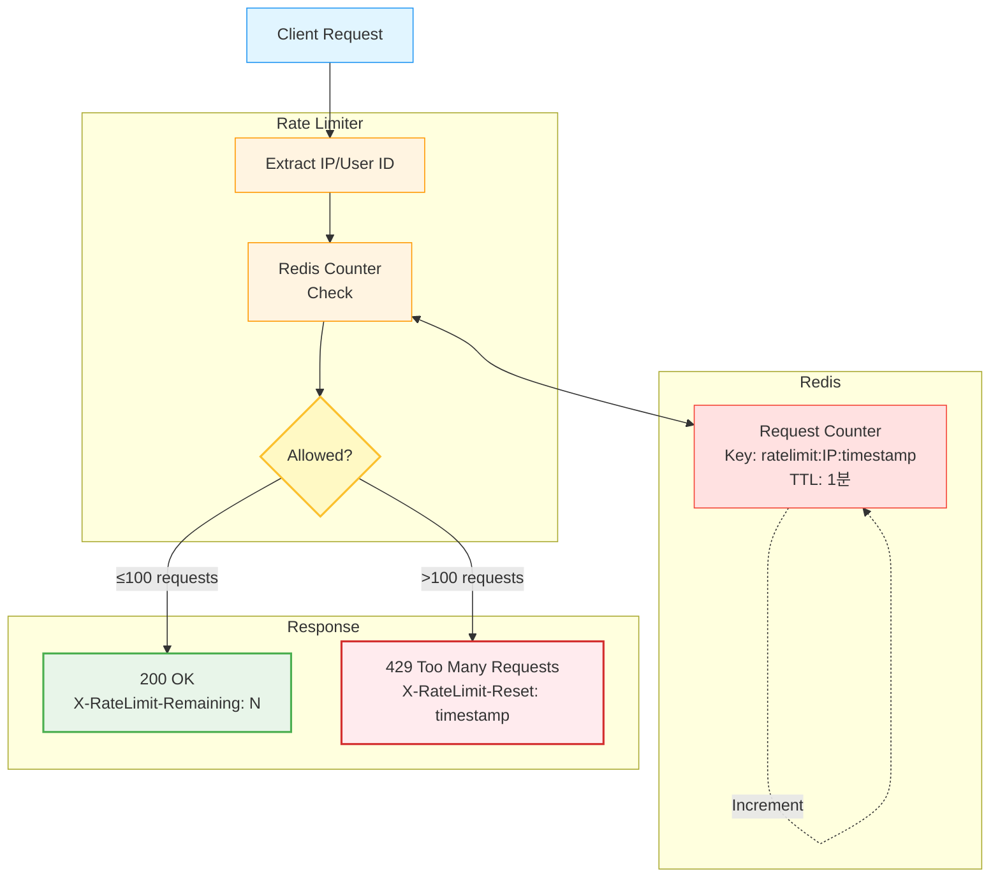

---

### 3. RBAC (Role-Based Access Control)

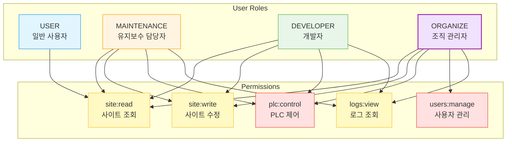

---

## 📚 관련 포트폴리오

이 설계 원칙은 다른 도메인에도 적용 가능합니다:

### 🎨 [Main Game Architecture](https://github.com/1985jwlee/portpolio_main)

**동일한 원칙의 게임 도메인 적용**

| 원칙 | IoT Backend | Game Server |
|------|------------|-------------|
| **외부 격리** | PLC 장애 시 서비스 유지 | DB 장애 시 게임 진행 |
| **이벤트 기반** | Kafka Event Stream | Kafka Event Stream |
| **계약 안정성** | API 스키마 불변 | 운영 API 불변 |
| **비동기 처리** | WebSocket + Kafka | Command → Event |

### 📊 [Coin Data API](https://github.com/1985jwlee/portpolio_coindataapi)

**외부 API 격리 패턴**

| 원칙 | IoT Backend | Coin API |
|------|------------|----------|
| **외부 격리** | PLC 프로토콜 추상화 | 거래소 API 추상화 |
| **정규화** | Modbus → Internal Schema | External API → Internal Schema |
| **캐싱** | Redis Multi-tier | In-Memory Cache |

> **핵심 메시지**: "설계 원칙은 도메인을 넘어 일반화 가능합니다"

---

## 📧 Contact

**GitHub**: [@1985jwlee](https://github.com/1985jwlee)  
**Email**: leejae.w.jl@icloud.com

---

## 📝 License

이 문서는 설계 포트폴리오로, 학습 및 평가 목적으로 공개되었습니다.

---

**Last Updated**: 2025-01-30

**Note**: 이 프로젝트는 실무 프로덕션 시스템의 아키텍처와 설계 판단력을 증명하기 위한 자료입니다.