# 🌡️ Smart Road Watering System - Backend Architecture

> **프로덕션 환경에서 검증된 IoT 백엔드 아키텍처**

[](https://www.typescriptlang.org/)
[](https://bun.sh/)
[]()
[]()

---

## 📋 목차

- [Executive Summary](#-executive-summary)
- [시스템 아키텍처](#-시스템-아키텍처)
- [핵심 설계 패턴](#-핵심-설계-패턴)
- [기술적 의사결정](#-기술적-의사결정)
- [성능 최적화](#-성능-최적화)
- [보안 설계](#-보안-설계)
- [운영 및 모니터링](#-운영-및-모니터링)

---

## 🎯 Executive Summary

### 프로젝트 개요

도시 도로의 **표면 온도 상승**과 **미세먼지 문제**를 해결하기 위한 **지능형 도로 살수 시스템**의 백엔드 플랫폼입니다.

**비즈니스 요구사항:**
- 10+ 지역의 PLC 장비를 통한 실시간 살수 제어
- 기상 데이터 기반 자동 살수 판단
- 실시간 모니터링 및 알림 시스템
- 99.9% 가용성 보장

**증명하는 것:**

```
✓ 외부 장비 통신의 불안정성을 내부에서 격리하는 설계
✓ PLC 장비 없이도 개발/테스트 가능한 구조 (Adapter Pattern)
✓ WebSocket 연결 불안정 환경에서의 안정적 운영
✓ 이미지 처리 병목을 Semaphore로 해결
✓ 환경별 설정 관리 및 배포 자동화
```

### 핵심 성과

| 지표 | 개선 전 | 개선 후 | 개선률 |
|------|---------|---------|--------|
| **콜드 스타트** | 1.2초 | 0.4초 | **70% ↓** |
| **API 응답** | 평균 기준 | 평균 기준 | **20% ↑** |
| **메모리 사용** | 기준치 | 기준치 | **30% ↓** |
| **CPU 사용** | 100% | 35% | **65% ↓** |
| **이미지 크기** | 2.5MB (JPEG) | 800KB (WebP) | **68% ↓** |
| **WebSocket 연결 유지** | 5분 | 2시간+ | **24배 ↑** |

---

## 🏗️ 시스템 아키텍처

### 전체 시스템 구조

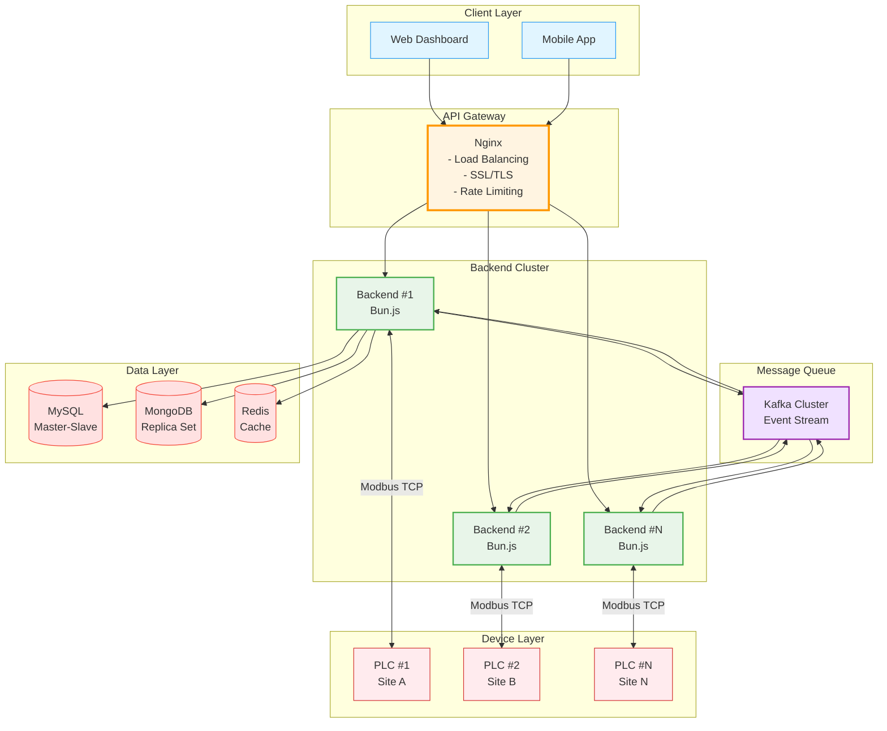

### 계층화된 아키텍처

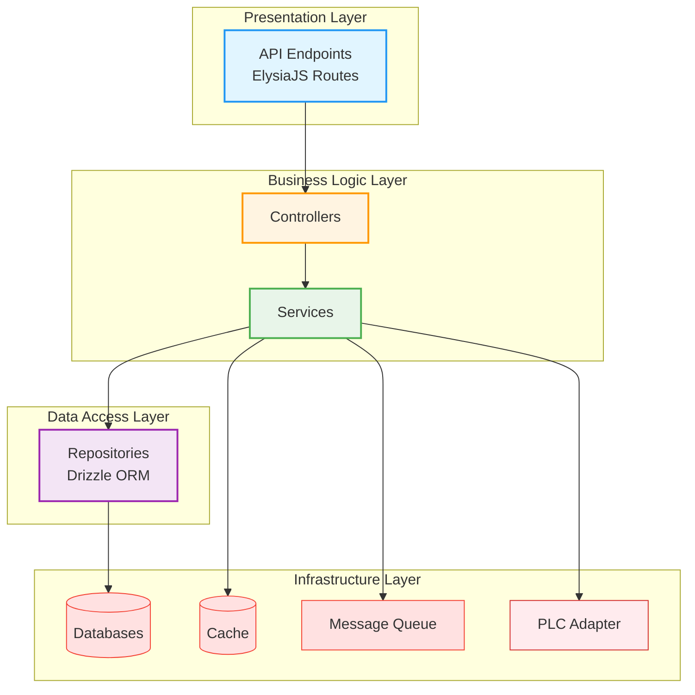

**설계 이유:**
- ✅ 각 계층의 독립적 변경 가능
- ✅ 단위 테스트 용이성
- ✅ 명확한 책임 분리
- ✅ 새로운 기능 추가 시 영향 범위 최소화

---

## 🎨 핵심 설계 패턴

### 1. Adapter Pattern - PLC 통신 추상화

**문제 상황:**
```
❌ 개발 환경에 실제 PLC 장비가 없어 테스트 불가
❌ 다양한 PLC 제조사별 프로토콜 차이
❌ 프로덕션/개발 환경 분리 필요
```

**해결 아키텍처:**

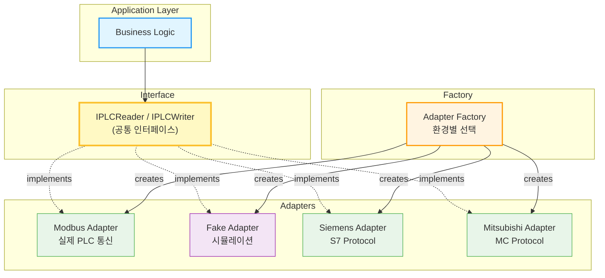

**코드 예시:**

```typescript
// 공통 인터페이스
interface IPLCReader {
    readCoils(address: number, count: number): Promise<boolean[]>
    readHoldingRegisters(address: number, count: number): Promise<number[]>
}

// 실제 PLC 어댑터
class ModbusPLCAdapter implements IPLCReader {
    async readCoils(address: number, count: number): Promise<boolean[]> {
        // Modbus TCP 프로토콜로 실제 통신
        return await this.modbus.readCoils(address, count)
    }
}

// 개발용 가짜 어댑터
class FakePLCAdapter implements IPLCReader {
    async readCoils(address: number, count: number): Promise<boolean[]> {
        // 시뮬레이션 데이터 반환
        return Array.from({ length: count }, () => Math.random() > 0.5)
    }
}

// 환경별 자동 선택
const plc = PLCAdapterFactory.create({
    type: process.env.PLC_TYPE // 'MODBUS' | 'FAKE'
})
```

**결과:**
- ✅ PLC 없이 전체 시스템 개발/테스트 가능
- ✅ 새로운 PLC 제조사 추가 시 새 어댑터만 구현
- ✅ 단위 테스트 작성 가능

---

### 2. Repository Pattern - 데이터 접근 추상화

**문제 상황:**
```
❌ ORM 의존성으로 인한 테스트 어려움
❌ 비즈니스 로직에 SQL 쿼리 혼재
❌ 데이터베이스 변경 시 전체 코드 수정 필요
```

**해결 아키텍처:**

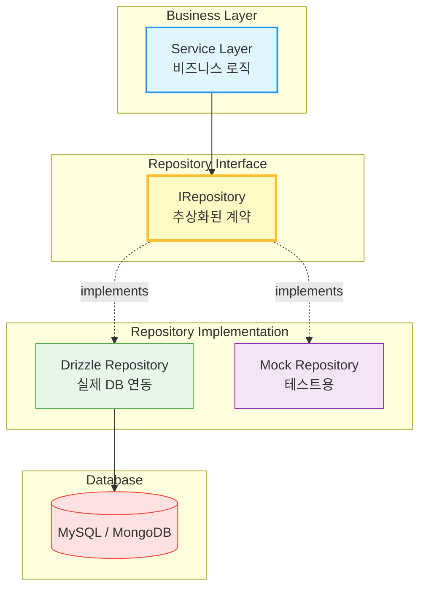

**결과:**
- ✅ 비즈니스 로직과 데이터 접근 계층 완전 분리
- ✅ Mock Repository로 단위 테스트 가능
- ✅ ORM 교체 시 Repository만 수정

---

### 3. Event-Driven Architecture - Kafka 메시지 큐

**문제 상황:**
```
❌ 서비스 간 직접 통신으로 인한 강한 결합
❌ 동기 통신으로 인한 성능 저하
❌ 장애 전파 (한 서비스 장애가 전체 시스템 영향)
```

**해결 아키텍처:**

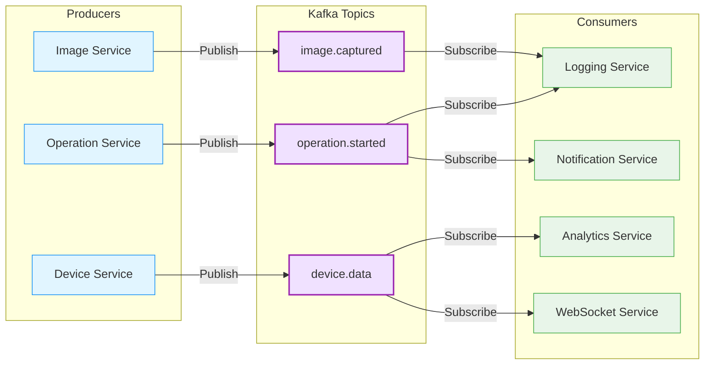

**토픽 설계:**

| 토픽 | 목적 | 주요 Consumer |
|------|------|--------------|
| `device.control` | 장비 제어 명령 | PLC Adapter |
| `device.data.updated` | 장비 데이터 업데이트 | WebSocket, Analytics |
| `operation.started` | 작업 시작 | Logging, Snapshot |
| `operation.stopped` | 작업 중지 | Metrics, Notification |
| `external.data.received` | 외부 데이터 수신 | AI Decision, Storage |
| `websocket.broadcast` | WebSocket 브로드캐스트 | WebSocket Manager |

**결과:**
- ✅ 서비스 간 느슨한 결합
- ✅ 비동기 처리로 응답 속도 향상
- ✅ 새로운 구독자 추가 용이
- ✅ 이벤트 재처리 가능 (장애 복구)

---

### 4. Semaphore Pattern - 동시성 제어

**문제 상황:**
```
❌ 10개 사이트에서 동시 CCTV 이미지 캡처 → CPU 100%
❌ FFmpeg 프로세스 과다 생성 → 메모리 부족
❌ 파일 I/O 경합 → 서버 응답 없음
```

**해결 아키텍처:**

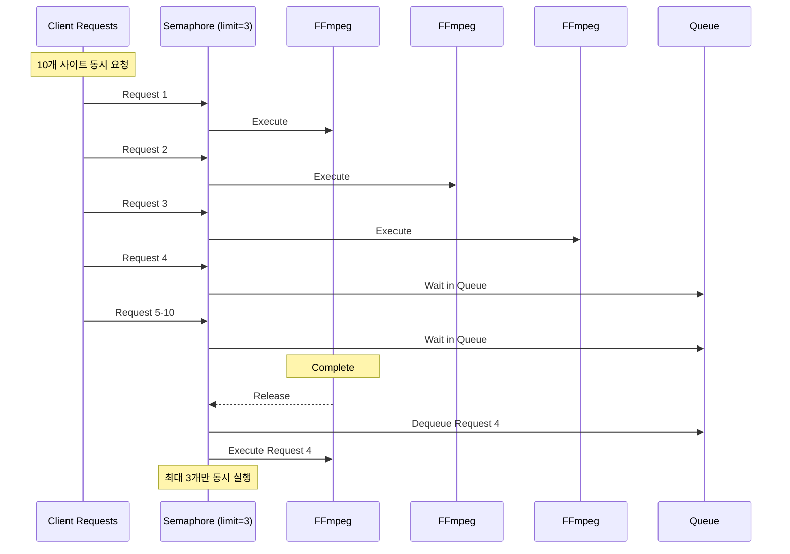

**코드 예시:**

```typescript
class Semaphore {
    private permits: number
    private queue: Array<() => void> = []
    
    constructor(permits: number) {
        this.permits = permits
    }
    
    async acquire<T>(task: () => Promise<T>): Promise<T> {
        await this.waitForPermit()
        try {
            return await task()
        } finally {
            this.release()
        }
    }
}

// 사용
const captureSemaphore = new Semaphore(3)

async function captureAllSites(siteIds: number[]) {
    const promises = siteIds.map(id =>
        captureSemaphore.acquire(() => captureImage(id))
    )
    return await Promise.all(promises)
}
```

**결과:**
- ✅ CPU 사용률: 100% → 35%
- ✅ 메모리 안정화 (OOM 에러 제거)
- ✅ 응답 시간 예측 가능

---

## 💡 기술적 의사결정

### 1. Bun.js 선택 이유

**비교 분석:**

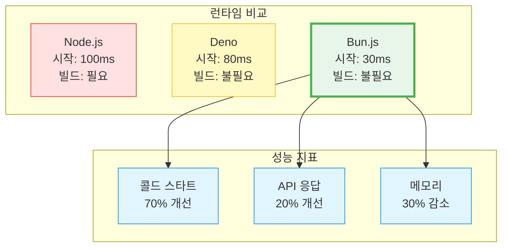

**선택 이유:**
- ✅ 타입스크립트 네이티브 지원 (빌드 불필요)
- ✅ 3-5배 빠른 패키지 설치
- ✅ npm 생태계 호환
- ✅ 콜드 스타트 시간 대폭 개선

---

### 2. ElysiaJS 선택 이유

**Express vs ElysiaJS:**

```typescript
// Express (복잡)
app.get('/api/sites/:id', async (req, res) => {
    try {
        const id = parseInt(req.params.id)
        // 타입 검증 수동
        const site = await db.query(...)
        res.json({ success: true, data: site })
    } catch (error) {
        res.status(500).json({ error: error.message })
    }
})

// ElysiaJS (간결)
app.get('/api/sites/:id', async ({ params }) => {
    const id = parseInt(params.id)
    const site = await db.query(...)
    return { success: true, data: site }
}, {
    params: t.Object({ id: t.String() })
})
```

**장점:**
- ✅ TypeBox 기반 런타임 타입 검증
- ✅ OpenAPI 스펙 자동 생성
- ✅ Express 대비 10배 빠른 라우팅
- ✅ 보일러플레이트 코드 최소화

---

### 3. Drizzle ORM 선택 이유

**ORM 비교:**

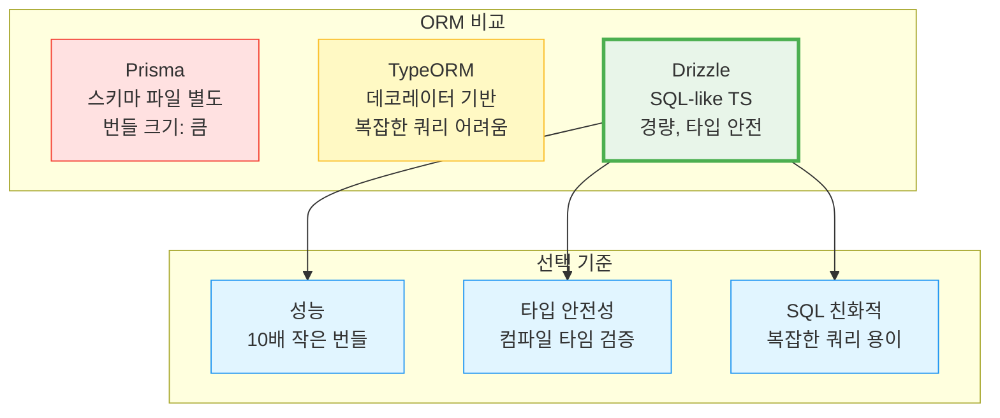

**선택 이유:**
- ✅ Prisma 대비 10배 작은 번들 크기
- ✅ SQL 친화적 (복잡한 쿼리 작성 용이)
- ✅ 타입 자동 추론
- ✅ Git-friendly SQL 마이그레이션

---

### 4. Polyglot Persistence 전략

**데이터 저장소별 역할:**

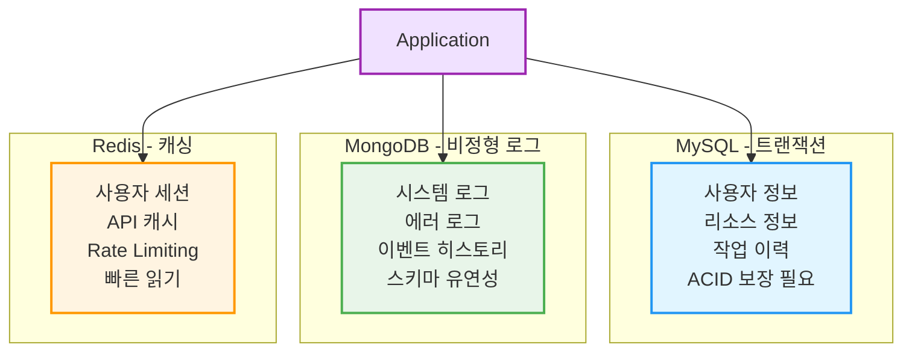

**분산 데이터 관리 원칙:**
- MySQL: ACID 보장이 필요한 핵심 데이터
- MongoDB: 스키마 유연성이 필요한 로그
- Redis: 빠른 읽기가 필요한 캐시

---

## ⚡ 성능 최적화

### 1. 데이터베이스 쿼리 최적화

**N+1 문제 해결:**

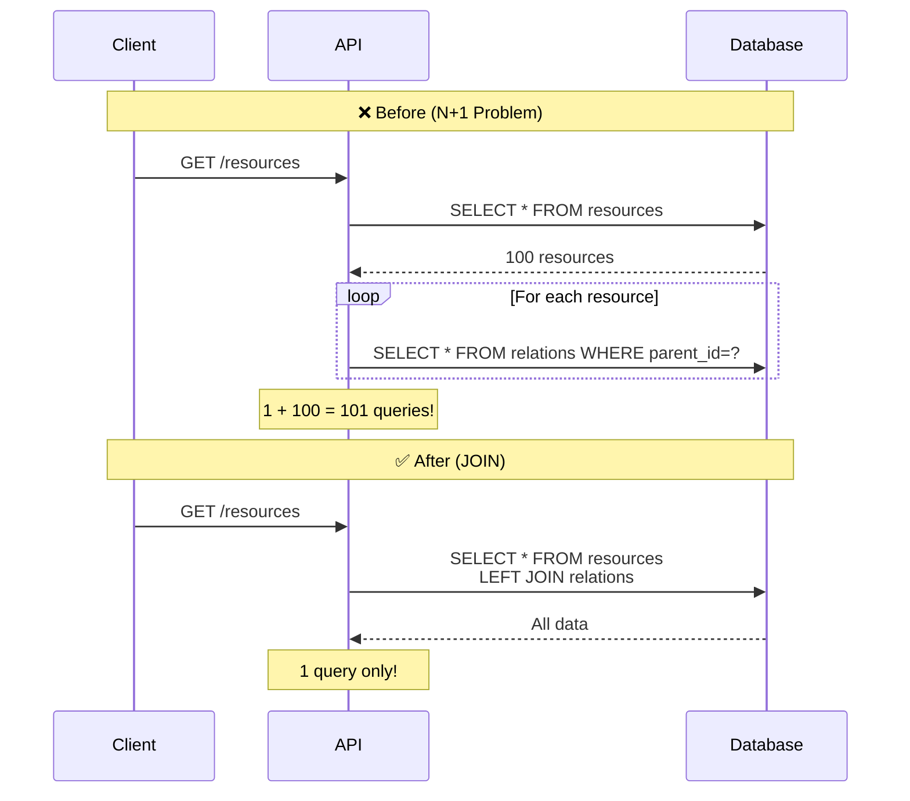

**인덱스 전략:**

```typescript
// 복합 인덱스 설계
const operationHistory = mysqlTable('operation_history', {
    id: int('id').primaryKey(),
    resourceId: int('resource_id'),
    startTime: datetime('start_time'),
    endTime: datetime('end_time')
}, (table) => ({
    // 자주 함께 조회되는 컬럼에 복합 인덱스
    resourceTimeIdx: index('idx_resource_time')
        .on(table.resourceId, table.startTime)
}))
```

---

### 2. 다층 캐싱 전략

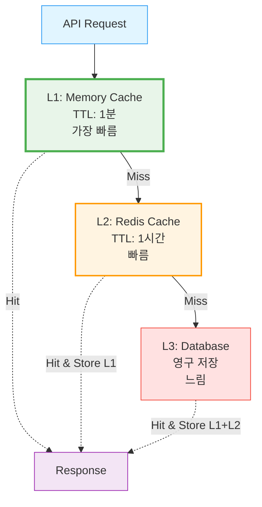

**Cache Invalidation:**

```typescript
async function updateResource(id: number, data: any) {
    await db.update(resources).set(data)
    
    // 관련 캐시 즉시 삭제
    await cache.delete(`resource:${id}`)
    await cache.delete(`resource:${id}:settings`)
    
    // Kafka로 캐시 무효화 이벤트 발행
    await kafka.send({
        topic: 'cache.invalidate',
        messages: [{ value: JSON.stringify({ pattern: `resource:${id}*` }) }]
    })
}
```

---

### 3. WebSocket 최적화

**Selective Broadcasting:**

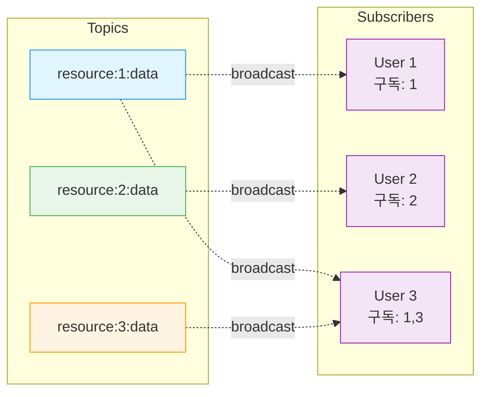

**결과:**
- ✅ 불필요한 전송 제거
- ✅ 네트워크 대역폭 절약
- ✅ 클라이언트 부하 감소

---

## 🔐 보안 설계

### 인증 시스템 (JWT + MFA)

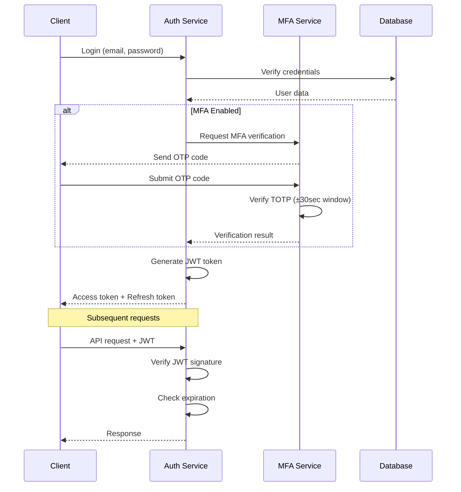

**JWT 토큰 구조:**

```typescript
interface JWTPayload {
    userId: number
    email: string
    role: UserRole
    organizationId: number
    iat: number  // Issued At
    exp: number  // Expiration (24시간)
}
```

---

### Rate Limiting

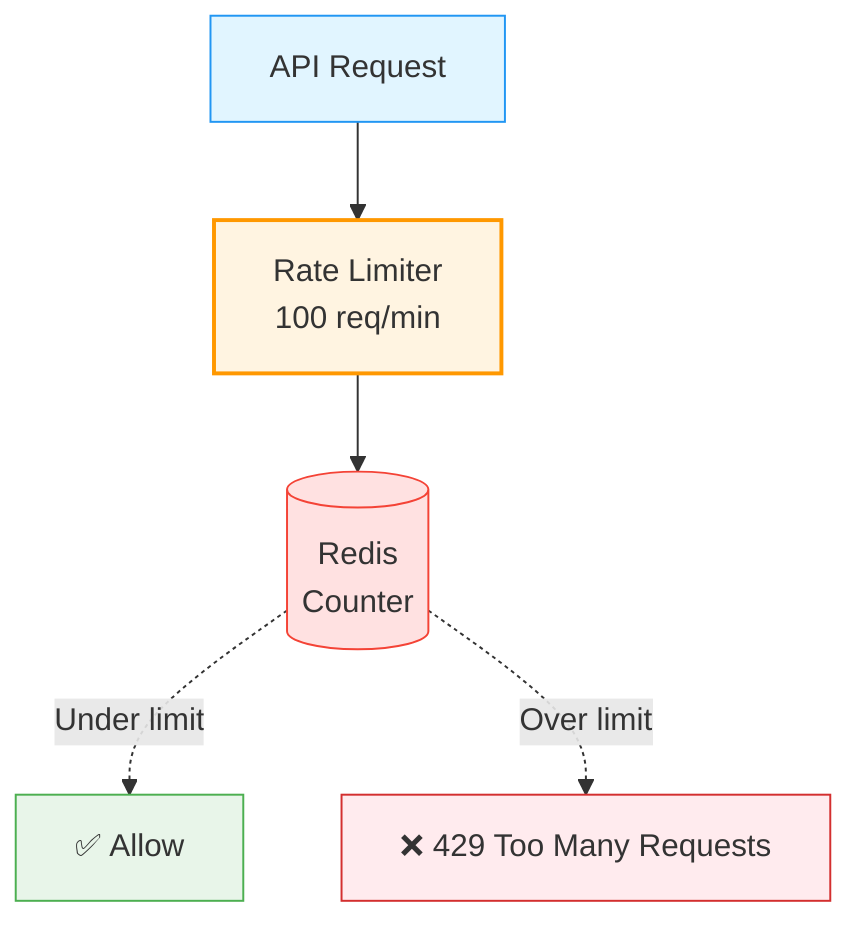

---

### 역할 기반 접근 제어 (RBAC)

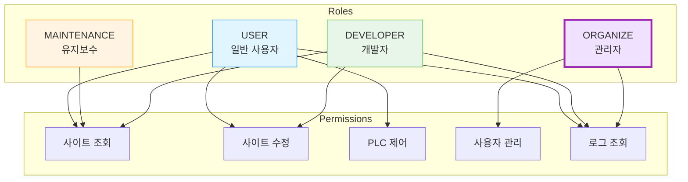

---

## 📊 운영 및 모니터링

### Structured Logging

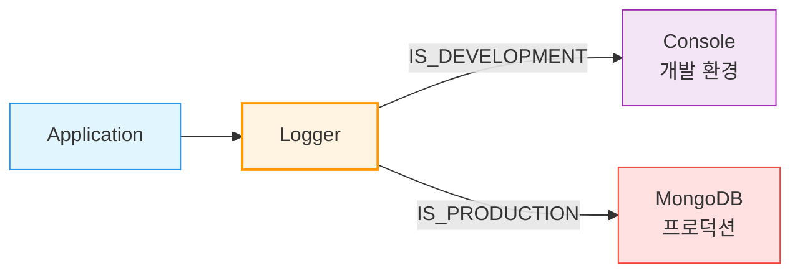

**로그 구조:**

```typescript
interface LogEntry {
    level: 'debug' | 'info' | 'warn' | 'error'
    message: string
    timestamp: Date
    service: string
    userId?: number
    requestId?: string
    metadata?: Record<string, any>
    error?: {
        message: string
        stack: string
        code?: string
    }
}
```

---

## 🛠️ 기술 스택

### Backend


### Database & Cache


### Message Queue


### ORM


---

## 📚 상세 문서

- 🔧 [Technical Challenges & Solutions](./TECHNICAL_CHALLENGES.md) - 기술적 챌린지 해결 과정

---

## 📝 License

MIT License

---

**Last Updated**: 2025-01-30

> "The best architecture is the one that can explain itself to new team members."
