# 🌡️ Production IoT Backend

> **레거시 산업 제어 시스템 → 이벤트 기반 마이크로서비스 플랫폼으로의 전환**  
> **실제 운영 제약 하에서 내린 아키텍처 결정의 이유와 교훈**

[]()
[]()
[]()

---

## 🔗 이 프로젝트의 위치

> **이 프로젝트는 [Event-driven Real-time Game Platform](https://github.com/1985jwlee/portpolio_main)의 설계 원칙이 실무 산업 시스템에서도 동일하게 검증됨을 증명하는 포트폴리오입니다.**

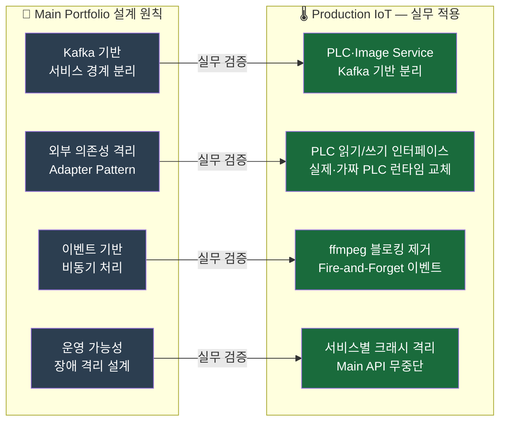
```mermaid
graph LR
    subgraph Main["🚩 Main Portfolio 설계 원칙"]
        M1["Kafka 기반\n서비스 경계 분리"]
        M2["외부 의존성 격리\nAdapter Pattern"]
        M3["이벤트 기반\n비동기 처리"]
        M4["운영 가능성\n장애 격리 설계"]
    end

    subgraph IoT["🌡️ Production IoT — 실무 적용"]
        I1["PLC·Image Service\nKafka 기반 분리"]
        I2["PLC 읽기/쓰기 인터페이스\n실제·가짜 PLC 런타임 교체"]
        I3["ffmpeg 블로킹 제거\nFire-and-Forget 이벤트"]
        I4["서비스별 크래시 격리\nMain API 무중단"]
    end

    M1 -->|"실무 검증"| I1
    M2 -->|"실무 검증"| I2
    M3 -->|"실무 검증"| I3
    M4 -->|"실무 검증"| I4

    style M1 fill:#2c3e50,color:#fff
    style M2 fill:#2c3e50,color:#fff
    style M3 fill:#2c3e50,color:#fff
    style M4 fill:#2c3e50,color:#fff
    style I1 fill:#1a6b3c,color:#fff
    style I2 fill:#1a6b3c,color:#fff
    style I3 fill:#1a6b3c,color:#fff
    style I4 fill:#1a6b3c,color:#fff
```

---

## 📋 목차

1. [프로젝트 개요](#1-프로젝트-개요)
2. [운영 제약 — 결정을 제한한 실제 조건들](#2-운영-제약--결정을-제한한-실제-조건들)
3. [레거시 구조가 만든 문제들](#3-레거시-구조가-만든-문제들)
4. [마이그레이션 목표 설정](#4-마이그레이션-목표-설정)
5. [전환 전략 — 경계는 사전에 설계하지 않았다](#5-전환-전략--경계는-사전에-설계하지-않았다)
6. [현재 아키텍처 v4.4.0](#6-현재-아키텍처-v440)
7. [서비스 경계 설계 — 소유권의 명확화](#7-서비스-경계-설계--소유권의-명확화)
8. [Kafka를 이벤트 버스로 선택한 이유](#8-kafka를-이벤트-버스로-선택한-이유)
9. [장애 격리와 관찰 가능성](#9-장애-격리와-관찰-가능성)
10. [Polyglot Persistence — 단일 DB를 포기한 이유](#10-polyglot-persistence--단일-db를-포기한-이유)
11. [언어 폴리글랏 — 기술 선택의 기준과 수용한 비용](#11-언어-폴리글랏--기술-선택의-기준과-수용한-비용)
12. [의도적으로 하지 않은 것들과 그 이유](#12-의도적으로-하지-않은-것들과-그-이유)
13. [아키텍처 교훈 — 무엇이 예상과 달랐는가](#13-아키텍처-교훈--무엇이-예상과-달랐는가)
14. [포트폴리오 포지셔닝](#14-포트폴리오-포지셔닝)

---

## 1. 프로젝트 개요

도로 표면 냉각 및 미세먼지 저감을 위한 지능형 도로 살수 시스템의 백엔드 플랫폼이다. 현장에 설치된 산업용 제어 장비(PLC)를 원격으로 제어하고, 센서 데이터·기상 데이터·AI 판단을 결합해 살수 시점을 자동 결정한다.

이 문서는 시스템이 단일 TypeScript 모놀리식에서 언어 폴리글랏 MSA 플랫폼으로 전환된 과정을 기록한다. 구조가 어떻게 생겼는지가 아니라, **어떤 제약 아래에서 어떤 이유로 그 결정을 내렸는지**에 초점을 맞춘다.

**이 문서가 답하려는 질문:**
- 어떤 운영 제약이 아키텍처 선택을 제한했는가?
- 어떤 대안을 검토했고 왜 기각했는가?
- 전환 과정에서 무엇이 계획대로 되지 않았는가?
- 다시 한다면 무엇을 다르게 하겠는가?

### 시스템 규모 (v4.4.0)

```
MSA 서비스:    3개 (TypeScript · Go · C#)
API 엔드포인트: 40+개
저장소:        5종 (MySQL · TimescaleDB · MongoDB · Redis · MinIO)
코드 라인:    ~13,000 lines
```

---

## 2. 운영 제약 — 결정을 제한한 실제 조건들

아키텍처 결정은 이상적인 조건에서 내려지지 않는다. 이 시스템의 모든 주요 결정은 아래 제약의 교차점에서 만들어졌다.

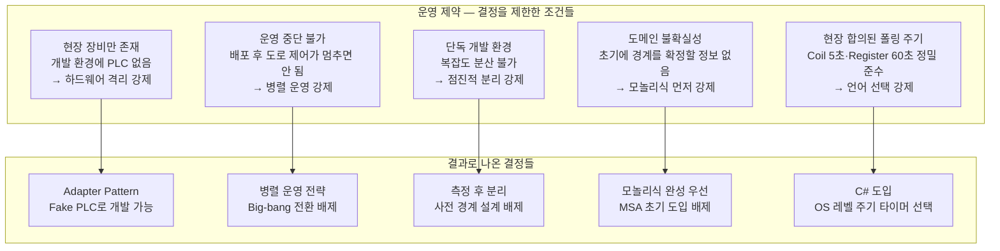
```mermaid
graph TB
    subgraph Constraints["운영 제약 — 결정을 제한한 조건들"]
        C1["현장 장비만 존재\n개발 환경에 PLC 없음\n→ 하드웨어 격리 강제"]
        C2["운영 중단 불가\n배포 후 도로 제어가 멈추면 안 됨\n→ 병렬 운영 강제"]
        C3["단독 개발 환경\n복잡도 분산 불가\n→ 점진적 분리 강제"]
        C4["도메인 불확실성\n초기에 경계를 확정할 정보 없음\n→ 모놀리식 먼저 강제"]
        C5["현장 합의된 폴링 주기\nCoil 5초·Register 60초 정밀 준수\n→ 언어 선택 강제"]
    end

    subgraph Decisions["결과로 나온 결정들"]
        D1["Adapter Pattern\nFake PLC로 개발 가능"]
        D2["병렬 운영 전략\nBig-bang 전환 배제"]
        D3["측정 후 분리\n사전 경계 설계 배제"]
        D4["모놀리식 완성 우선\nMSA 초기 도입 배제"]
        D5["C# 도입\nOS 레벨 주기 타이머 선택"]
    end

    C1 --> D1
    C2 --> D2
    C3 --> D3
    C4 --> D4
    C5 --> D5
```

### 각 제약이 결정에 미친 영향

**개발 환경에 PLC 없음** → 코드가 현장 배포 전까지 하드웨어 연동을 검증할 수 없었다. 이 제약이 Adapter Pattern을 강제했다. 패턴을 위한 패턴이 아니라, 개발을 진행하려면 하드웨어를 추상화하지 않으면 안 됐다.

**운영 중단 불가** → 배포 후 시스템이 24시간 운영되어야 한다. 기존 서비스를 내리고 새 서비스로 교체하는 방식은 허용되지 않았다. 모든 서비스 분리는 기존 서비스와 병렬 운영 후 교체하는 방식으로 이루어졌다. 이것은 전환 비용을 높이지만 선택의 여지가 없었다.

**단독 개발 환경** → 복잡도를 팀 간에 분산할 수 없었다. 이것이 MSA 전환을 점진적으로 유지해야 하는 실용적 이유다. 한 번에 모든 서비스를 분리하면 유지 가능한 복잡도를 초과한다.

**현장 합의된 폴링 주기** → 이 주기는 협상 불가능한 운영 요구사항이었다. 시스템 언어를 선택할 때 "더 나은 언어"가 아니라 "이 주기를 정밀하게 보장하는 언어"가 기준이 됐다.

---

## 3. 레거시 구조가 만든 문제들

모놀리식이 운영에 진입하면서 구조적 문제가 세 방향에서 나타났다. 각 문제에 대해 단순 수정으로 해결을 시도했고, 그 시도가 실패한 이후에야 구조 분리를 결정했다.

### 3-1. Node.js 이벤트 루프의 CPU 바운드 문제

분사 이벤트마다 이미지 캡처 작업이 실행됐다. 처음에는 동시성 제한으로 해결하려 했다. 동작은 했지만, 분사 빈도가 높아질수록 API 응답 지연이 비례해서 증가하는 것을 발견했다. 동시성 제한은 처리량을 줄일 뿐, CPU 바운드 작업이 이벤트 루프 큐에 대기하는 근본 문제를 해결하지 못했다.

**검토한 대안과 기각 이유:**

| 대안 | 기각 이유 |
|------|---------|
| Worker Thread 사용 | ffmpeg 서브프로세스 관리가 더 복잡해지고, 메시지 패싱 비용 발생 |
| 동시성 제한 강화 | 임시방편. 근본 원인(이벤트 루프 점유) 미해결 |
| C++/Rust 네이티브 모듈 | 빌드 환경 복잡도 증가, 단독 유지보수 불가 |
| **Go 독립 서비스 + Kafka** | **선택**: goroutine이 OS 스레드를 직접 활용해 이벤트 루프와 완전 분리 |

### 3-2. 산업 제어 시스템에서의 타이밍 신뢰성 문제

Coil 상태를 5초마다, Register 센서를 60초마다 읽어야 한다는 것은 현장 운영자와 합의된 수치였다. Node.js의 타이머는 이벤트 루프 상태에 따라 지연된다. 이미지 캡처가 진행되는 동안 폴링이 수초 밀렸고, 이것이 센서 데이터 누락으로 이어졌다.

이것은 성능 문제가 아니라 신뢰성 문제다. 단순 최적화로 접근했다가 문제가 반복된 후, 폴링 주기의 정밀성을 보장하는 것이 구조 수준의 결정이어야 한다는 것을 인정했다.

**검토한 대안과 기각 이유:**

| 대안 | 기각 이유 |
|------|---------|
| 이벤트 루프 최적화 | Node.js 타이머 자체가 이벤트 루프 기반. 근본 해결 불가 |
| 별도 Node.js 프로세스 | 동일 런타임. 타이밍 문제는 동일하게 존재 |
| Python + 스케줄러 | Modbus TCP 생태계가 약함. 학습 비용 대비 이점 불명확 |
| **C# .NET + 주기 타이머** | **선택**: OS 레벨 정밀 주기 보장. Modbus TCP 라이브러리 성숙도 높음 |

### 3-3. 프로세스 경계 없는 장애 전파

PLC 통신 오류가 예외로 발생하면 같은 프로세스 안의 에러 핸들러까지 전파됐다. 인증 API나 분사 이력 조회는 PLC와 논리적으로 무관하지만, 물리적으로 같은 프로세스에 있어 영향을 받았다. 이것은 코드 문제가 아니라 구조 문제다. 단일 프로세스 안에서는 장애 전파를 완전히 막을 수 없다는 것을 인정하는 것이 구조 분리를 결정한 출발점이었다.

### 3-4. 관계형 DB에 시계열 데이터를 담을 때의 구조적 한계

운영 초기에는 MySQL로 충분했다. 그러나 날씨와 센서 데이터가 매분 수집되며 쌓이면서 시간 범위 쿼리가 느려지기 시작했다. MySQL의 인덱스 구조는 시간 기준 범위 조회에 최적화되어 있지 않다. 당장의 장애가 아니라 데이터 증가에 따라 악화될 구조적 문제였다.

---

## 4. 마이그레이션 목표 설정

문제 분석을 통해 세 가지 목표를 확정했다. 기술을 먼저 선택하지 않았다. 목표를 먼저 설정하고 기술은 그 목표를 달성하는 수단으로 선택했다.

**① 실행 특성이 다른 작업은 격리한다**

비동기 I/O(API), CPU 바운드 작업(이미지 캡처), 정밀 주기 실행(PLC 폴링)은 같은 런타임에서 공존하면 서로를 방해한다는 것을 운영에서 확인했다. 이것은 코드 품질의 문제가 아니라 실행 모델의 불일치다.

**② 장애 범위를 서비스 단위로 예측 가능하게 만든다**

PLC 서비스 재시작이 인증 API를 멈춰서는 안 된다. 장애 발생 시 운영자가 "어떤 기능이 살아있고 어떤 기능이 중단됐는가"를 예측할 수 있어야 한다. 예측 불가능한 장애는 대응 시간을 늘린다.

**③ 데이터 특성에 맞는 저장소를 선택한다**

단일 DB로 모든 요구사항을 처리하는 것은 각 저장소 고유의 최적화를 포기하는 것이다. 각 데이터 유형이 요구하는 접근 패턴이 다르다는 것이 운영에서 드러났다.

---

## 5. 전환 전략 — 경계는 사전에 설계하지 않았다

### 핵심 원칙: 측정된 문제부터 분리한다

서비스 경계를 먼저 설계하고 분리하는 방식을 선택하지 않았다. 모놀리식을 완성해 실제 운영에 투입한 뒤, 병목이 측정된 컴포넌트부터 순서대로 분리했다.

이것은 방법론이 아니라 제약에서 나온 결정이다. 도메인을 충분히 이해하지 못한 상태에서 경계를 확정하면 나중에 수정 비용이 더 크다. 잘못된 MSA 경계는 잘못된 모놀리식보다 수정하기 어렵다.

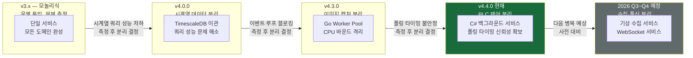
```mermaid
graph LR
    subgraph Phase0["v3.x — 모놀리식\n운영 투입, 문제 측정"]
        M["단일 서비스\n모든 도메인 완성"]
    end

    subgraph Phase1["v4.0.0\n시계열 데이터 분리"]
        D1["TimescaleDB 이관\n쿼리 성능 문제 해소"]
    end

    subgraph Phase2["v4.3.0\n이미지 캡처 분리"]
        D2["Go Worker Pool\nCPU 바운드 격리"]
    end

    subgraph Phase3["v4.4.0 현재\nPLC 제어 분리"]
        D3["C# 백그라운드 서비스\n폴링 타이밍 신뢰성 확보"]
    end

    subgraph Phase4["2026 Q3~Q4 예정\n수집·통신 분리"]
        D4["기상 수집 서비스\nWebSocket 서비스"]
    end

    Phase0 -->|"시계열 쿼리 성능 저하\n측정 후 분리 결정"| Phase1
    Phase1 -->|"이벤트 루프 블로킹\n측정 후 분리 결정"| Phase2
    Phase2 -->|"폴링 타이밍 불안정\n측정 후 분리 결정"| Phase3
    Phase3 -->|"다음 병목 예상\n사전 대비"| Phase4

    style Phase3 fill:#1a6b3c,color:#fff
    style Phase4 fill:#616a6b,color:#fff
```

### 전환 방식: 병렬 운영 후 교체

각 서비스 분리 시 기존 구현과 신규 서비스를 동시에 실행했다. Kafka Consumer Group을 분리해 두 서비스가 같은 메시지를 처리하지 않도록 하면서, 신규 서비스의 동작을 프로덕션 트래픽으로 검증했다.

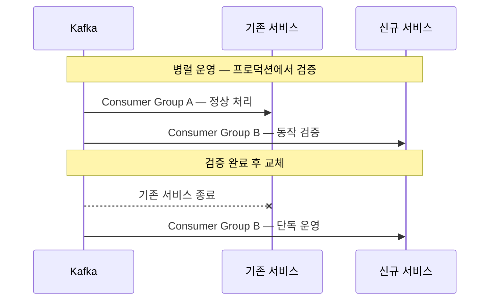
```mermaid
sequenceDiagram
    participant K as Kafka
    participant OLD as 기존 서비스
    participant NEW as 신규 서비스

    Note over K,NEW: 병렬 운영 — 프로덕션에서 검증
    K->>OLD: Consumer Group A — 정상 처리
    K->>NEW: Consumer Group B — 동작 검증

    Note over K,NEW: 검증 완료 후 교체
    K--xOLD: 기존 서비스 종료
    K->>NEW: Consumer Group B — 단독 운영
```

### 전환 과정에서 발생한 계획 외 문제들

전환이 계획대로만 진행되지는 않았다. 이 부분이 실제 마이그레이션과 이상적 마이그레이션의 차이다.

**공유 DB 접근 충돌**: 신규 서비스가 동일한 DB에 접근하면서 기존 서비스와 동일 레코드에 동시 쓰기가 발생할 수 있었다. 단순히 서비스를 분리하는 것만으로는 부족했고, 멱등성 처리 레이어를 추가해야 했다. 이것은 사전에 설계하지 않은 부분이었다.

**환경변수 호환성 계층 필요**: 새 서비스가 기존 환경변수 파일을 공유해야 했으나, 언어별 환경변수 바인딩 방식이 달라 래핑이 필요했다. 운영 환경에서 설정 불일치는 침묵하는 버그를 만든다.

**토픽 네이밍 일관성 누락**: 환경별 토픽 접미사 규칙을 신규 서비스에 적용하는 것을 초기에 빠뜨렸다. 개발 환경에서 프로덕션 토픽에 연결되는 잠재적 위험이 있었다. 명시적 규칙으로 문서화하기 전까지 수동 확인에 의존했다.

**병렬 운영 종료 시점의 기준 부재**: "언제 기존 서비스를 종료해도 안전한가"의 명시적 기준이 없었다. 암묵적 판단에 의존했고, 이것이 전환 시점을 불필요하게 늦추는 원인이 됐다.

---

## 6. 현재 아키텍처 v4.4.0

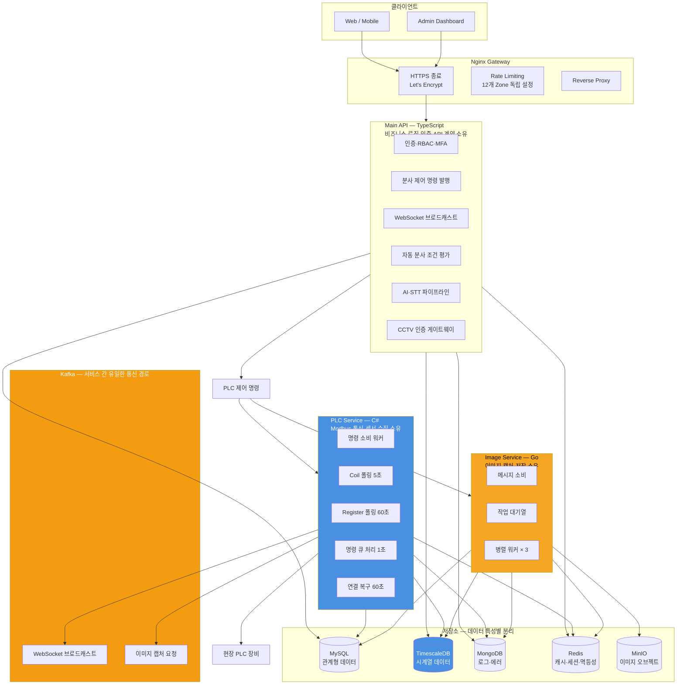
```mermaid
graph TB
    subgraph Client["클라이언트"]
        WEB["Web / Mobile"]
        ADMIN["Admin Dashboard"]
    end

    subgraph Gateway["Nginx Gateway\n단일 진입점"]
        SSL["HTTPS 종료\nLet's Encrypt"]
        RL["Rate Limiting\n12개 Zone 독립 설정"]
        PROXY["Reverse Proxy"]
    end

    subgraph MainAPI["Main API — TypeScript\n비즈니스 로직·인증·API 계약 소유"]
        AUTH["인증·RBAC·MFA"]
        COOLING["분사 제어 명령 발행"]
        WS["WebSocket 브로드캐스트"]
        SCHED["자동 분사 조건 평가"]
        AI["AI·STT 파이프라인"]
        CCTV_C["CCTV 인증 게이트웨이"]
    end

    subgraph PLCMSA["PLC Service — C#\nModbus 통신·센서 수집 소유"]
        KCW["명령 소비 워커"]
        CPW["Coil 폴링 5초"]
        RPW["Register 폴링 60초"]
        QW["명령 큐 처리 1초"]
        LC["연결 복구 60초"]
    end

    subgraph IMGMSA["Image Service — Go\n이미지 캡처·저장 소유"]
        CONSUMER["메시지 소비"]
        QUEUE["작업 대기열"]
        WORKERS["병렬 워커 × 3"]
    end

    subgraph EventBus["Kafka — 서비스 간 유일한 통신 경로"]
        K1["PLC 제어 명령"]
        K2["WebSocket 브로드캐스트"]
        K3["이미지 캡처 요청"]
    end

    subgraph Storage["저장소 — 데이터 특성별 분리"]
        MY[("MySQL\n관계형 데이터")]
        TSDB[("TimescaleDB\n시계열 데이터")]
        MG[("MongoDB\n로그·에러")]
        RD[("Redis\n캐시·세션·멱등성")]
        MN[("MinIO\n이미지 오브젝트")]
    end

    WEB & ADMIN --> SSL --> MainAPI
    MainAPI --> EventBus
    EventBus --> PLCMSA & IMGMSA
    PLCMSA --> PLC_HW["현장 PLC 장비"]
    PLCMSA --> K2 & K3
    IMGMSA --> MN
    MainAPI & PLCMSA & IMGMSA --> MY & TSDB & MG & RD

    style PLCMSA fill:#4A90E2,color:#fff
    style IMGMSA fill:#F5A623,color:#000
    style EventBus fill:#f39c12,color:#fff
    style TSDB fill:#4A90E2,color:#fff
```

---

## 7. 서비스 경계 설계 — 소유권의 명확화

경계를 설계할 때 "어떤 기능을 포함할지"보다 "어떤 기능을 배제할지"가 더 중요했다. 소유권은 책임의 경계다. 한 서비스가 다른 서비스의 내부를 알게 되면, 그 서비스의 배포나 변경이 다른 서비스에 영향을 미친다.

### 각 서비스가 소유하지 않는 것 (의도적 배제)

| 서비스 | 소유하는 것 | 의도적으로 소유하지 않는 것 | 배제 이유 |
|--------|-----------|----------------------|---------|
| **Main API** | 비즈니스 규칙, API 계약, 인증, 분사 조건 평가 | Modbus 통신, PLC 상태, 이미지 캡처 실행 | PLC 상태를 알게 되면 PLC 장애가 API에 전파됨 |
| **PLC Service** | Modbus TCP 연결, 센서 폴링, 분사 제어 실행 | API 요청 처리, 비즈니스 조건 평가, 이미지 캡처 | 관심사가 섞이면 배포 단위를 분리할 이유가 없어짐 |
| **Image Service** | RTSP 캡처, 이미지 인코딩, 저장소 업로드 | 언제 캡처할지 결정, PLC 상태 인지 | 결정 로직이 들어오는 순간 Main API와 결합됨 |

### 동기 vs 비동기 통신 — 각 경로의 선택 근거

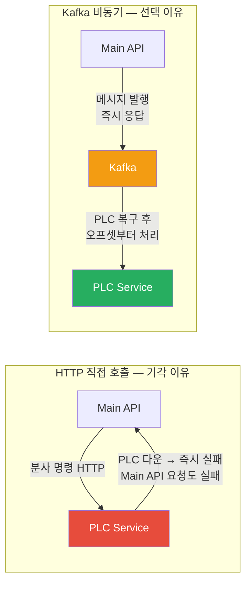
```mermaid
graph LR
    subgraph Sync["HTTP 직접 호출 — 기각 이유"]
        A1["Main API"] -->|"분사 명령 HTTP"| B1["PLC Service"]
        B1 -->|"PLC 다운 → 즉시 실패\nMain API 요청도 실패"| A1
    end

    subgraph Async["Kafka 비동기 — 선택 이유"]
        A2["Main API"] -->|"메시지 발행\n즉시 응답"| K["Kafka"]
        K -->|"PLC 복구 후\n오프셋부터 처리"| B2["PLC Service"]
    end

    style B1 fill:#e74c3c,color:#fff
    style K fill:#f39c12,color:#fff
    style B2 fill:#27ae60,color:#fff
```

**수용한 트레이드오프**: 분사 명령의 처리가 즉시 확인되지 않는다. 명령 발행과 실제 PLC 실행 사이에 Kafka 처리 시간이 존재한다. 현장 운영 요구사항에서 수초 이내 처리가 허용 범위였기 때문에 이 지연을 수용했다.

---

## 8. Kafka를 이벤트 버스로 선택한 이유

| 대안 | 검토 내용 | 기각 이유 |
|------|---------|---------|
| **Redis Pub/Sub** | 가벼운 메시지 브로커 | 소비자 다운 중 발행된 메시지 유실. 재처리 불가 |
| **RabbitMQ** | 성숙한 메시지 큐 | 오프셋 기반 재처리와 Consumer Group 분리 지원 약함 |
| **직접 HTTP 호출** | 타입 안전, 단순 | 동기 결합. 수신자 장애가 송신자에게 즉시 전파 |
| **gRPC** | 타입 안전한 RPC | 동기 결합. 인터페이스 버전 관리 복잡도 증가 |

Kafka를 선택한 결정적 이유 세 가지:

**① 메시지 영구 보존** — 소비자가 다운된 사이 발행된 메시지도 복구 후 처리 가능하다. "메시지가 유실됐는가 아니면 처리 지연인가"를 구분할 수 있다.

**② 병렬 운영 기간을 지원** — Consumer Group을 분리하면 기존 서비스와 신규 서비스가 독립적으로 소비한다. 운영 중단 없는 전환 전략의 기반이었다.

**③ DLQ 패턴 구현 가능** — 처리 실패 메시지를 보존하고 재처리한다. 분사 명령 같은 중요 메시지의 영구 유실을 방지한다.

**수용한 비용**: Kafka는 운영 복잡도가 높다. 로컬 개발 환경에서 클러스터를 실행해야 하고, 신규 서비스 추가 시마다 토픽 네이밍 규칙을 수동으로 확인해야 했다. 이 비용이 예상보다 높았다.

### PLC 명령 멱등성 — Kafka at-least-once의 위험 대응

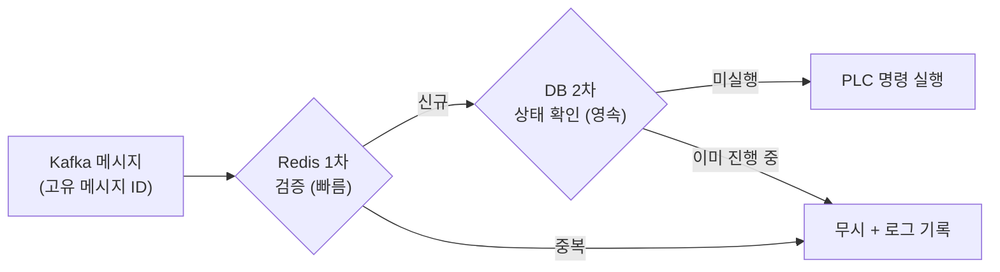
```mermaid
flowchart LR
    MSG["Kafka 메시지\n(고유 메시지 ID)"]
    R{"Redis 1차\n검증 (빠름)"}
    D{"DB 2차\n상태 확인 (영속)"}
    EXEC["PLC 명령 실행"]
    IGNORE["무시 + 로그 기록"]

    MSG --> R
    R -->|"신규"| D
    R -->|"중복"| IGNORE
    D -->|"미실행"| EXEC
    D -->|"이미 진행 중"| IGNORE
```

Redis(빠른 1차) + DB 상태 확인(영속적 2차)을 조합한 이유: Redis 장애 시에도 DB 검증으로 안전을 보장하기 위해서다.

---

## 9. 장애 격리와 관찰 가능성

### 설계 철학: 장애를 막는 것이 아니라 예측 가능하게 만든다

장애 격리 설계의 목적은 장애를 막는 것이 아니다. 장애가 발생했을 때 어떤 기능이 영향을 받고 어떤 기능은 계속 동작하는지를 예측 가능하게 만드는 것이다.

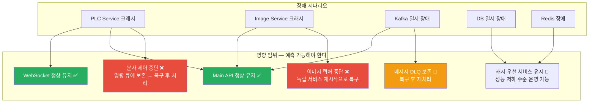
```mermaid
graph TB
    subgraph Failures["장애 시나리오"]
        F1["PLC Service 크래시"]
        F2["Image Service 크래시"]
        F3["Kafka 일시 장애"]
        F4["DB 일시 장애"]
        F5["Redis 장애"]
    end

    subgraph Impacts["영향 범위 — 예측 가능해야 한다"]
        OK1["Main API 정상 유지 ✅"]
        OK2["WebSocket 정상 유지 ✅"]
        STOP1["분사 제어 중단 ❌\n명령 큐에 보존 → 복구 후 처리"]
        STOP2["이미지 캡처 중단 ❌\n독립 서비스 재시작으로 복구"]
        BUF["메시지 DLQ 보존 🔄\n복구 후 재처리"]
        DEG["캐시 우선 서비스 유지 🔄\n성능 저하 수준 운영 가능"]
    end

    F1 --> STOP1 & OK1 & OK2
    F2 --> STOP2 & OK1
    F3 --> BUF & OK1
    F4 --> DEG
    F5 --> DEG

    style OK1 fill:#27ae60,color:#fff
    style OK2 fill:#27ae60,color:#fff
    style STOP1 fill:#e74c3c,color:#fff
    style STOP2 fill:#e74c3c,color:#fff
    style BUF fill:#f39c12,color:#fff
```

### 관찰 가능성 — 아키텍처 수준의 결정

장애가 발생했을 때 원인을 파악할 수 없으면 격리 설계의 의미가 없다. 관찰 가능성은 사후에 붙이는 것이 아니라 아키텍처 단계에서 결정해야 한다.

- **비동기 에러 로그**: 에러 로깅이 처리 성능에 영향을 주지 않도록 채널 기반 비동기 쓰기를 사용한다. 동기 로그는 로그 저장소 장애가 서비스 처리 성능에 직접 영향을 미치는 결합을 만든다.
- **Kafka DLQ**: "메시지가 유실됐는가 아니면 처리 지연인가"를 구분하는 관찰 도구다.
- **Health Check**: 모든 의존 서비스의 연결 상태를 단일 응답으로 확인한다.

**현재 아키텍처의 관찰 가능성 한계**: 분산 추적(Distributed Tracing)이 구현되지 않았다. 서비스가 3개로 늘어난 현재, 요청 하나가 여러 서비스를 거칠 때 전체 흐름을 단일 뷰로 볼 수 없다. 이것이 현재 식별된 가장 큰 운영 취약점이다.

---

## 10. Polyglot Persistence — 단일 DB를 포기한 이유

단일 DB로 시작하는 것은 합리적이다. 하지만 운영이 진행되면서 각 데이터 유형이 서로 다른 접근 패턴을 가진다는 것이 드러났다.

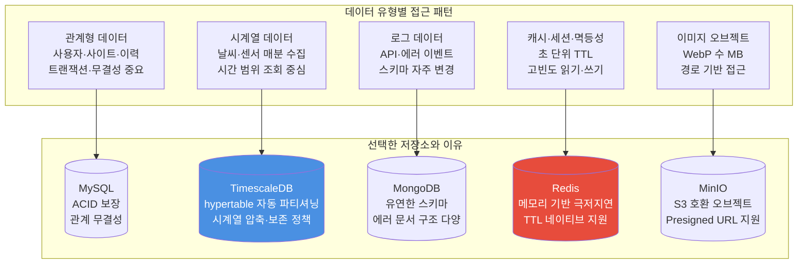
```mermaid
graph TB
    subgraph DataTypes["데이터 유형별 접근 패턴"]
        REL["관계형 데이터\n사용자·사이트·이력\n트랜잭션·무결성 중요"]
        TS_D["시계열 데이터\n날씨·센서 매분 수집\n시간 범위 조회 중심"]
        LOG_D["로그 데이터\nAPI·에러 이벤트\n스키마 자주 변경"]
        CACHE_D["캐시·세션·멱등성\n초 단위 TTL\n고빈도 읽기·쓰기"]
        FILE_D["이미지 오브젝트\nWebP 수 MB\n경로 기반 접근"]
    end

    subgraph Stores["선택한 저장소와 이유"]
        MY[("MySQL\nACID 보장\n관계 무결성")]
        TSDB[("TimescaleDB\nhypertable 자동 파티셔닝\n시계열 압축·보존 정책")]
        MG[("MongoDB\n유연한 스키마\n에러 문서 구조 다양")]
        RD[("Redis\n메모리 기반 극저지연\nTTL 네이티브 지원")]
        MN[("MinIO\nS3 호환 오브젝트\nPresigned URL 지원")]
    end

    REL --> MY
    TS_D --> TSDB
    LOG_D --> MG
    CACHE_D --> RD
    FILE_D --> MN

    style TSDB fill:#4A90E2,color:#fff
    style RD fill:#e74c3c,color:#fff
```

**TimescaleDB 전환 — 검토한 대안**: MySQL 유지(인덱스 최적화), InfluxDB(전용 시계열 DB), TimescaleDB(PostgreSQL 확장) 세 가지를 검토했다. InfluxDB는 별도 쿼리 언어 학습이 필요하고 관계형 데이터와 결합 쿼리가 불가능했다. TimescaleDB는 기존 SQL 쿼리를 대부분 재사용할 수 있어 이관 비용이 가장 낮았다.

**Redis 사용의 확장 — 알고리즘 복잡도 변경**: 사이트별 사용자 목록을 Redis SET으로 인덱싱해 WebSocket 메시지 라우팅을 O(n)에서 O(1)로 바꿨다. "DB 부하를 줄인다"는 수준이 아니라 알고리즘 복잡도 자체를 바꾸는 설계 결정이다.

---

## 11. 언어 폴리글랏 — 기술 선택의 기준과 수용한 비용

폴리글랏은 목표가 아니라 결과다. 각 언어 추가는 기존 언어로 해결할 수 없는 구체적인 문제가 있을 때만 이루어졌다.

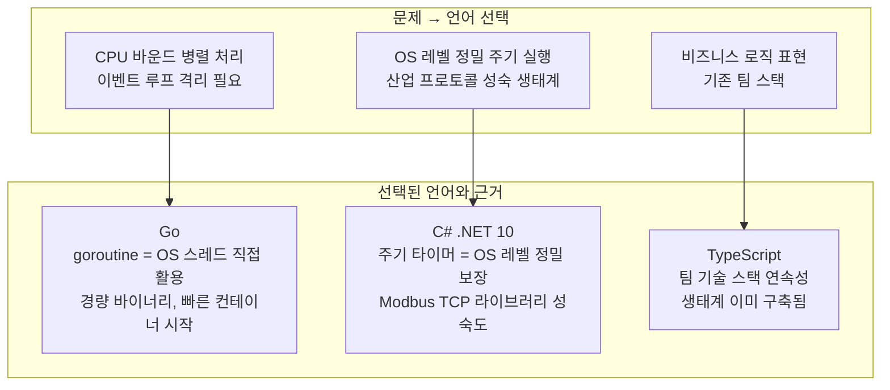
```mermaid
graph TB
    subgraph Problem["문제 → 언어 선택"]
        P1["CPU 바운드 병렬 처리\n이벤트 루프 격리 필요"]
        P2["OS 레벨 정밀 주기 실행\n산업 프로토콜 성숙 생태계"]
        P3["비즈니스 로직 표현\n기존 팀 스택"]
    end

    subgraph Choice["선택된 언어와 근거"]
        Go["Go\ngoroutine = OS 스레드 직접 활용\n경량 바이너리, 빠른 컨테이너 시작"]
        CS["C# .NET 10\n주기 타이머 = OS 레벨 정밀 보장\nModbus TCP 라이브러리 성숙도"]
        TS["TypeScript\n팀 기술 스택 연속성\n생태계 이미 구축됨"]
    end

    P1 --> Go
    P2 --> CS
    P3 --> TS
```

**폴리글랏이 수용한 운영 비용**: 언어가 늘어날수록 빌드 환경, 의존성 관리, 컨테이너 이미지, 보안 패치 주기를 별도로 관리해야 한다. 단독 개발 환경에서는 이 비용 전부를 혼자 부담한다. 3개 언어가 현재의 실질적 한계다.

### PLC Adapter Pattern — 설계 철학이 아니라 현실 제약이 강제한 패턴

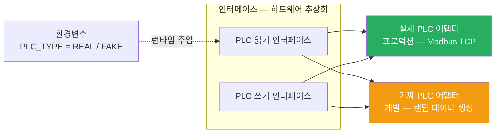
```mermaid
graph LR
    subgraph IF["인터페이스 — 하드웨어 추상화"]
        IR["PLC 읽기 인터페이스"]
        IW["PLC 쓰기 인터페이스"]
    end

    REAL["실제 PLC 어댑터\n프로덕션 — Modbus TCP"]
    FAKE["가짜 PLC 어댑터\n개발 — 랜덤 데이터 생성"]
    ENV["환경변수\nPLC_TYPE = REAL / FAKE"]

    IR & IW --> REAL & FAKE
    ENV -.->|"런타임 주입"| IR

    style REAL fill:#27ae60,color:#fff
    style FAKE fill:#f39c12,color:#fff
```

---

## 12. 의도적으로 하지 않은 것들과 그 이유

| 선택하지 않은 것 | 검토 내용 | 기각 이유 |
|---------------|---------|---------| 
| **초기 MSA 분리** | 처음부터 서비스 분리 | 도메인 이해 전 경계 설계 → 잘못된 분리. 수정 비용이 모놀리식보다 높음 |
| **Kubernetes** | 컨테이너 오케스트레이션 | 현재 3개 서비스 규모에서 인프라 복잡도 대비 이점 없음 |
| **gRPC 서비스 간 통신** | 타입 안전한 RPC | 동기 결합. 수신자 장애가 송신자에게 즉시 전파 |
| **Redis Pub/Sub** | 가벼운 메시지 브로커 | 소비자 다운 중 발행된 메시지 유실 |
| **완전한 MSA 전환** | 모든 기능 독립 서비스화 | 남은 서비스 분리의 이점이 아직 측정되지 않음 |
| **분산 추적 도입** | Jaeger/Zipkin 등 | 우선순위에서 밀렸으나 현재 가장 필요한 관찰 도구로 인식됨 |

---

## 13. 아키텍처 교훈 — 무엇이 예상과 달랐는가

### 경계는 설계에서 나오지 않았다

초기에는 올바른 서비스 경계를 사전에 설계할 수 있다고 생각했다. 실제로는 운영에서 측정된 문제가 경계를 결정했다. ffmpeg 블로킹은 코드 리뷰 단계에서 예측할 수 없었다. PLC 타이밍 불안정은 실제 현장 데이터가 쌓인 뒤에야 드러났다.

### 보안 버그는 아키텍처 수준에서 막을 수 없다

MSA 전환을 진행하는 동안 코드 리뷰에서 아키텍처 설계로는 방지할 수 없는 Critical 버그들을 발견했다.

```
코드 리뷰에서만 발견 가능했던 버그들:
- RBAC 우회 — async 함수 반환값이 항상 truthy로 판정됨 (기능 테스트 통과)
- 평문 비밀번호 SQL 비교
- MFA setup 인증 없음 — 타인 TOTP 시크릿 생성 가능
- 자동 분사 조건 자기비교 — 항상 조건 충족
- 경쟁 조건으로 인한 세션 버전 불일치
```

아키텍처가 아무리 잘 설계되어 있어도 코드 레벨 검증 없이는 운영 신뢰성을 보장할 수 없다.

### 폴리글랏의 운영 비용은 단독 개발 환경에서 더 높다

각 언어마다 빌드 파이프라인, 의존성 업데이트, 컨테이너 이미지를 관리하는 것은 팀이 나눌 수 있는 비용이다. 단독 개발 환경에서는 이 비용을 혼자 부담한다.

### 다시 한다면 달리 할 것들

**분산 추적을 더 일찍 구축했을 것**: 서비스가 3개로 늘어난 현재, 요청 하나가 여러 서비스를 거칠 때 전체 흐름을 볼 수 없다. 첫 번째 서비스 분리 시점에 도입했어야 했다.

**병렬 운영 종료 기준을 명시적으로 정했을 것**: 암묵적 판단이 전환 시점을 불필요하게 늦췄다. 명시적 성공 기준이 있었으면 전환을 더 빠르게 완료했을 것이다.

**토픽 네이밍 규칙을 첫 서비스부터 문서화했을 것**: 작은 부주의지만, 운영 환경에서 설정 불일치는 침묵하는 버그를 만든다.

---

## 14. 포트폴리오 포지셔닝

### 이 프로젝트가 증명하는 것

```
✓ 운영 제약 하에서 아키텍처 결정을 내리는 판단력
✓ 모놀리식 → MSA 전환 — 실측 문제 기반 단계적 분리
✓ 언어 폴리글랏 — 제약과 문제 특성 기반 선택, 수용한 비용 인식
✓ 서비스 경계 설계 — 소유권 명확화, 의도적 배제 경계
✓ Kafka 이벤트 버스 — 장애 격리와 메시지 신뢰성, 전환 전략 지원
✓ 관찰 가능성 — 아키텍처의 일부로 설계된 에러 추적과 현재 한계 인식
✓ 코드 리뷰 기반 Critical 버그 발견 — 아키텍처 너머 운영 신뢰성
✓ 산업 IoT 도메인 — PLC Modbus TCP, 현장 합의된 운영 제약 이해
```

### 다른 포트폴리오와의 설계 원칙 연결

| 원칙 | Production IoT | Main Portfolio (게임 서버) | Coin Data API |
|------|---------------|--------------------------|--------------| 
| 외부 의존성 격리 | PLC 읽기/쓰기 인터페이스 | Domain Event 격리 | IExchangeKlineManager |
| 비동기 이벤트 처리 | Kafka Fire-and-Forget | Kafka Fire-and-Forget | WebSocket → Cache |
| 장애 격리 설계 | 서비스별 크래시 독립 | DB 장애가 게임플레이 안 멈춤 | 거래소 장애 시 캐시 |
| Polyglot Persistence | MySQL·TSDB·Mongo·Redis | Redis·MongoDB·MySQL | In-Memory |

---

## 🛠️ 기술 스택

**Main API** —    

**MSA Services** —  

**IoT / Protocol** —   

**Event Stream** — 

**Storage** —     

**Security** —   

**Infra** —   

---

## 📄 상세 문서

| 문서 | 내용 |
|------|------|
| [ARCHITECTURE.md](./docs/ARCHITECTURE.md) | 전체 시스템 아키텍처 상세 |
| [LEGACY_ARCHITECTURE.md](./docs/LEGACY_ARCHITECTURE.md) | 교체된 패턴 기록·결정 근거 |
| [API_OVERVIEW.md](./docs/API_OVERVIEW.md) | 서비스별 API 설계 포인트 |
| [DEPLOYMENT.md](./docs/DEPLOYMENT.md) | 배포 가이드·MSA 서비스 실행 |
| [DEVELOPMENT_GUIDE.md](./docs/DEVELOPMENT_GUIDE.md) | 개발 환경 설정·코딩 규칙 |
| [PROJECT_REPORT.md](./docs/PROJECT_REPORT.md) | 프로젝트 현황·완성도 |

---

## 💬 한 줄 요약

> 이 프로젝트는 IoT 시스템을 만든 기록이 아니라,  
> **"운영 중단 불가·단독 개발·하드웨어 접근 제한이라는 실제 제약 아래에서, 측정된 문제를 기반으로 Kafka 이벤트 버스로 연결된 언어 폴리글랏 MSA로 점진적으로 전환한 — 결정의 이유·수용한 트레이드오프·교훈의 기록"**이다.

---

## 📧 Contact

**GitHub**: [@1985jwlee](https://github.com/1985jwlee)
**Email**: leejae.w.jl@icloud.com
**Main Portfolio**: [portpolio_main](https://github.com/1985jwlee/portpolio_main)

---

**Last Updated**: 2026-03-19 | **Version**: 4.4.0 | **Status**: ✅ Production Ready