# 🌡️ Production IoT Backend — 쿨링로드 시스템

> **실제 도로 살수 장비를 제어하는 프로덕션 백엔드 — 설계 판단부터 배포까지**

[](CHANGELOG.md)
[]()
[]()

---

## 📋 목차

1. [Portfolio Summary](#-portfolio-summary)
2. [3가지 핵심 설계 결정](#-3가지-핵심-설계-결정)
3. [의도적으로 하지 않은 것들](#-의도적으로-하지-않은-것들)
4. [시스템 아키텍처](#-시스템-아키텍처)
5. [보안 설계](#-보안-설계)
6. [운영 안정성](#-운영-안정성)
7. [코드 리뷰 이력](#-코드-리뷰-이력)
8. [기술 스택](#️-기술-스택)
9. [상세 문서](#-상세-문서)
10. [한 줄 요약](#-한-줄-요약)

---

## 📌 Portfolio Summary

**이 포트폴리오가 증명하는 것:**

```
✓ 실제 운영 중인 IoT 시스템 설계 경험
✓ PLC(산업용 제어기기)와의 Modbus TCP 통신 구현
✓ 프로덕션 레벨 보안 설계 (JWT 이중 무효화, MFA, RBAC)
✓ Kafka + DLQ + Semaphore 등 실무 패턴 직접 구현
✓ 코드 리뷰를 통한 Critical 버그 10종 이상 발견 및 수정
✓ 10,000줄 규모 TypeScript 코드베이스 아키텍처 유지
```

**대상 독자**: CTO, 테크 리드, 백엔드/IoT 엔지니어

> "기능을 만든 기록이 아니라, 프로덕션에서 실제 장비를 제어하며 쌓은 설계 판단의 기록입니다."

### 시스템 규모

```
TypeScript 파일: 28개    코드 라인: ~10,000 lines
Controllers:    9개     Core Modules:  8개
MySQL 테이블:   15개     MongoDB Collections: 5개
API 엔드포인트: 40+개   문서: 25개 Markdown
```

---

## 🏗️ 3가지 핵심 설계 결정

### 1️⃣ PLC 어댑터 패턴 — 하드웨어 격리

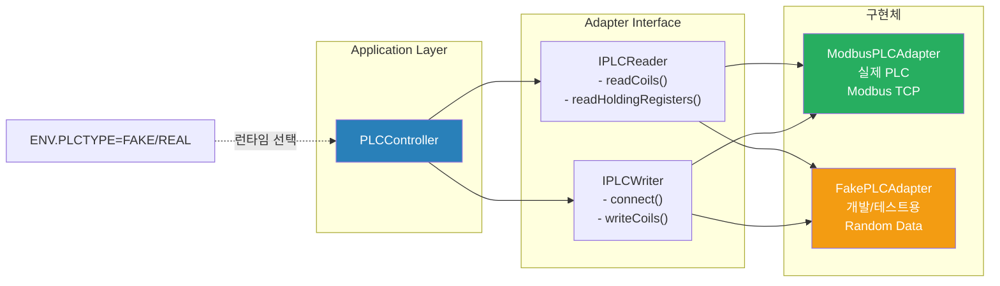
```mermaid
graph LR
    subgraph Application["Application Layer"]
        PC["PLCController"]
    end

    subgraph Interface["Adapter Interface"]
        IR["IPLCReader\n- readCoils()\n- readHoldingRegisters()"]
        IW["IPLCWriter\n- connect()\n- writeCoils()"]
    end

    subgraph Impl["구현체"]
        REAL["ModbusPLCAdapter\n실제 PLC\nModbus TCP"]
        FAKE["FakePLCAdapter\n개발/테스트용\nRandom Data"]
    end

    PC --> IR & IW
    IR & IW --> REAL
    IR & IW --> FAKE

    ENV["ENV.PLCTYPE=FAKE/REAL"] -.->|"런타임 선택"| PC

    style REAL fill:#27ae60,color:#fff
    style FAKE fill:#f39c12,color:#fff
    style PC fill:#2980b9,color:#fff
```

**설계 근거:**

```
문제: 개발 환경에 실제 PLC 장비 없음 + 장비 의존성이 코드에 직접 침투하면 테스트 불가
해결: IPLCReader / IPLCWriter 인터페이스로 하드웨어 완전 격리
효과: ENV.PLCTYPE=FAKE 하나로 전환, 실제 코드 변경 없이 개발 가능
```

**인터페이스 정의:**
```typescript
interface IPLCReader {
    readCoils(modbus: ModbusRTU): Promise<boolean[] | undefined>
    readHoldingRegisters(modbus: ModbusRTU): Promise<number[] | undefined>
}

interface IPLCWriter {
    connect(modbus: ModbusRTU, address: string, port: number): Promise<boolean>
    writeCoils(modbus: ModbusRTU, data: boolean[]): Promise<void>
}
```

> **같은 원칙이 다른 포트폴리오에서도**: Coin Data API의 `IExchangeKlineManager`, 게임 서버의 Domain Event 격리와 동일한 "외부 의존성을 인터페이스 뒤에 숨기는" 패턴입니다.

---

### 2️⃣ Kafka Producer 벌크 전송 + DLQ — 메시지 신뢰성

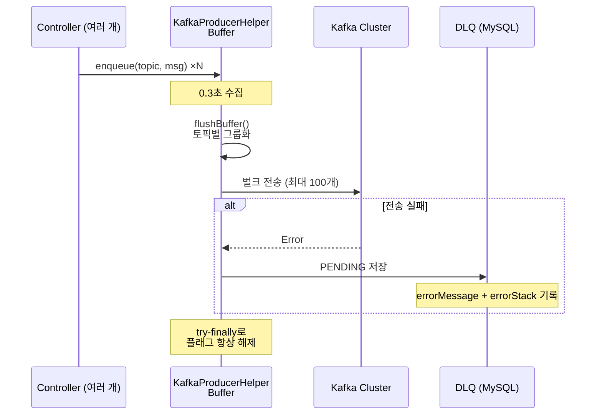
```mermaid
sequenceDiagram
    participant C as Controller (여러 개)
    participant B as KafkaProducerHelper<br/>Buffer
    participant K as Kafka Cluster
    participant DLQ as DLQ (MySQL)

    C->>B: enqueue(topic, msg) ×N
    Note over B: 0.3초 수집
    B->>B: flushBuffer()<br/>토픽별 그룹화
    B->>K: 벌크 전송 (최대 100개)

    alt 전송 실패
        K-->>B: Error
        B->>DLQ: PENDING 저장
        Note over DLQ: errorMessage + errorStack 기록
    end

    Note over B: try-finally로<br/>플래그 항상 해제
```

**성능 비교:**

| 지표 | 즉시 전송 (Before) | 벌크 전송 (After) |
|------|-------------------|------------------|
| 네트워크 요청 | 메시지당 1회 | 100개당 1~2회 |
| CPU 사용률 | ~80% | ~30% |
| 처리량 | 100 msg/sec | 5,000+ msg/sec |
| 지연 | 0ms | 최대 300ms |

**`try-finally` 패턴 — 플래그 영구 고착 방지:**
```typescript
private async flushBuffer() {
    if (this.process) return
    this.process = true
    try {
        // 배치 처리
    } finally {
        this.process = false  // 예외 발생 시에도 반드시 실행
    }
}
```

**DLQ 상태 흐름:**

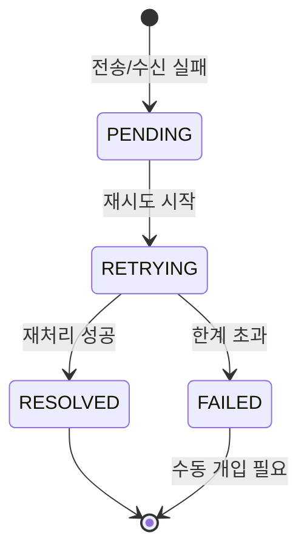
```mermaid
stateDiagram-v2
    [*] --> PENDING : 전송/수신 실패
    PENDING --> RETRYING : 재시도 시작
    RETRYING --> RESOLVED : 재처리 성공
    RETRYING --> FAILED : 한계 초과
    RESOLVED --> [*]
    FAILED --> [*] : 수동 개입 필요
```

---

### 3️⃣ Polyglot Persistence — 저장소별 역할 분리

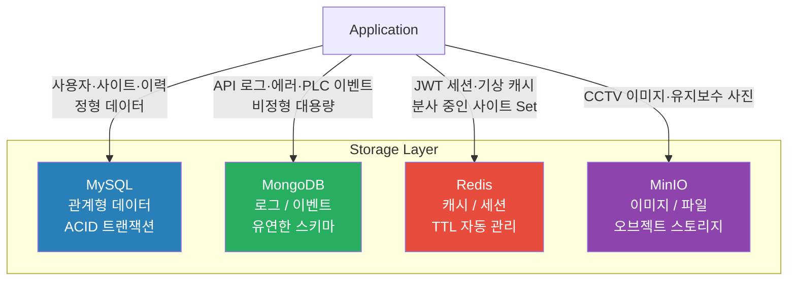
```mermaid
graph TB
    APP["Application"]

    subgraph Storage["Storage Layer"]
        MYSQL["MySQL\n관계형 데이터\nACID 트랜잭션"]
        MONGO["MongoDB\n로그 / 이벤트\n유연한 스키마"]
        REDIS["Redis\n캐시 / 세션\nTTL 자동 관리"]
        MINIO["MinIO\n이미지 / 파일\n오브젝트 스토리지"]
    end

    APP -->|"사용자·사이트·이력\n정형 데이터"| MYSQL
    APP -->|"API 로그·에러·PLC 이벤트\n비정형 대용량"| MONGO
    APP -->|"JWT 세션·기상 캐시\n분사 중인 사이트 Set"| REDIS
    APP -->|"CCTV 이미지·유지보수 사진"| MINIO

    style MYSQL fill:#2980b9,color:#fff
    style MONGO fill:#27ae60,color:#fff
    style REDIS fill:#e74c3c,color:#fff
    style MINIO fill:#8e44ad,color:#fff
```

| 저장소 | 역할 | 선택 이유 |
|--------|------|-----------|
| MySQL | 사용자, 사이트, 살수 이력, PLC 명령 | ACID, 복잡한 JOIN, 트랜잭션 |
| MongoDB | API 로그, MFA 로그, PLC 이벤트, 에러 | 유연한 스키마, 대용량 append |
| Redis | 세션, 기상 캐시, 분사 중인 사이트 Set | 속도, TTL, Set 자료구조 |
| MinIO | CCTV 이미지, 유지보수 사진 | S3 호환, 오브젝트 스토리지 |

---

## 🚫 의도적으로 하지 않은 것들

> **"할 수 있다"와 "해야 한다"는 다릅니다.**

| 비선택 | 선택하지 않은 이유 | 대신 선택한 것 |
|--------|-----------------|--------------|
| 단일 DB | 용도가 다른 데이터를 한 곳에 → 최적화 불가 | Polyglot Persistence |
| Offset 페이지네이션 | 대용량에서 성능 폭락 (1M rows → 2.5초) | Cursor 기반 (0.03초) |
| PLC 직접 호출 코드 | 하드웨어 의존성이 비즈니스 로직에 침투 | Adapter Pattern (Interface) |
| 블랙리스트만으로 JWT 무효화 | 단일 장애점 | TrashboxJWT + jwtTokenVersion 이중 무효화 |
| Rate Limiting을 백엔드에서 | 서버 리소스 낭비, 이미 도달 후 차단 | Nginx에서 처리 (도달 전 차단) |
| MSA로 즉시 분리 | 프로젝트 규모에 과도한 복잡도 | Modular Monolith (경계는 명확히) |
| 즉시 Kafka 전송 | 메시지당 1회 네트워크 → 고부하 시 병목 | 0.3초 버퍼링 + 벌크 전송 |

---

## 📊 시스템 아키텍처

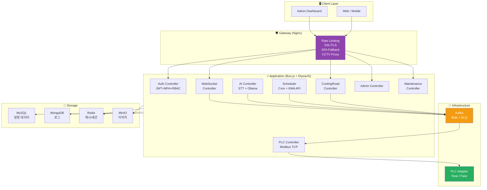
```mermaid
graph TB
    subgraph Client["🖥️ Client Layer"]
        WEB["Web / Mobile"]
        ADMIN["Admin Dashboard"]
    end

    subgraph Gateway["🛡️ Gateway (Nginx)"]
        RL["Rate Limiting\nSSL/TLS\nSPA Fallback\nCCTV Proxy"]
    end

    subgraph App["⚡ Application (Bun.js + ElysiaJS)"]
        AUTH["Auth Controller\nJWT+MFA+RBAC"]
        COOLING["CoolingRoad\nController"]
        WS["WebSocket\nController"]
        PLC_C["PLC Controller\nModbus TCP"]
        SCHED["Scheduler\nCron + KMA API"]
        AI["AI Controller\nSTT + Ollama"]
        ADMIN_C["Admin Controller"]
        MAINT["Maintenance\nController"]
    end

    subgraph Infra["📨 Infrastructure"]
        KAFKA["Kafka\nBulk + DLQ"]
        ADAPTER["PLC Adapter\nReal / Fake"]
    end

    subgraph Store["💾 Storage"]
        MY["MySQL\n정형 데이터"]
        MG["MongoDB\n로그"]
        RD["Redis\n캐시/세션"]
        MN["MinIO\n이미지"]
    end

    WEB & ADMIN --> RL --> AUTH & COOLING & WS & ADMIN_C & MAINT
    COOLING & SCHED --> KAFKA --> PLC_C --> ADAPTER
    AI --> KAFKA
    WS --> KAFKA
    App --> MY & MG & RD & MN

    style KAFKA fill:#f39c12,color:#fff
    style ADAPTER fill:#27ae60,color:#fff
    style RL fill:#8e44ad,color:#fff
```

### 전체 데이터 흐름

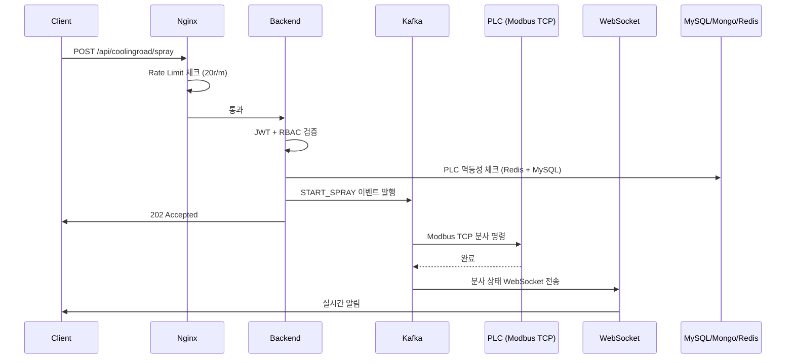
```mermaid
sequenceDiagram
    participant C as Client
    participant N as Nginx
    participant B as Backend
    participant K as Kafka
    participant P as PLC (Modbus TCP)
    participant W as WebSocket
    participant DB as MySQL/Mongo/Redis

    C->>N: POST /api/coolingroad/spray
    N->>N: Rate Limit 체크 (20r/m)
    N->>B: 통과
    B->>B: JWT + RBAC 검증
    B->>DB: PLC 멱등성 체크 (Redis + MySQL)
    B->>K: START_SPRAY 이벤트 발행
    B->>C: 202 Accepted
    K->>P: Modbus TCP 분사 명령
    P-->>K: 완료
    K->>W: 분사 상태 WebSocket 전송
    W->>C: 실시간 알림
```

---

## 🔐 보안 설계

### JWT 이중 무효화

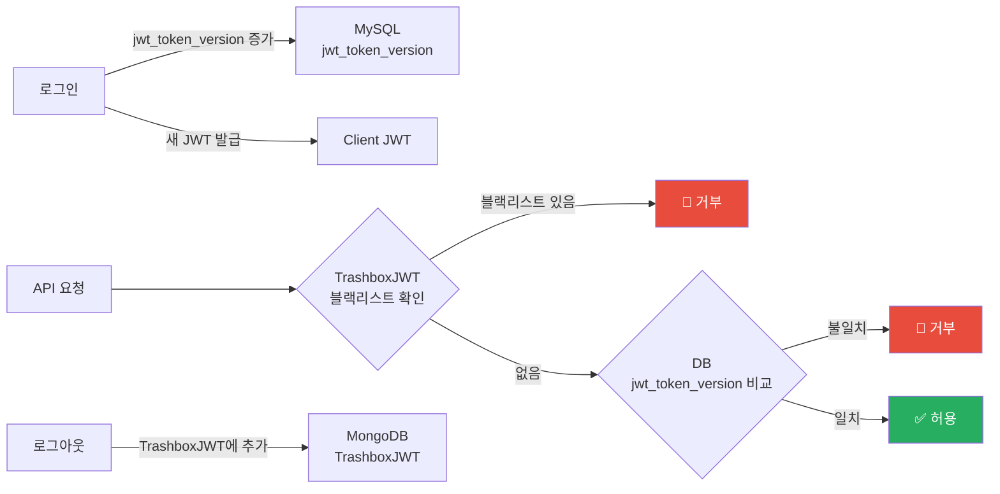
```mermaid
flowchart LR
    LOGIN["로그인"] -->|"jwt_token_version 증가"| MYSQL["MySQL\njwt_token_version"]
    LOGIN -->|"새 JWT 발급"| CLIENT["Client JWT"]
    
    REQ["API 요청"] --> V1{"TrashboxJWT\n블랙리스트 확인"}
    V1 -->|"블랙리스트 있음"| REJECT1["🔴 거부"]
    V1 -->|"없음"| V2{"DB\njwt_token_version 비교"}
    V2 -->|"불일치"| REJECT2["🔴 거부"]
    V2 -->|"일치"| ALLOW["✅ 허용"]

    LOGOUT["로그아웃"] -->|"TrashboxJWT에 추가"| MONGO["MongoDB\nTrashboxJWT"]

    style REJECT1 fill:#e74c3c,color:#fff
    style REJECT2 fill:#e74c3c,color:#fff
    style ALLOW fill:#27ae60,color:#fff
```

**왜 이중 무효화인가:**
- `TrashboxJWT` 단독: 블랙리스트 미기록 시 만료 전까지 유효
- `jwtTokenVersion` 단독: 과거 세션 즉시 만료 불가
- **이중 적용**: 로그아웃 즉시 무효화 + 타기기 세션 자동 만료

### RBAC 구조

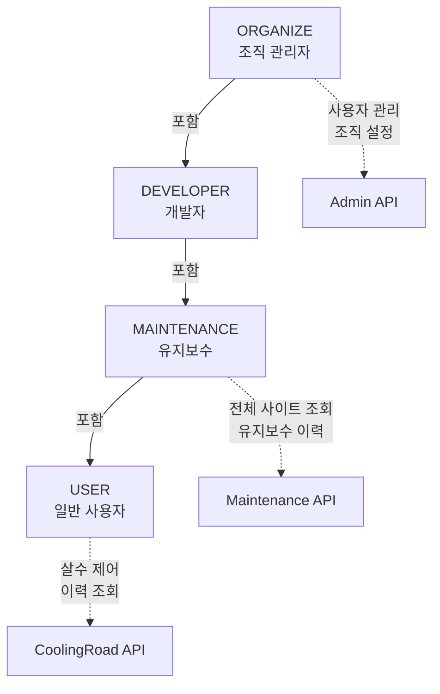
```mermaid
graph TD
    ORGANIZE["ORGANIZE\n조직 관리자"] -->|"포함"| DEV
    DEV["DEVELOPER\n개발자"] -->|"포함"| MAINT
    MAINT["MAINTENANCE\n유지보수"] -->|"포함"| USER
    USER["USER\n일반 사용자"]

    ORGANIZE -.->|"사용자 관리\n조직 설정"| ORG_API["Admin API"]
    MAINT -.->|"전체 사이트 조회\n유지보수 이력"| MAINT_API["Maintenance API"]
    USER -.->|"살수 제어\n이력 조회"| USER_API["CoolingRoad API"]
```

### MFA (TOTP)

```
✓ RFC 6238 기반 TOTP (30초 유효)
✓ 타이밍 공격 방지 (상수 시간 비교)
✓ 재시도 제한 (Redis 기반)
✓ 재사용 방지 (이미 사용된 OTP 블랙리스트)
```

### Nginx Rate Limiting

| Zone | Rate | 적용 엔드포인트 |
|------|------|--------------|
| auth_limit | 10r/m | /signin, /signup |
| coolingroad_write_limit | 20r/m | POST /spray |
| coolingroad_read_limit | 60r/m | GET 요청 |
| mfa_limit | 15r/m | /mfa/* |
| upload_limit | 10r/m | 파일 업로드 |

---

## 🛡️ 운영 안정성

### PLC 명령 멱등성

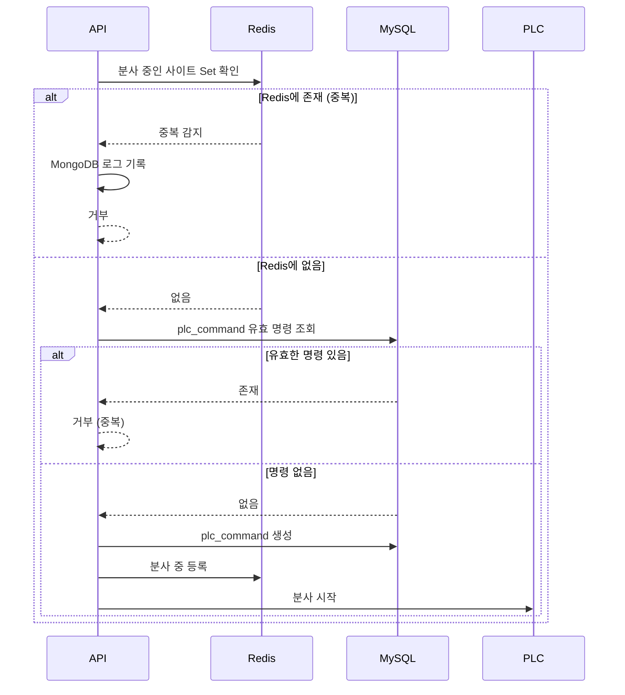
```mermaid
sequenceDiagram
    participant API
    participant Redis
    participant MySQL
    participant PLC

    API->>Redis: 분사 중인 사이트 Set 확인
    alt Redis에 존재 (중복)
        Redis-->>API: 중복 감지
        API->>API: MongoDB 로그 기록
        API-->>API: 거부
    else Redis에 없음
        Redis-->>API: 없음
        API->>MySQL: plc_command 유효 명령 조회
        alt 유효한 명령 있음
            MySQL-->>API: 존재
            API-->>API: 거부 (중복)
        else 명령 없음
            MySQL-->>API: 없음
            API->>MySQL: plc_command 생성
            API->>Redis: 분사 중 등록
            API->>PLC: 분사 시작
        end
    end
```

**효과**: Redis + MySQL 이중 멱등성 체크 → 네트워크 재시도로 인한 중복 분사 100% 차단

### PLC 고장코드 — 비트 플래그

11가지 고장 유형을 정수 1개로 표현:

```typescript
enum PLCMalfunctionCode {
    NONE = 0,
    PUMP1 = 1 << 0,                           // 1
    PUMP2 = 1 << 1,                           // 2
    TEMPHUMID_SENSOR_COMMUNICATION = 1 << 2,  // 4
    DUST_SENSOR_COMMUNICATION = 1 << 3,       // 8
    ROADTEMP_SENSOR_COMMUNICATION = 1 << 4,   // 16
    // ... 총 11가지
}

// fault_code = 5 → PUMP1(1) + TEMPHUMID_SENSOR_COMMUNICATION(4)
// 비트 연산으로 어떤 고장인지 즉시 판별
if (site.fault_code & PLCMalfunctionCode.PUMP1) { /* 펌프1 고장 */ }
```

### Semaphore — FFmpeg 동시성 제어

```typescript
// CCTV 이미지 캡처는 FFmpeg 프로세스를 생성
// 동시에 너무 많이 실행되면 메모리/CPU 폭증
private imageSemaphore = new Semaphore(3)  // 최대 3개 동시 실행

await this.imageSemaphore.acquire(async () => {
    return await captureFrameWebP(rtspUrl)
})
```

### Graceful Shutdown

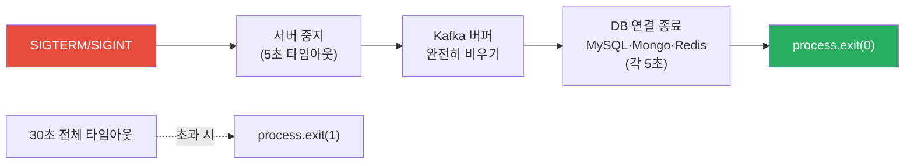
```mermaid
flowchart LR
    SIGNAL["SIGTERM/SIGINT"] --> STOP["서버 중지\n(5초 타임아웃)"]
    STOP --> KAFKA_FLUSH["Kafka 버퍼\n완전히 비우기"]
    KAFKA_FLUSH --> DB["DB 연결 종료\nMySQL·Mongo·Redis\n(각 5초)"]
    DB --> EXIT["process.exit(0)"]
    
    TIMEOUT["30초 전체 타임아웃"] -.->|"초과 시"| FORCE["process.exit(1)"]

    style SIGNAL fill:#e74c3c,color:#fff
    style EXIT fill:#27ae60,color:#fff
```

### 자동 분사 시스템

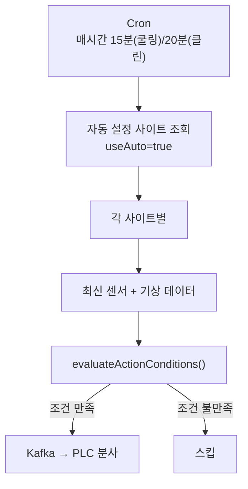
```mermaid
flowchart TD
    CRON["Cron\n매시간 15분(쿨링)/20분(클린)"] --> SITES["자동 설정 사이트 조회\nuseAuto=true"]
    SITES --> LOOP["각 사이트별"]
    LOOP --> DATA["최신 센서 + 기상 데이터"]
    DATA --> EVAL["evaluateActionConditions()"]
    EVAL -->|"조건 만족"| KAFKA["Kafka → PLC 분사"]
    EVAL -->|"조건 불만족"| SKIP["스킵"]
```

---

## 🔍 코드 리뷰 이력

> **"코드 리뷰를 통해 발견하고 수정한 버그들이 이 시스템의 신뢰성을 만들었습니다."**

### Critical 버그 (🔴)

| 버전 | 버그 | 영향 | 수정 |
|------|------|------|------|
| v3.6.7 | `signInOrganizer` SQL 평문 비밀번호 비교 | 🔴 인증 우회 가능 | bcrypt 전환 |
| v3.6.0 | 날씨 캐시 Redis hit 시 서버 크래시 | 🔴 서비스 중단 | Map 직렬화 수정 |
| v3.6.0 | PLC 멱등성 쿼리 방향 반전 (`gte`/`lte`) | 🔴 중복 분사 발생 | 방향 수정 |
| v3.5.0 | AuthGuard `checkRole()` async 버그 | 🔴 RBAC 완전 우회 | async 제거 |
| v3.5.4 | 비밀번호 재설정 강도 검증 누락 | 🔴 약한 비밀번호 허용 | 검증 추가 |
| v3.3.16 | JWT 단일 무효화 → 이중 무효화 미적용 | 🔴 로그아웃 후 재사용 | TrashboxJWT 추가 |

### High 버그 (🟠)

| 버전 | 버그 | 수정 |
|------|------|------|
| v3.6.0 | `stopSpray` 조건 `&&` → `||` | 분사 중단 조건 오류 수정 |
| v3.6.0 | `spraying_sites` 영구 잠금 | 단수 전환으로 완전 제거 |
| v3.6.0 | siteid 소유권 미검증 → 타기관 데이터 열람 | 소유권 검증 추가 |
| v3.6.0 | MinIO 실패 무시 + DB 롤백 없음 | 트랜잭션 처리 추가 |

### 리뷰를 통한 구조적 개선

| 버전 | 개선 내용 |
|------|----------|
| v3.3.18 | AuthGuard 중복 ~70줄 → `createGuard()` 통합 |
| v3.3.8 | Kafka 즉시 전송 → 0.3초 벌크 (처리량 50배) |
| v3.3.7 | Offset 페이징 → Cursor 페이징 (83배 성능) |
| v3.5.3 | Graceful Shutdown 종료 순서 역전 수정 |
| v3.5.2 | FFmpeg→PNG→Sharp(2단계) → FFmpeg→WebP(1단계, 메모리 40% 감소) |

---

## 🛠️ 기술 스택

| 영역 | 기술 |
|------|------|
| Runtime | Bun.js 1.0+ |
| Framework | ElysiaJS 1.0+ |
| Language | TypeScript 5.0+ |
| ORM | Drizzle ORM |
| DI | tsyringe (Singleton Container) |
| Message Queue | Apache Kafka (KafkaJS) |
| PLC 통신 | Modbus TCP (modbus-serial) |
| 이미지 처리 | FFmpeg (WebP 직접 인코딩) |
| 저장소 | MySQL · MongoDB · Redis · MinIO |
| 인증 | JWT HS512 + MFA TOTP |
| 인프라 | Docker Compose · Nginx · Let's Encrypt |
| ID 생성 | Snowflake ID (분산 환경 대비) |

---

## 📚 상세 문서

| 문서 | 내용 | 대상 |
|------|------|------|
| [설계 결정 과정](docs/design-decisions-portfolio.md) | 왜 이렇게 설계했는가 | 테크 리드, CTO |
| [아키텍처](docs/ARCHITECTURE.md) | 전체 시스템 구조 | 백엔드 엔지니어 |
| [배포 가이드](docs/DEPLOYMENT.md) | Docker + Nginx + SSL | DevOps |
| [API 계약](docs/API_CONTRACT.md) | 전체 엔드포인트 | 프론트엔드 개발자 |
| [WebSocket 가이드](docs/WEBSOCKET_GUIDE.md) | WebSocket 통합 | 프론트엔드 개발자 |
| [CHANGELOG](CHANGELOG.md) | 버전별 변경 이력 | 팀 전체 |

---

## 💬 한 줄 요약

> 이 포트폴리오는 실제 도로 위 장비를 제어하는 프로덕션 IoT 시스템을 설계·운영하면서,  
> **"PLC 어댑터 격리, Kafka 벌크 DLQ, JWT 이중 무효화, 코드 리뷰 기반 Critical 버그 10종 수정"**을  
> 실무에서 직접 판단하고 구현한 기록입니다.

---

**GitHub**: [@1985jwlee](https://github.com/1985jwlee)  
**Last Updated**: 2026-03-04 | **Version**: 3.8.0
