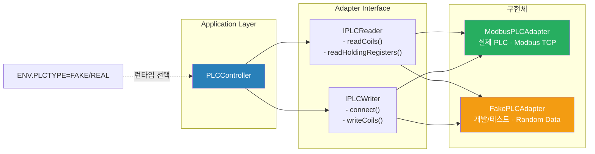
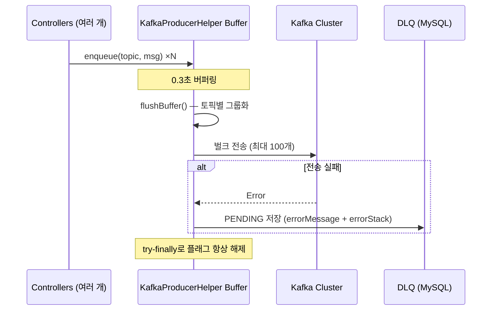
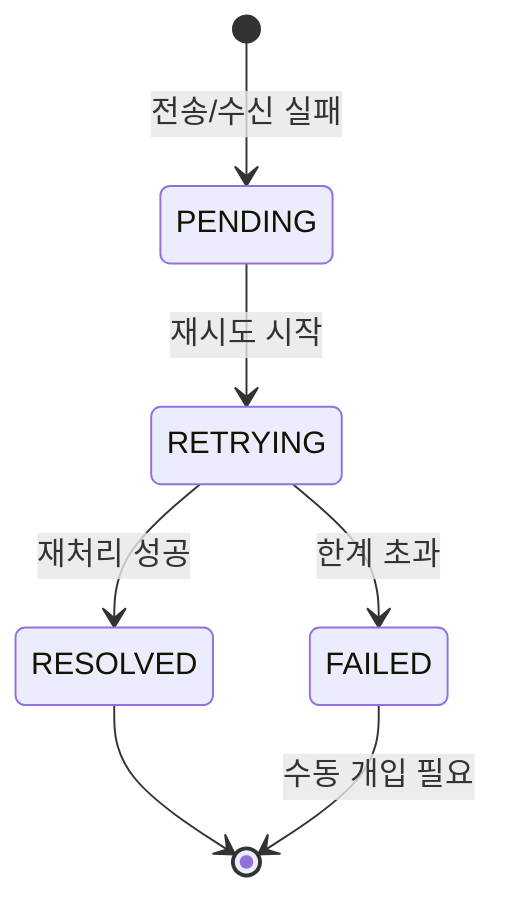
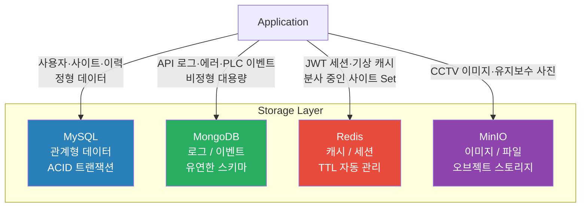
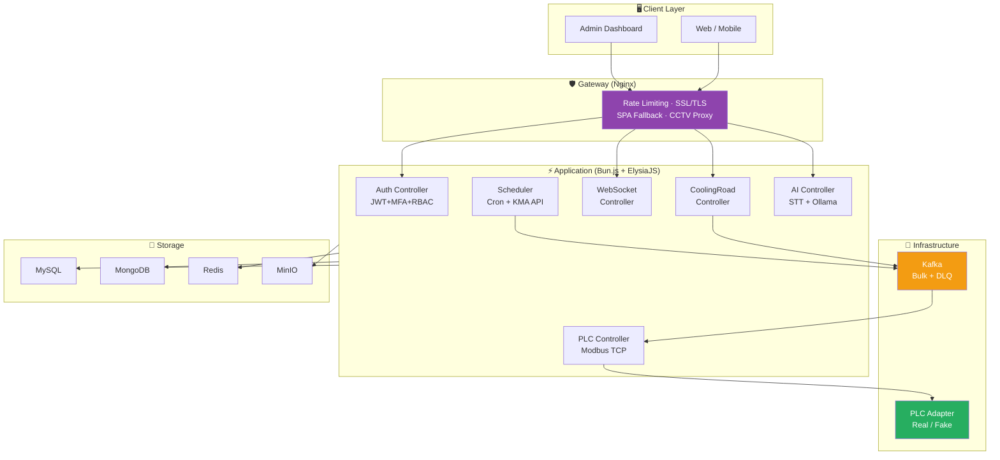
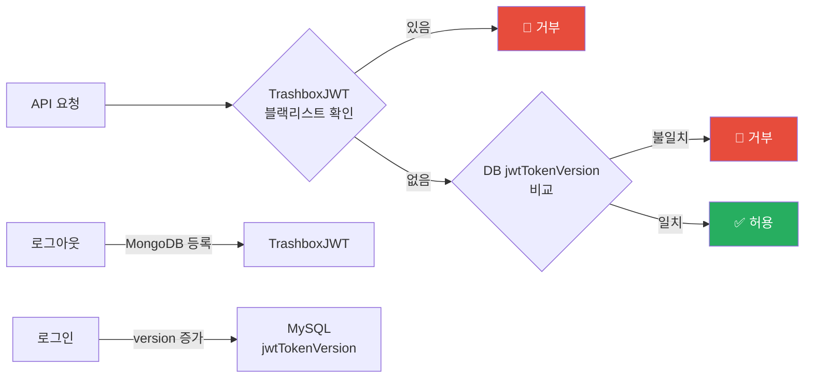
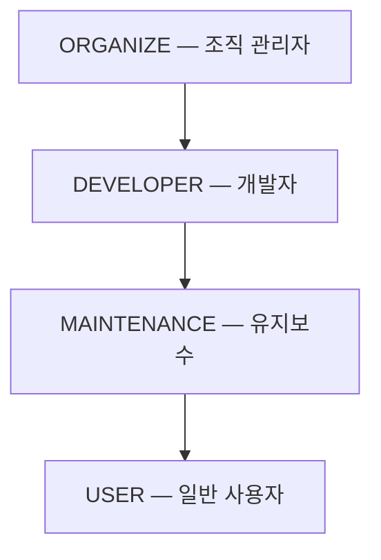
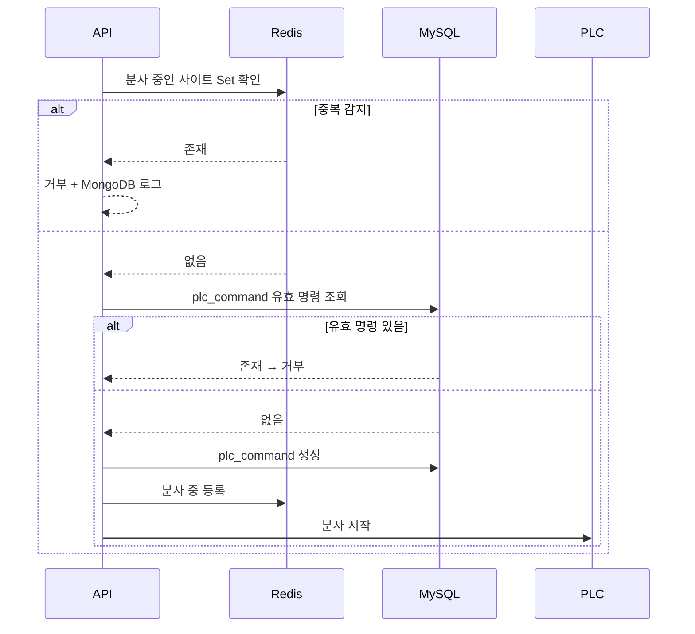
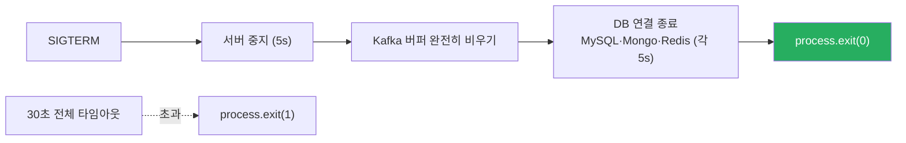

# 🌡️ Production IoT Backend — 쿨링로드 시스템

> **실제 도로 살수 장비를 제어하는 프로덕션 백엔드 — 설계 판단부터 배포까지**

[]()
[]()
[]()

-----

## 📋 목차

1. [Portfolio Summary](#-portfolio-summary)
1. [3가지 핵심 설계 결정](#-3가지-핵심-설계-결정)
1. [의도적으로 하지 않은 것들](#-의도적으로-하지-않은-것들)
1. [시스템 아키텍처](#-시스템-아키텍처)
1. [보안 설계](#-보안-설계)
1. [운영 안정성](#-운영-안정성)
1. [코드 리뷰 이력](#-코드-리뷰-이력)
1. [기술 스택](#️-기술-스택)
1. [상세 문서](#-상세-문서)
1. [한 줄 요약](#-한-줄-요약)

-----

## 📌 Portfolio Summary

**이 포트폴리오가 증명하는 것:**

```
✓ 실제 운영 중인 IoT 시스템 설계·구현 경험
✓ PLC(산업용 제어기기)와의 Modbus TCP 통신 구현
✓ 프로덕션 레벨 보안 설계 (JWT 이중 무효화, MFA, RBAC)
✓ Kafka + DLQ + Semaphore 등 실무 패턴 직접 구현
✓ 코드 리뷰를 통한 Critical 버그 10종 이상 발견 및 수정
✓ ~10,000줄 규모 TypeScript 코드베이스 아키텍처 유지
```

> “기능을 만든 기록이 아니라, 프로덕션에서 실제 장비를 제어하며 쌓은 설계 판단의 기록입니다.”

### 시스템 규모

```
TypeScript 파일:  28개     코드 라인:  ~10,000 lines
Controllers:       9개     Core Modules:  8개
MySQL 테이블:     15개     MongoDB Collections: 5개
API 엔드포인트: 40+개     문서: 25개 Markdown
```

-----

## 🏗️ 3가지 핵심 설계 결정

### 1️⃣ PLC 어댑터 패턴 — 하드웨어 격리


```mermaid
graph LR
    subgraph Application["Application Layer"]
        PC["PLCController"]
    end
    subgraph Interface["Adapter Interface"]
        IR["IPLCReader\n- readCoils()\n- readHoldingRegisters()"]
        IW["IPLCWriter\n- connect()\n- writeCoils()"]
    end
    subgraph Impl["구현체"]
        REAL["ModbusPLCAdapter\n실제 PLC · Modbus TCP"]
        FAKE["FakePLCAdapter\n개발/테스트 · Random Data"]
    end
    PC --> IR & IW
    IR & IW --> REAL
    IR & IW --> FAKE
    ENV["ENV.PLCTYPE=FAKE/REAL"] -.->|"런타임 선택"| PC
    style REAL fill:#27ae60,color:#fff
    style FAKE fill:#f39c12,color:#fff
    style PC fill:#2980b9,color:#fff
```

**설계 근거:**

- 개발 환경에 실제 PLC 장비 없음 → 하드웨어 의존성을 인터페이스 뒤에 격리
- `ENV.PLCTYPE=FAKE` 하나로 전환, 코드 변경 없이 개발·테스트 가능
- PLC 통신 프로토콜 변경 시 Adapter만 교체

> **같은 원칙, 다른 도메인**: Coin Data API의 `IExchangeKlineManager`, 게임 서버의 Domain Event 격리와 동일한 “외부 의존성을 인터페이스 뒤에 숨기는” 패턴

-----

### 2️⃣ Kafka 벌크 전송 + DLQ — 처리량과 신뢰성


```mermaid
sequenceDiagram
    participant C as Controllers (여러 개)
    participant B as KafkaProducerHelper Buffer
    participant K as Kafka Cluster
    participant DLQ as DLQ (MySQL)

    C->>B: enqueue(topic, msg) ×N
    Note over B: 0.3초 버퍼링
    B->>B: flushBuffer() — 토픽별 그룹화
    B->>K: 벌크 전송 (최대 100개)
    alt 전송 실패
        K-->>B: Error
        B->>DLQ: PENDING 저장 (errorMessage + errorStack)
    end
    Note over B: try-finally로 플래그 항상 해제
```

|지표     |즉시 전송    |벌크 전송       |
|-------|---------|------------|
|네트워크 요청|메시지당 1회  |100개당 1~2회  |
|CPU 사용률|~80%     |~30%        |
|처리량    |100 msg/s|5,000+ msg/s|
|지연     |0ms      |최대 300ms    |

**DLQ 상태 흐름:**


```mermaid
stateDiagram-v2
    [*] --> PENDING : 전송/수신 실패
    PENDING --> RETRYING : 재시도 시작
    RETRYING --> RESOLVED : 재처리 성공
    RETRYING --> FAILED : 한계 초과
    RESOLVED --> [*]
    FAILED --> [*] : 수동 개입 필요
```

-----

### 3️⃣ Polyglot Persistence — 저장소별 역할 분리


```mermaid
graph TB
    APP["Application"]
    subgraph Storage["Storage Layer"]
        MYSQL["MySQL\n관계형 데이터\nACID 트랜잭션"]
        MONGO["MongoDB\n로그 / 이벤트\n유연한 스키마"]
        REDIS["Redis\n캐시 / 세션\nTTL 자동 관리"]
        MINIO["MinIO\n이미지 / 파일\n오브젝트 스토리지"]
    end
    APP -->|"사용자·사이트·이력\n정형 데이터"| MYSQL
    APP -->|"API 로그·에러·PLC 이벤트\n비정형 대용량"| MONGO
    APP -->|"JWT 세션·기상 캐시\n분사 중인 사이트 Set"| REDIS
    APP -->|"CCTV 이미지·유지보수 사진"| MINIO
    style MYSQL fill:#2980b9,color:#fff
    style MONGO fill:#27ae60,color:#fff
    style REDIS fill:#e74c3c,color:#fff
    style MINIO fill:#8e44ad,color:#fff
```

|저장소    |역할                         |선택 이유               |
|-------|---------------------------|--------------------|
|MySQL  |사용자, 사이트, 살수 이력, PLC 명령    |ACID, 복잡한 JOIN, 트랜잭션|
|MongoDB|API 로그, MFA 로그, PLC 이벤트, 에러|유연한 스키마, 대용량 append |
|Redis  |세션, 기상 캐시, 분사 중인 사이트 Set   |속도, TTL, Set 자료구조   |
|MinIO  |CCTV 이미지, 유지보수 사진          |S3 호환, 오브젝트 스토리지    |

-----

## 🚫 의도적으로 하지 않은 것들

|비선택              |선택하지 않은 이유                  |대신 선택한 것                        |
|-----------------|----------------------------|--------------------------------|
|단일 DB            |로그·캐시·정형 데이터를 한 곳에 → 최적화 불가 |Polyglot Persistence            |
|Offset 페이지네이션    |대용량에서 성능 폭락 (1M rows → 2.5초)|Cursor 기반 (0.03초, 83배)          |
|PLC 직접 호출 코드     |하드웨어 의존성이 비즈니스 로직에 침투       |Adapter Pattern                 |
|단일 JWT 무효화       |PLC 제어에서 로그아웃 후 재사용 = 보안 위협 |TrashboxJWT + jwtTokenVersion 이중|
|백엔드 Rate Limiting|서버 도달 후 차단 → 리소스 낭비         |Nginx에서 도달 전 차단                 |
|즉시 Kafka 전송      |고부하 시 네트워크 폭증               |0.3초 버퍼링 + 벌크 전송                |
|MSA 즉시 분리        |규모 대비 운영 복잡도 과다             |Modular Monolith (경계는 명확히)      |

-----

## 📊 시스템 아키텍처


```mermaid
graph TB
    subgraph Client["🖥️ Client Layer"]
        WEB["Web / Mobile"]
        ADMIN["Admin Dashboard"]
    end
    subgraph Gateway["🛡️ Gateway (Nginx)"]
        RL["Rate Limiting · SSL/TLS\nSPA Fallback · CCTV Proxy"]
    end
    subgraph App["⚡ Application (Bun.js + ElysiaJS)"]
        AUTH["Auth Controller\nJWT+MFA+RBAC"]
        COOLING["CoolingRoad\nController"]
        WS["WebSocket\nController"]
        PLC_C["PLC Controller\nModbus TCP"]
        SCHED["Scheduler\nCron + KMA API"]
        AI["AI Controller\nSTT + Ollama"]
    end
    subgraph Infra["📨 Infrastructure"]
        KAFKA["Kafka\nBulk + DLQ"]
        ADAPTER["PLC Adapter\nReal / Fake"]
    end
    subgraph Store["💾 Storage"]
        MY["MySQL"]
        MG["MongoDB"]
        RD["Redis"]
        MN["MinIO"]
    end
    WEB & ADMIN --> RL --> AUTH & COOLING & WS & AI
    COOLING & SCHED --> KAFKA --> PLC_C --> ADAPTER
    App --> MY & MG & RD & MN
    style KAFKA fill:#f39c12,color:#fff
    style ADAPTER fill:#27ae60,color:#fff
    style RL fill:#8e44ad,color:#fff
```

-----

## 🔐 보안 설계

### JWT 이중 무효화


```mermaid
flowchart LR
    REQ["API 요청"] --> V1{"TrashboxJWT\n블랙리스트 확인"}
    V1 -->|"있음"| R1["🔴 거부"]
    V1 -->|"없음"| V2{"DB jwtTokenVersion\n비교"}
    V2 -->|"불일치"| R2["🔴 거부"]
    V2 -->|"일치"| OK["✅ 허용"]
    LOGOUT["로그아웃"] -->|"MongoDB 등록"| TB["TrashboxJWT"]
    LOGIN["로그인"] -->|"version 증가"| DB["MySQL\njwtTokenVersion"]
    style R1 fill:#e74c3c,color:#fff
    style R2 fill:#e74c3c,color:#fff
    style OK fill:#27ae60,color:#fff
```

**단일 세션 정책**: 새 기기에서 로그인 시 `jwtTokenVersion` 증가 → 기존 기기의 모든 세션 즉시 만료. PLC 제어처럼 민감한 작업에서의 동시 접근을 구조적으로 방지.

### RBAC 4계층


```mermaid
graph TD
    ORGANIZE["ORGANIZE — 조직 관리자"] --> DEV["DEVELOPER — 개발자"]
    DEV --> MAINT["MAINTENANCE — 유지보수"]
    MAINT --> USER["USER — 일반 사용자"]
```

### Nginx Rate Limiting

|Zone                   |Rate |적용 대상   |
|-----------------------|-----|--------|
|auth_limit             |10r/m|로그인·회원가입|
|coolingroad_write_limit|20r/m|분사 제어   |
|coolingroad_read_limit |60r/m|데이터 조회  |
|mfa_limit              |15r/m|MFA 인증  |
|upload_limit           |10r/m|파일 업로드  |

-----

## 🛡️ 운영 안정성

### PLC 명령 멱등성 (Redis + MySQL 이중 체크)


```mermaid
sequenceDiagram
    participant API
    participant Redis
    participant MySQL
    participant PLC
    API->>Redis: 분사 중인 사이트 Set 확인
    alt 중복 감지
        Redis-->>API: 존재
        API-->>API: 거부 + MongoDB 로그
    else
        Redis-->>API: 없음
        API->>MySQL: plc_command 유효 명령 조회
        alt 유효 명령 있음
            MySQL-->>API: 존재 → 거부
        else
            MySQL-->>API: 없음
            API->>MySQL: plc_command 생성
            API->>Redis: 분사 중 등록
            API->>PLC: 분사 시작
        end
    end
```

### PLC 고장코드 — 비트 플래그 (11가지 유형을 정수 1개로)

```typescript
enum PLCMalfunctionCode {
    PUMP1 = 1 << 0,                           // 1
    PUMP2 = 1 << 1,                           // 2
    TEMPHUMID_SENSOR_COMMUNICATION = 1 << 2,  // 4
    DUST_SENSOR_COMMUNICATION = 1 << 3,       // 8
    // ... 총 11가지
}
// fault_code = 5 → PUMP1(1) + TEMPHUMID_SENSOR_COMMUNICATION(4) 동시 고장
```

### Graceful Shutdown


```mermaid
flowchart LR
    SIG["SIGTERM"] --> STOP["서버 중지 (5s)"]
    STOP --> FLUSH["Kafka 버퍼 완전히 비우기"]
    FLUSH --> DB["DB 연결 종료\nMySQL·Mongo·Redis (각 5s)"]
    DB --> EXIT["process.exit(0)"]
    TO["30초 전체 타임아웃"] -.->|"초과"| KILL["process.exit(1)"]
    style EXIT fill:#27ae60,color:#fff
```

-----

## 🔍 코드 리뷰 이력

### Critical 버그 (🔴)

|버전     |버그                                           |수정        |
|-------|---------------------------------------------|----------|
|v3.5.0 |AuthGuard `checkRole()` async 버그 → RBAC 완전 우회|async 제거  |
|v3.6.7 |`signInOrganizer` SQL 평문 비밀번호 비교             |bcrypt 전환 |
|v3.6.0 |날씨 캐시 Redis hit 시 서버 크래시                     |Map 직렬화 수정|
|v3.6.0 |PLC 멱등성 쿼리 `gte`/`lte` 방향 반전 → 중복 분사         |방향 수정     |
|v3.5.4 |비밀번호 재설정 강도 검증 누락                            |검증 추가     |
|v3.3.16|JWT 단일 무효화 → 로그아웃 후 재사용 가능                   |이중 무효화 구현 |

### 구조적 개선

|버전     |개선                                    |
|-------|--------------------------------------|
|v3.3.18|AuthGuard 중복 ~70줄 → `createGuard()` 통합|
|v3.3.8 |Kafka 즉시 전송 → 0.3초 벌크 (처리량 50배)       |
|v3.3.7 |Offset → Cursor 페이징 (83배 성능)          |
|v3.5.2 |FFmpeg 2단계 → 1단계 WebP 인코딩 (메모리 40%↓)  |
|v3.5.3 |Graceful Shutdown 종료 순서 역전 수정         |

-----

## 🛠️ 기술 스택

|영역           |기술                                    |
|-------------|--------------------------------------|
|Runtime      |Bun.js 1.0+                           |
|Framework    |ElysiaJS 1.0+                         |
|Language     |TypeScript 5.0+                       |
|ORM / DI     |Drizzle ORM + tsyringe                |
|Message Queue|Apache Kafka (KafkaJS)                |
|PLC 통신       |Modbus TCP (modbus-serial)            |
|이미지 처리       |FFmpeg (WebP 직접 인코딩)                  |
|저장소          |MySQL · MongoDB · Redis · MinIO       |
|인증           |JWT HS512 + MFA TOTP                  |
|인프라          |Docker Compose · Nginx · Let’s Encrypt|
|ID 생성        |Snowflake ID                          |

-----

## 📚 상세 문서

|문서                                              |내용                  |대상        |
|------------------------------------------------|--------------------|----------|
|[설계 결정 과정](docs/design-decisions-portfolio.md) ⭐|왜 이렇게 설계했는가         |테크 리드, CTO|
|[아키텍처](docs/ARCHITECTURE.md)                    |전체 시스템 구조           |백엔드 엔지니어  |
|[배포 가이드](docs/DEPLOYMENT.md)                    |Docker + Nginx + SSL|DevOps    |
|[API 계약](docs/API_CONTRACT.md)                  |전체 엔드포인트            |프론트엔드 개발자 |
|[WebSocket 가이드](docs/WEBSOCKET_GUIDE.md)        |WebSocket 통합        |프론트엔드 개발자 |
|[CHANGELOG](CHANGELOG.md)                       |버전별 변경 이력           |팀 전체      |

-----

## 💬 한 줄 요약

> 이 포트폴리오는 실제 도로 위 장비를 제어하는 프로덕션 IoT 시스템을 설계·운영하면서,  
> **“PLC 어댑터 격리, Kafka 벌크 DLQ, JWT 이중 무효화, 코드 리뷰 기반 Critical 버그 10종 수정”** 을  
> 실무에서 직접 판단하고 구현한 기록입니다.

-----

**Version**: 3.8.0 | **Last Updated**: 2026-03-04