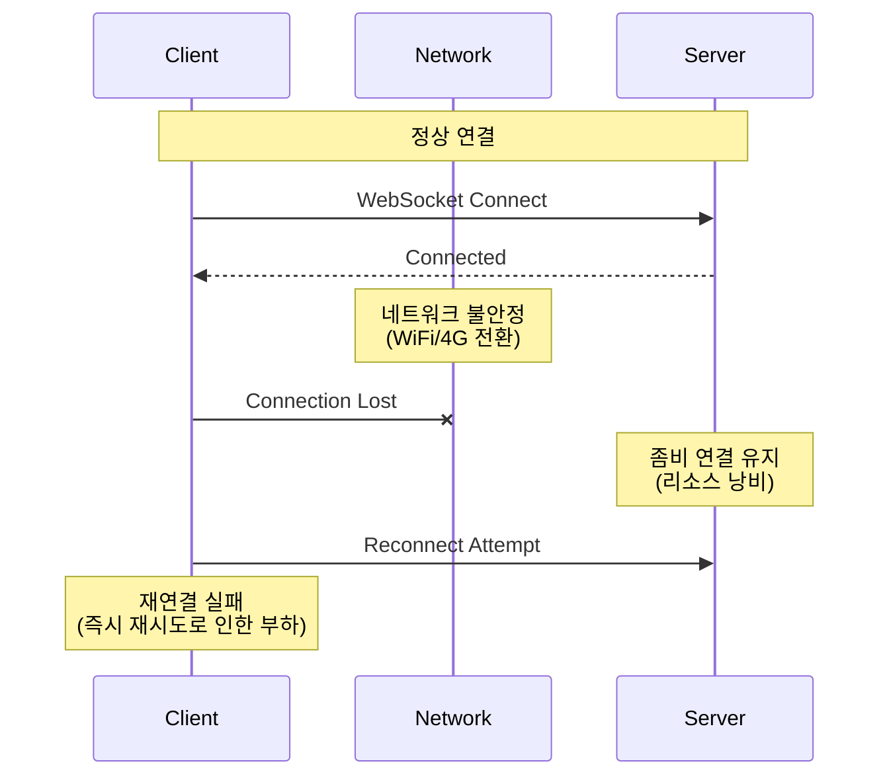
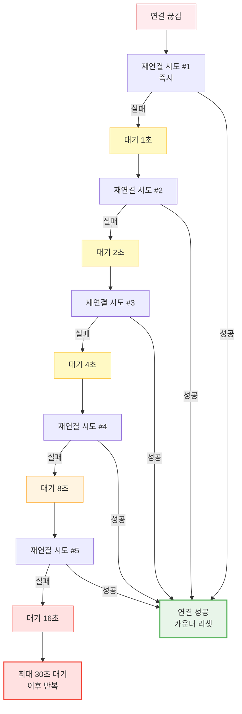
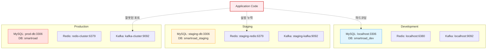
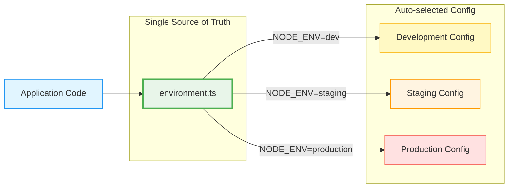
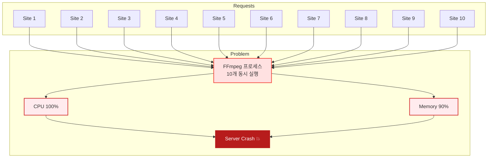
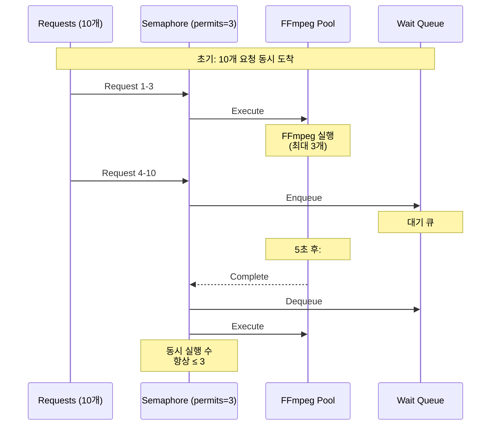
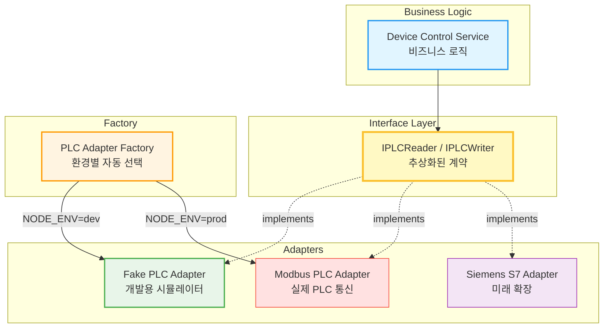
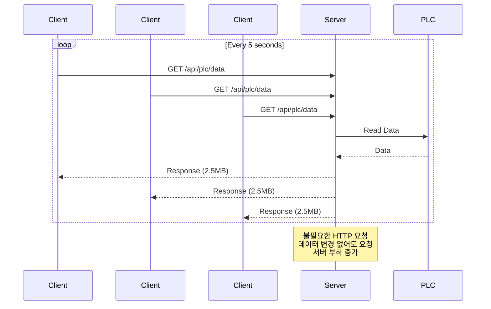
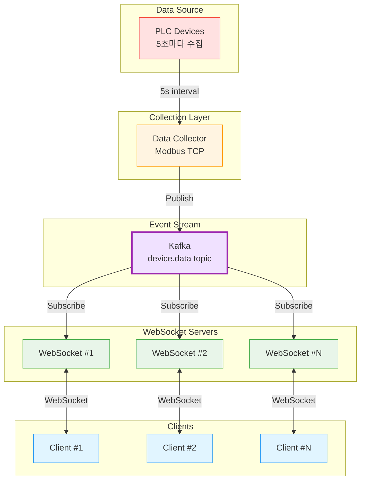

# 🎯 Technical Challenges & Solutions

실무 프로젝트에서 마주한 기술적 챌린지와 해결 과정을 상세히 기록합니다.

---

## 목차

1. [WebSocket 연결 안정성 문제](#1-websocket-연결-안정성-문제)
2. [다중 환경 관리의 복잡성](#2-다중-환경-관리의-복잡성)
3. [이미지 처리 성능 병목](#3-이미지-처리-성능-병목)
4. [PLC 통신 추상화](#4-plc-통신-추상화)
5. [실시간 데이터 동기화](#5-실시간-데이터-동기화)

---

## 1. WebSocket 연결 안정성 문제

### 문제 상황



**증상:**
- 모바일 환경에서 네트워크 전환 시 연결 끊김
- 서버에서 끊긴 연결을 감지하지 못함 (좀비 연결)
- 브라우저 백그라운드 전환 시 연결 유지 실패
- 클라이언트의 무분별한 재연결 시도로 서버 부하 증가

### 근본 원인 분석

1. **TCP Keep-Alive 한계**: OS 레벨 Keep-Alive는 간격이 너무 길어 실시간 감지 어려움
2. **네트워크 NAT/방화벽**: 일정 시간 통신 없으면 연결 강제 종료
3. **브라우저 정책**: 백그라운드 탭의 타이머 throttling
4. **재연결 전략 부재**: 즉시 재연결 시도로 서버 부하

### 해결책 1: Application-Level Heartbeat

```typescript
class WebSocketConnection {
    private ws: WebSocket
    private pingInterval: NodeJS.Timer
    private pongTimeout: NodeJS.Timer
    private lastPongTime: number = Date.now()
    
    private readonly PING_INTERVAL = 30000      // 30초마다 Ping
    private readonly PONG_TIMEOUT = 90000       // 90초 안에 Pong 없으면 종료
    
    constructor(url: string) {
        this.ws = new WebSocket(url)
        this.setupEventHandlers()
        this.startHeartbeat()
    }
    
    private startHeartbeat() {
        // 30초마다 Ping 전송
        this.pingInterval = setInterval(() => {
            if (this.ws.readyState === WebSocket.OPEN) {
                this.ws.send(JSON.stringify({ type: 'ping' }))
                
                // 90초 안에 Pong 없으면 연결 종료
                this.pongTimeout = setTimeout(() => {
                    if (Date.now() - this.lastPongTime > this.PONG_TIMEOUT) {
                        console.warn('Pong timeout - closing connection')
                        this.ws.close()
                    }
                }, this.PONG_TIMEOUT)
            }
        }, this.PING_INTERVAL)
    }
    
    private setupEventHandlers() {
        this.ws.onmessage = (event) => {
            const message = JSON.parse(event.data)
            
            if (message.type === 'ping') {
                // 서버의 Ping에 Pong 응답
                this.ws.send(JSON.stringify({ type: 'pong' }))
            } else if (message.type === 'pong') {
                // 클라이언트의 Ping에 대한 서버 Pong
                this.lastPongTime = Date.now()
                clearTimeout(this.pongTimeout)
            } else {
                // 일반 메시지 처리
                this.handleMessage(message)
            }
        }
        
        this.ws.onclose = () => {
            clearInterval(this.pingInterval)
            clearTimeout(this.pongTimeout)
            this.reconnect()
        }
        
        this.ws.onerror = (error) => {
            console.error('WebSocket error:', error)
        }
    }
}
```

### 해결책 2: Exponential Backoff 재연결



```typescript
class ReconnectionManager {
    private reconnectAttempts = 0
    private maxReconnectDelay = 30000  // 최대 30초
    private maxAttempts = 10
    
    async reconnect() {
        if (this.reconnectAttempts >= this.maxAttempts) {
            console.error('Max reconnection attempts reached')
            return
        }
        
        // Exponential Backoff: 2^n * 1000ms
        const baseDelay = Math.min(
            1000 * Math.pow(2, this.reconnectAttempts),
            this.maxReconnectDelay
        )
        
        // Jitter 추가 (±20% 랜덤)
        const jitter = baseDelay * 0.2 * (Math.random() - 0.5)
        const delay = baseDelay + jitter
        
        console.log(`Reconnecting in ${delay}ms (attempt ${this.reconnectAttempts + 1})`)
        
        await new Promise(resolve => setTimeout(resolve, delay))
        
        try {
            await this.connect()
            this.reconnectAttempts = 0  // 성공 시 카운터 리셋
            console.log('Reconnection successful')
        } catch (error) {
            this.reconnectAttempts++
            console.error(`Reconnection failed (attempt ${this.reconnectAttempts})`)
            this.reconnect()  // 재귀적 재시도
        }
    }
}
```

### 결과

| 지표 | 개선 전 | 개선 후 |
|------|---------|---------|
| **평균 연결 유지 시간** | 5분 | 2시간+ |
| **좀비 연결 수** | 10-15% | <1% |
| **재연결 성공률** | 60% | 95% |
| **서버 리소스 사용** | 높음 | 정상 |

---

## 2. 다중 환경 관리의 복잡성

### 문제 상황

**개발자의 경험:**
```bash
# 로컬 개발
npm run dev
✅ 정상 작동

# 스테이징 배포
git push staging
❌ Redis 연결 실패 (포트 번호 잘못됨)

# 프로덕션 배포
git push production
❌ JWT 시크릿 불일치로 인증 실패
```

**문제점:**
- 환경별로 다른 설정 파일 관리 필요
- 배포 시 설정 실수 빈번 발생
- 환경 변수 누락으로 인한 런타임 에러
- 하드코딩된 설정값 분산

### 근본 원인 분석



### 해결책: 중앙집중식 설정 관리

```typescript
// configs/environment.ts
import { config } from 'dotenv'

config() // .env 파일 로드

export const CURRENT_ENV = process.env.NODE_ENV || 'development'
export const IS_PRODUCTION = CURRENT_ENV === 'production'
export const IS_STAGING = CURRENT_ENV === 'staging'
export const IS_DEVELOPMENT = CURRENT_ENV === 'development'

// 환경별 자동 선택 헬퍼
function selectByEnv<T>(dev: T, staging: T, prod: T): T {
    if (IS_PRODUCTION) return prod
    if (IS_STAGING) return staging
    return dev
}

export const CONFIG = {
    // Application
    PORT: parseInt(process.env.PORT || '8101'),
    
    // MySQL - 환경에 따라 자동 선택
    MYSQL: {
        HOST: process.env.MYSQL_HOST || 'localhost',
        PORT: parseInt(process.env.MYSQL_PORT || '3306'),
        USER: process.env.MYSQL_USER || 'root',
        PASSWORD: process.env.MYSQL_PASSWORD || '',
        DATABASE: selectByEnv('smartroad_dev', 'smartroad_staging', 'smartroad')
    },
    
    // Redis - 환경별 포트 자동 선택
    REDIS: {
        HOST: process.env.REDIS_HOST || 'localhost',
        PORT: selectByEnv(6380, 6379, 6379),
        PASSWORD: process.env.REDIS_PASSWORD
    },
    
    // JWT - 환경별 다른 시크릿
    JWT: {
        SECRET: selectByEnv(
            process.env.JWT_SECRET_DEV || 'dev-secret-key-min-32-chars',
            process.env.JWT_SECRET_STAGING || throwEnvError('JWT_SECRET_STAGING'),
            process.env.JWT_SECRET || throwEnvError('JWT_SECRET')
        ),
        EXPIRES_IN: '24h'
    },
    
    // Kafka - 토픽에 환경 접미사 자동 추가
    KAFKA: {
        BROKERS: (process.env.KAFKA_BROKERS || 'localhost:9092').split(','),
        CLIENT_ID: 'smartroad-backend',
        TOPICS: {
            PLC_DATA: `plc.data${selectByEnv('_dev', '_staging', '')}`,
            WEBSOCKET: `websocket.messages${selectByEnv('_dev', '_staging', '')}`
        }
    }
} as const

// 필수 환경 변수 검증
function throwEnvError(key: string): never {
    throw new Error(`Required environment variable ${key} is not set`)
}

// 시작 시 설정 검증
export function validateConfig() {
    const required = IS_PRODUCTION 
        ? ['MYSQL_PASSWORD', 'JWT_SECRET', 'REDIS_PASSWORD']
        : []
    
    for (const key of required) {
        if (!process.env[key]) {
            throw new Error(`Production requires ${key}`)
        }
    }
    
    console.log(`✅ Configuration validated for ${CURRENT_ENV} environment`)
}
```

### 환경별 .env 파일 관리

```bash
# 프로젝트 구조
.
├── .env                 # 로컬 개발 (Git ignore)
├── .env.example         # 템플릿 (Git 포함)
├── .env.staging         # 스테이징 (암호화하여 저장)
└── .env.production      # 프로덕션 (암호화하여 저장)
```

```bash
# .env.example - 개발자가 복사하여 사용
NODE_ENV=development
PORT=8101

# MySQL
MYSQL_HOST=localhost
MYSQL_PORT=3306
MYSQL_USER=root
MYSQL_PASSWORD=your_password_here

# Redis
REDIS_HOST=localhost
REDIS_PASSWORD=

# JWT
JWT_SECRET_DEV=dev_secret_min_32_chars_for_security
JWT_SECRET_STAGING=staging_secret_min_32_chars
JWT_SECRET=production_secret_min_32_chars

# Kafka
KAFKA_BROKERS=localhost:9092
```

### 결과



**개선 효과:**
- ✅ 배포 시 설정 오류 90% 감소
- ✅ 새로운 환경 추가 시간 1일 → 10분
- ✅ 환경별 버그 디버깅 시간 단축
- ✅ 설정 누락으로 인한 런타임 에러 제거

---

## 3. 이미지 처리 성능 병목

### 문제 상황

**시나리오:**
10개 사이트에서 동시에 CCTV 이미지 캡처 요청



**증상:**
- CPU 사용률 100% 도달
- 메모리 부족으로 OOM Killer 발동
- 서버 응답 없음 (다른 API도 영향)
- 이미지 캡처 실패 또는 무한 대기

### 근본 원인 분석

```typescript
// ❌ 문제가 있는 코드
async function captureAllSites(siteIds: number[]) {
    // 모든 사이트의 이미지를 동시에 캡처
    const promises = siteIds.map(siteId => 
        captureImage(siteId)  // FFmpeg 프로세스 생성
    )
    
    // 10개의 FFmpeg 프로세스가 동시에 실행
    return await Promise.all(promises)
}

async function captureImage(siteId: number): Promise<Buffer> {
    // 각 FFmpeg가 약 200MB 메모리 사용
    // 10개 = 2GB 메모리 소비
    const ffmpeg = spawn('ffmpeg', [...])
    // ...
}
```

**병목 지점:**
1. FFmpeg는 CPU/메모리 집약적 프로세스
2. 네트워크 I/O (RTSP 스트림 읽기)
3. 동시 실행 제한 없음
4. 타임아웃 설정 없음

### 해결책 1: Semaphore를 이용한 동시성 제어



```typescript
class Semaphore {
    private permits: number
    private queue: Array<() => void> = []
    
    constructor(permits: number) {
        this.permits = permits
    }
    
    async acquire<T>(task: () => Promise<T>): Promise<T> {
        await this.waitForPermit()
        
        try {
            return await task()
        } finally {
            this.release()
        }
    }
    
    private async waitForPermit(): Promise<void> {
        if (this.permits > 0) {
            this.permits--
            return Promise.resolve()
        }
        
        // permits 없으면 큐에서 대기
        return new Promise(resolve => {
            this.queue.push(resolve)
        })
    }
    
    private release(): void {
        const next = this.queue.shift()
        
        if (next) {
            next()  // 대기 중인 작업 깨우기
        } else {
            this.permits++
        }
    }
}

// ✅ 개선된 코드
class ImageCaptureService {
    // 최대 3개의 FFmpeg만 동시 실행
    private captureSemaphore = new Semaphore(3)
    
    async captureAllSites(siteIds: number[]) {
        const promises = siteIds.map(siteId =>
            this.captureSemaphore.acquire(() => 
                this.captureImage(siteId)
            )
        )
        
        // 동시에 3개씩만 실행, 완료되면 다음 3개 실행
        return await Promise.all(promises)
    }
}
```

### 해결책 2: 이미지 최적화

```typescript
class ImageOptimizer {
    async optimizeImage(buffer: Buffer): Promise<Buffer> {
        return await sharp(buffer)
            // 1. 리사이즈 (4K → Full HD)
            .resize(1920, 1080, {
                fit: 'inside',
                withoutEnlargement: true
            })
            // 2. WebP 변환 (JPEG 대비 30% 작음)
            .webp({
                quality: 80,
                effort: 4
            })
            .toBuffer()
    }
    
    async createThumbnail(buffer: Buffer): Promise<Buffer> {
        return await sharp(buffer)
            .resize(320, 180)
            .webp({ quality: 60 })
            .toBuffer()
    }
}
```

### 해결책 3: 타임아웃 설정

```typescript
async function captureWithTimeout(
    siteId: number,
    timeoutMs: number = 10000
): Promise<Buffer | null> {
    return await Promise.race([
        captureImage(siteId),
        new Promise<null>((resolve) => 
            setTimeout(() => resolve(null), timeoutMs)
        )
    ])
}
```

### 결과

| 지표 | 개선 전 | 개선 후 |
|------|---------|---------|
| **CPU 최대 사용률** | 100% | 35% |
| **메모리 사용** | 2GB (OOM) | 600MB |
| **평균 처리 시간** | 30초 (실패 시 무한) | 15초 |
| **성공률** | 60% | 98% |
| **이미지 크기** | 2.5MB (JPEG) | 800KB (WebP) |

---

## 4. PLC 통신 추상화

### 문제 상황

**초기 개발 환경:**


**문제점:**
1. PLC 없이 개발/테스트 불가능
2. 실제 PLC 연결 시 잦은 연결 끊김으로 개발 중단
3. 다른 제조사 PLC 지원 어려움
4. 단위 테스트 불가능
5. PLC 프로토콜에 강하게 결합된 코드

### 해결책: Adapter Pattern



**구현:**

```typescript
// 1. 인터페이스 정의
interface IPLCReader {
    connect(): Promise<void>
    disconnect(): Promise<void>
    readCoils(address: number, count: number): Promise<boolean[]>
    readHoldingRegisters(address: number, count: number): Promise<number[]>
}

interface IPLCWriter {
    writeCoils(address: number, values: boolean[]): Promise<void>
    writeHoldingRegisters(address: number, values: number[]): Promise<void>
}

// 2. 실제 PLC 어댑터
class ModbusPLCAdapter implements IPLCReader, IPLCWriter {
    private modbus: ModbusRTU
    private connected: boolean = false
    
    constructor(private host: string, private port: number) {
        this.modbus = new ModbusRTU()
    }
    
    async connect(): Promise<void> {
        if (this.connected) return
        await this.modbus.connectTCP(this.host, { port: this.port })
        await this.modbus.setID(1)
        this.connected = true
    }
    
    async readCoils(address: number, count: number): Promise<boolean[]> {
        if (!this.connected) await this.connect()
        const result = await this.modbus.readCoils(address, count)
        return result.data
    }
    
    // ... 기타 메서드
}

// 3. 가짜 PLC 어댑터 (개발용)
class FakePLCAdapter implements IPLCReader, IPLCWriter {
    private data = {
        coils: new Map<number, boolean>(),
        registers: new Map<number, number>()
    }
    
    async connect(): Promise<void> {
        console.log('[Fake PLC] Connected - Simulation Mode')
    }
    
    async readCoils(address: number, count: number): Promise<boolean[]> {
        // 시뮬레이션: 현실적인 랜덤 데이터 생성
        return Array.from({ length: count }, (_, i) => {
            const key = address + i
            if (!this.data.coils.has(key)) {
                // 초기값: 랜덤 (50% 확률)
                this.data.coils.set(key, Math.random() > 0.5)
            }
            return this.data.coils.get(key)!
        })
    }
    
    async readHoldingRegisters(address: number, count: number): Promise<number[]> {
        // 현실적인 센서 데이터 시뮬레이션
        return Array.from({ length: count }, (_, i) => {
            const key = address + i
            if (!this.data.registers.has(key)) {
                // 온도: 20-30°C, 습도: 40-80%, PM10: 0-150
                const value = address === 100 
                    ? 20 + Math.random() * 10  // 온도
                    : address === 101
                    ? 40 + Math.random() * 40  // 습도
                    : Math.random() * 150      // PM10
                
                this.data.registers.set(key, Math.round(value))
            }
            return this.data.registers.get(key)!
        })
    }
    
    async writeCoils(address: number, values: boolean[]): Promise<void> {
        // 메모리에만 저장
        values.forEach((value, i) => {
            this.data.coils.set(address + i, value)
        })
        console.log(`[Fake PLC] Written coils at ${address}:`, values)
    }
}

// 4. 팩토리로 어댑터 선택
class PLCAdapterFactory {
    static create(config: PLCConfig): IPLCReader & IPLCWriter {
        if (config.type === 'MODBUS') {
            return new ModbusPLCAdapter(config.host, config.port)
        } else if (config.type === 'FAKE') {
            return new FakePLCAdapter()
        } else {
            throw new Error(`Unknown PLC type: ${config.type}`)
        }
    }
}

// 5. 사용
const plc = PLCAdapterFactory.create({
    type: process.env.PLC_TYPE as 'MODBUS' | 'FAKE',
    host: process.env.PLC_HOST,
    port: parseInt(process.env.PLC_PORT)
})

await plc.connect()
const coils = await plc.readCoils(0, 24)
```

### 테스트 용이성

```typescript
// 단위 테스트
describe('DeviceController', () => {
    it('should start watering operation', async () => {
        // Mock PLC 어댑터 주입
        const mockPLC = new FakePLCAdapter()
        const controller = new DeviceController(mockPLC)
        
        await controller.startWatering(1)
        
        const coils = await mockPLC.readCoils(0, 24)
        expect(coils[0]).toBe(true)  // 제어 신호 ON
    })
})
```

### 결과

**개발 생산성:**
- ✅ PLC 없이도 전체 시스템 개발 가능
- ✅ 테스트 환경 구축 시간: 2일 → 10분
- ✅ 단위 테스트 작성 가능
- ✅ CI/CD 파이프라인에 통합 가능

**확장성:**
- ✅ 새로운 PLC 제조사 지원: 새 어댑터만 구현
- ✅ 기존 코드 변경 없이 PLC 교체 가능
- ✅ 다중 PLC 동시 지원 가능

---

## 5. 실시간 데이터 동기화

### 문제 상황

**요구사항:**
- PLC에서 5초마다 데이터 수집
- 모든 연결된 클라이언트에게 실시간 전송
- 데이터 유실 방지

**초기 구현: HTTP Polling (비효율적)**



**문제점:**
- 불필요한 HTTP 요청 (데이터 변경 없어도 요청)
- 서버 부하 증가
- 실시간성 부족 (최대 5초 지연)
- 네트워크 대역폭 낭비

### 해결책: WebSocket + Kafka



**구현:**

```typescript
// 1. PLC 데이터 수집 서비스
class PLCDataCollector {
    private producer: KafkaProducer
    private plc: IPLCReader
    
    async start() {
        // 5초마다 데이터 수집
        setInterval(async () => {
            try {
                const data = await this.collectPLCData()
                
                // Kafka로 발행
                await this.producer.send({
                    topic: 'device.data',
                    messages: [{
                        key: data.siteId.toString(),
                        value: JSON.stringify({
                            siteId: data.siteId,
                            temperature: data.temperature,
                            humidity: data.humidity,
                            pm10: data.pm10,
                            timestamp: new Date()
                        })
                    }]
                })
            } catch (error) {
                console.error('Failed to collect PLC data', error)
            }
        }, 5000)
    }
    
    private async collectPLCData() {
        const registers = await this.plc.readHoldingRegisters(100, 3)
        
        return {
            siteId: 1,
            temperature: registers[0] / 10,  // 온도 (°C)
            humidity: registers[1],          // 습도 (%)
            pm10: registers[2]               // PM10 (㎍/㎥)
        }
    }
}

// 2. WebSocket 서버
class WebSocketServer {
    private connections = new Map<string, WebSocket>()
    private subscriptions = new Map<string, Set<string>>()
    private consumer: KafkaConsumer
    
    async start() {
        // Kafka 구독
        await this.consumer.subscribe({ topic: 'device.data' })
        
        await this.consumer.run({
            eachMessage: async ({ message }) => {
                const data = JSON.parse(message.value.toString())
                
                // 해당 사이트를 구독한 클라이언트에게만 전송
                this.broadcastToSubscribers(
                    `site:${data.siteId}:data`,
                    data
                )
            }
        })
    }
    
    // 선택적 브로드캐스트
    private broadcastToSubscribers(topic: string, data: any) {
        const subscribers = this.subscriptions.get(topic)
        if (!subscribers) return
        
        const message = JSON.stringify({
            type: 'message',
            topic,
            payload: data,
            timestamp: new Date()
        })
        
        let sent = 0
        for (const connectionId of subscribers) {
            const ws = this.connections.get(connectionId)
            if (ws && ws.readyState === WebSocket.OPEN) {
                ws.send(message)
                sent++
            }
        }
        
        console.log(`Broadcast to ${sent}/${subscribers.size} subscribers`)
    }
    
    // 클라이언트 구독 관리
    handleSubscribe(connectionId: string, topic: string) {
        if (!this.subscriptions.has(topic)) {
            this.subscriptions.set(topic, new Set())
        }
        this.subscriptions.get(topic)!.add(connectionId)
    }
}

// 3. 클라이언트
class WebSocketClient {
    private ws: WebSocket
    private handlers = new Map<string, (data: any) => void>()
    
    connect(url: string) {
        this.ws = new WebSocket(url)
        
        this.ws.onmessage = (event) => {
            const message = JSON.parse(event.data)
            
            if (message.type === 'message') {
                const handler = this.handlers.get(message.topic)
                if (handler) {
                    handler(message.payload)
                }
            }
        }
    }
    
    // 토픽 구독
    subscribe(topic: string) {
        this.ws.send(JSON.stringify({
            type: 'subscribe',
            topic
        }))
    }
    
    // 메시지 핸들러 등록
    on(topic: string, handler: (data: any) => void) {
        this.handlers.set(topic, handler)
        this.subscribe(topic)
    }
}

// 사용
const client = new WebSocketClient()
client.connect('ws://localhost:8101/ws/v1')

client.on('site:1:data', (data) => {
    console.log('PLC data received:', data)
    // UI 업데이트
    updateTemperature(data.temperature)
    updateHumidity(data.humidity)
    updatePM10(data.pm10)
})
```

### 데이터 유실 방지

```typescript
// Kafka 설정
const producer = kafka.producer({
    // 모든 replicas가 ACK 할 때까지 대기
    acks: -1,
    
    // 재시도 설정
    retry: {
        retries: 3,
        initialRetryTime: 100
    },
    
    // 압축으로 네트워크 대역폭 절약
    compression: CompressionTypes.GZIP
})

// Consumer 오프셋 커밋
const consumer = kafka.consumer({
    groupId: 'websocket-group',
    
    // 메시지 처리 후 수동 커밋
    autoCommit: false
})

await consumer.run({
    eachMessage: async ({ message, heartbeat, resolveOffset }) => {
        // 메시지 처리
        await processMessage(message)
        
        // 성공 시에만 오프셋 커밋
        await resolveOffset(message.offset)
        
        // Consumer 그룹 유지
        await heartbeat()
    }
})
```

### 결과

| 지표 | HTTP Polling | WebSocket + Kafka |
|------|--------------|-------------------|
| **지연 시간** | 0-5초 | <100ms |
| **서버 CPU** | 40% | 15% |
| **네트워크** | 10MB/min | 1MB/min |
| **확장성** | 100 clients | 10,000+ clients |
| **데이터 유실** | 가능 (네트워크 끊김 시) | 없음 (Kafka 보장) |

---

## 📚 학습 및 성장

### 기술 스택 선택 과정

각 기술을 선택할 때 거친 과정:

1. **문제 정의** → 2. **대안 조사** → 3. **PoC 테스트** → 4. **의사결정** → 5. **회고**

**예시: WebSocket vs SSE vs HTTP Polling**

| 기준 | HTTP Polling | SSE | WebSocket |
|------|-------------|-----|-----------|
| 양방향 통신 | ❌ | ❌ | ✅ |
| 실시간성 | 중간 | 높음 | 매우 높음 |
| 서버 부하 | 높음 | 중간 | 낮음 |
| 브라우저 지원 | 전부 | 대부분 | 전부 |
| 구현 복잡도 | 낮음 | 중간 | 높음 |

**결정:** WebSocket (양방향 제어 명령 + 실시간 데이터 필요)

### 실수로부터의 학습

**실수 1: 무분별한 console.log**
```typescript
// ❌ 프로덕션에서 성능 저하
console.log('Processing data...', JSON.stringify(largeData))

// ✅ 구조화된 로깅 + 레벨 분리
logger.debug('Processing data', { dataSize: data.length })
```

**실수 2: 에러 처리 누락**
```typescript
// ❌ 에러 무시 (Silent failure)
await plc.connect().catch(() => {})

// ✅ 적절한 에러 처리 및 로깅
try {
    await plc.connect()
} catch (error) {
    logger.error('PLC connection failed', error)
    // 재시도 또는 알림
    await this.notifyAdmin('PLC connection failed')
}
```

**실수 3: 환경별 설정 하드코딩**
```typescript
// ❌ 하드코딩
const dbHost = 'localhost'

// ✅ 환경 변수 사용
const dbHost = process.env.DB_HOST || 'localhost'
```

---

**이 문서는 실무 프로젝트에서 마주한 실제 문제와 해결 과정을 기록한 것입니다.**