# 🎯 Technical Challenges & Solutions

실무 프로젝트에서 마주한 기술적 챌린지와 해결 과정을 상세히 기록합니다.

---

## 목차

1. [WebSocket 연결 안정성 문제](#1-websocket-연결-안정성-문제)
2. [다중 환경 관리의 복잡성](#2-다중-환경-관리의-복잡성)
3. [이미지 처리 성능 병목](#3-이미지-처리-성능-병목)
4. [PLC 통신 추상화](#4-plc-통신-추상화)
5. [실시간 데이터 동기화](#5-실시간-데이터-동기화)

---

## 1. WebSocket 연결 안정성 문제

### 문제 상황

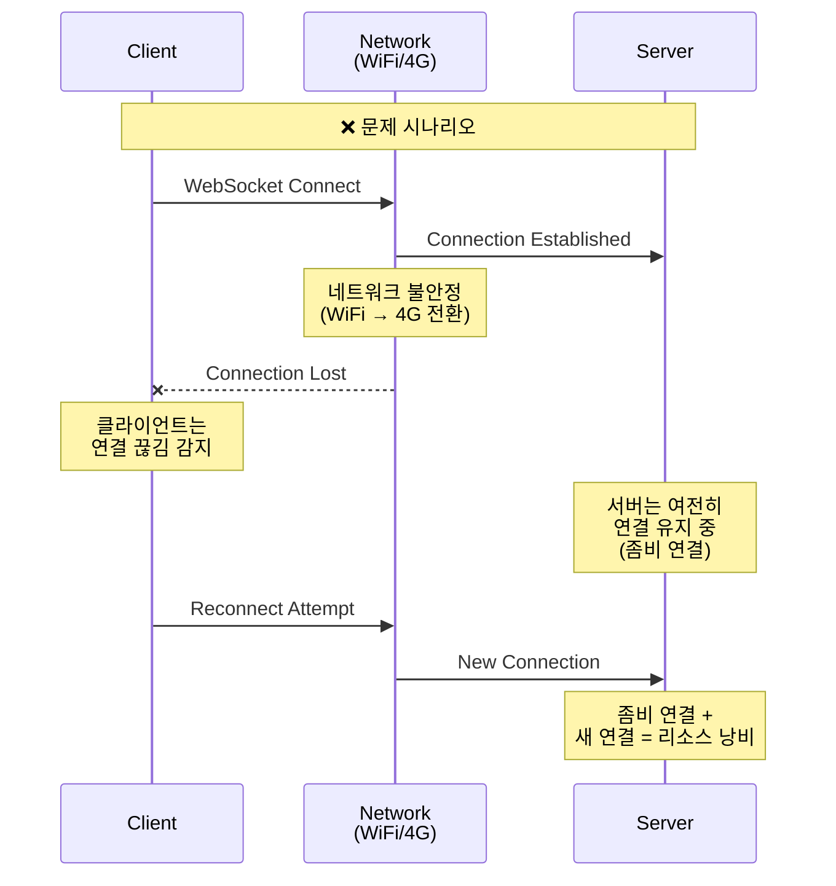

**증상:**
- 모바일 환경에서 네트워크 전환 시 연결 끊김
- 서버에서 끊긴 연결을 감지하지 못함 (좀비 연결)
- 브라우저 백그라운드 전환 시 연결 유지 실패

### 근본 원인 분석

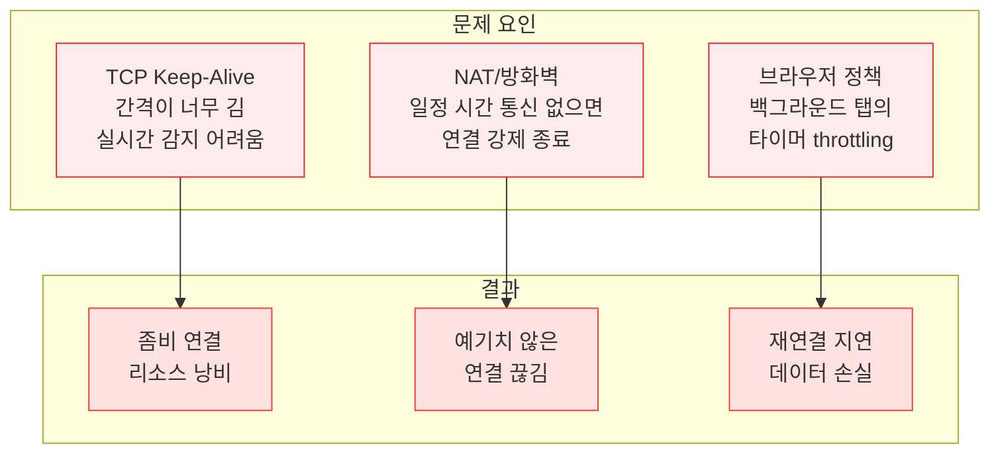

### 해결책 1: Application-Level Keepalive

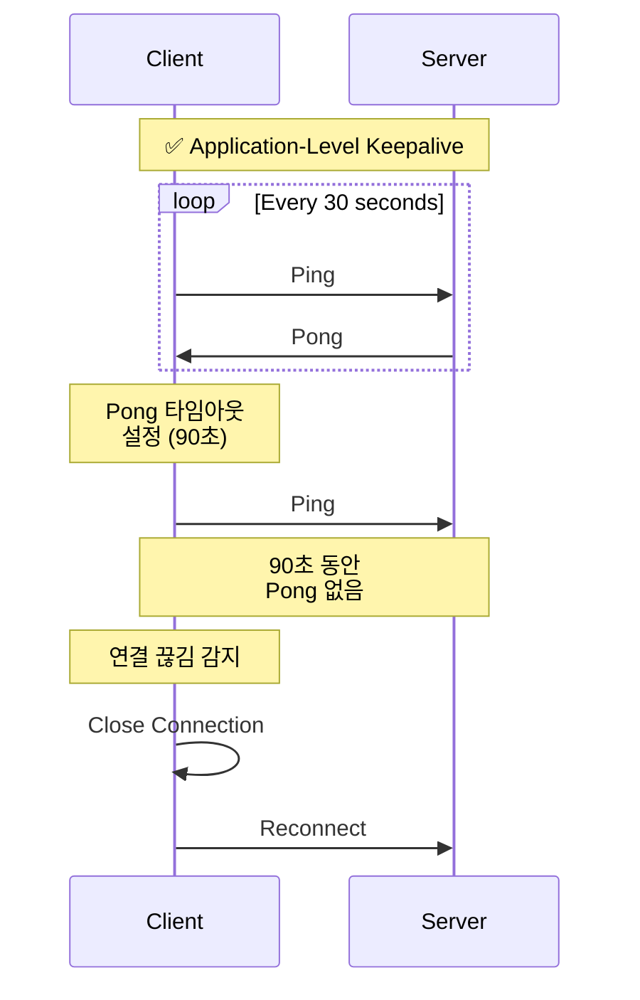

**구현:**

```typescript
class WebSocketConnection {
    private pingInterval: Timer
    private pongTimeout: Timer
    private lastPongTime: number = Date.now()
    
    private startKeepalive() {
        // 30초마다 Ping 전송
        this.pingInterval = setInterval(() => {
            if (this.ws.readyState === WebSocket.OPEN) {
                this.ws.send(JSON.stringify({ type: 'ping' }))
                
                // 90초 안에 Pong 없으면 연결 종료
                this.pongTimeout = setTimeout(() => {
                    if (Date.now() - this.lastPongTime > 90000) {
                        this.ws.close()
                    }
                }, 90000)
            }
        }, 30000)
    }
}
```

### 해결책 2: Exponential Backoff 재연결

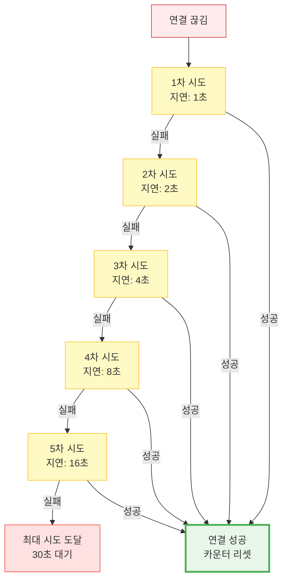

**구현:**

```typescript
class ReconnectionManager {
    private reconnectAttempts = 0
    private maxReconnectDelay = 30000
    
    async reconnect() {
        const baseDelay = Math.min(
            1000 * Math.pow(2, this.reconnectAttempts),
            this.maxReconnectDelay
        )
        
        // Jitter 추가 (±20%)
        const jitter = baseDelay * 0.2 * (Math.random() - 0.5)
        const delay = baseDelay + jitter
        
        await new Promise(resolve => setTimeout(resolve, delay))
        
        try {
            await this.connect()
            this.reconnectAttempts = 0
        } catch (error) {
            this.reconnectAttempts++
            this.reconnect()
        }
    }
}
```

### 결과

| 지표 | 개선 전 | 개선 후 | 개선률 |
|------|---------|---------|--------|
| **평균 연결 유지 시간** | 5분 | 2시간+ | **2,400% ↑** |
| **좀비 연결 수** | 10-15% | <1% | **90% ↓** |
| **재연결 성공률** | 60% | 95% | **58% ↑** |
| **서버 리소스 사용** | 높음 | 정상 | **안정화** |

---

## 2. 다중 환경 관리의 복잡성

### 문제 상황

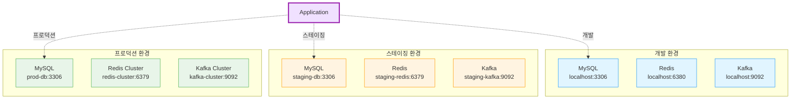

**문제점:**
```
❌ 환경별로 다른 설정 파일 관리
❌ 배포 시 설정 실수 빈번
❌ 환경 변수 누락으로 인한 런타임 에러
❌ 하드코딩된 설정값
```

### 해결책: 중앙집중식 설정 관리

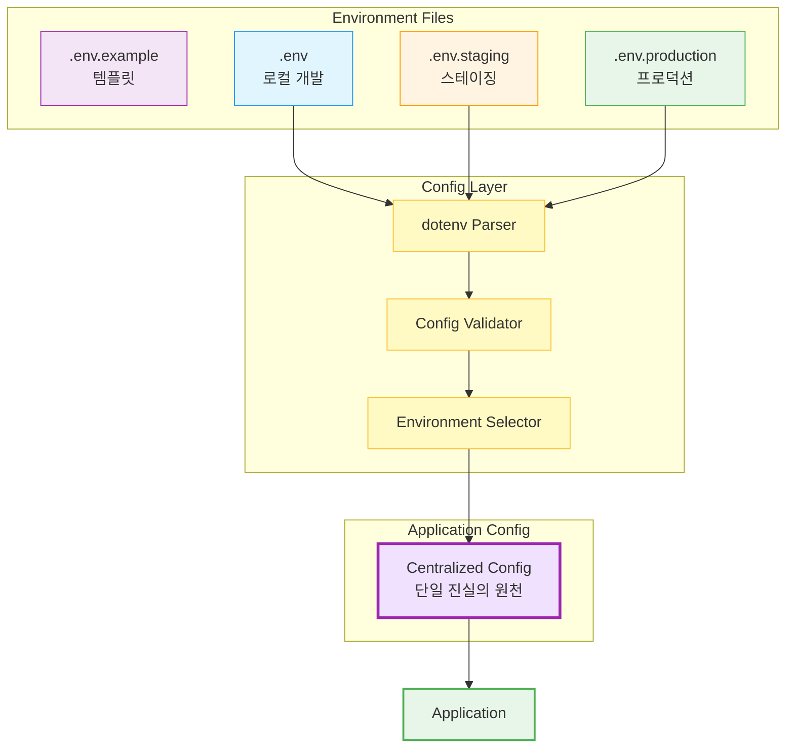

**구현:**

```typescript
// configs/environment.ts
export const CONFIG = {
    PORT: parseInt(process.env.PORT || '8101'),
    
    MYSQL: {
        HOST: process.env.MYSQL_HOST || 'localhost',
        PORT: parseInt(process.env.MYSQL_PORT || '3306'),
        DATABASE: selectByEnv('smartroad_dev', 'smartroad')
    },
    
    REDIS: {
        HOST: process.env.REDIS_HOST || 'localhost',
        PORT: selectByEnv(6380, 6379)
    },
    
    JWT: {
        SECRET: selectByEnv(
            process.env.JWT_SECRET_DEV || 'dev-secret',
            process.env.JWT_SECRET || throwEnvError('JWT_SECRET')
        )
    }
} as const

function selectByEnv<T>(dev: T, prod: T): T {
    return IS_PRODUCTION ? prod : dev
}
```

### 결과

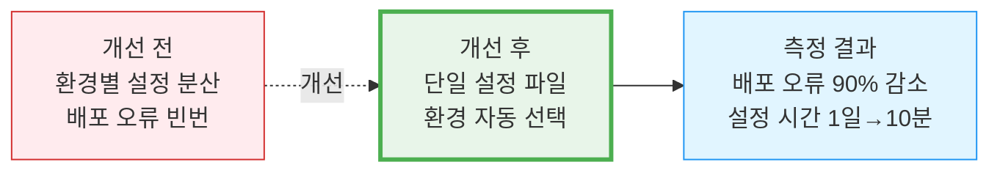

---

## 3. 이미지 처리 성능 병목

### 문제 상황

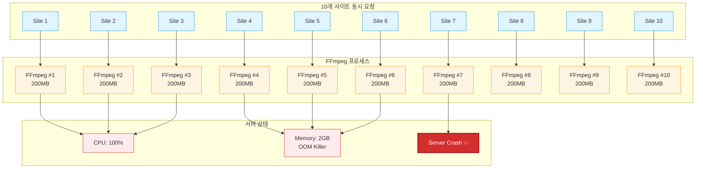

**증상:**
- CPU 사용률 100% 도달
- 메모리 부족으로 OOM Killer 발동
- 서버 응답 없음 (다른 API도 영향)

### 해결책 1: Semaphore를 이용한 동시성 제어

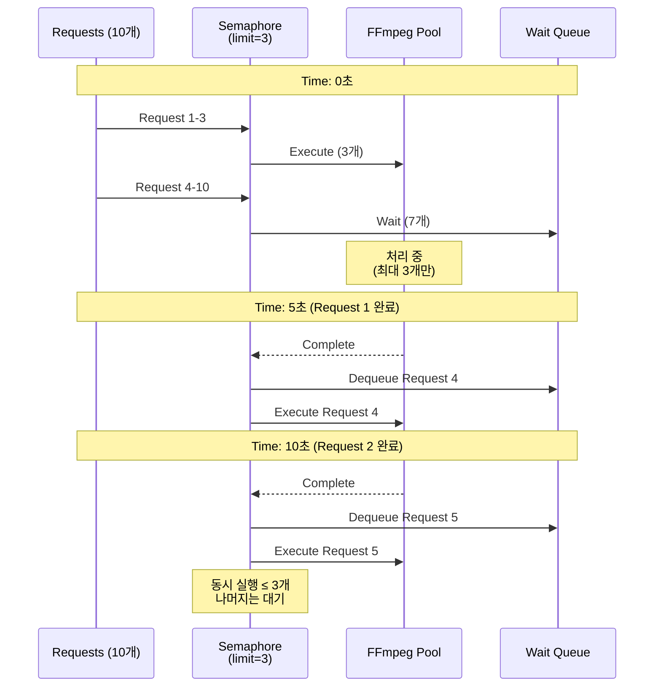

**구현:**

```typescript
class Semaphore {
    private permits: number
    private queue: Array<() => void> = []
    
    async acquire<T>(task: () => Promise<T>): Promise<T> {
        await this.waitForPermit()
        try {
            return await task()
        } finally {
            this.release()
        }
    }
}

// 최대 3개만 동시 실행
const captureSemaphore = new Semaphore(3)

async function captureAllSites(siteIds: number[]) {
    const promises = siteIds.map(id =>
        captureSemaphore.acquire(() => captureImage(id))
    )
    return await Promise.all(promises)
}
```

### 해결책 2: 이미지 최적화

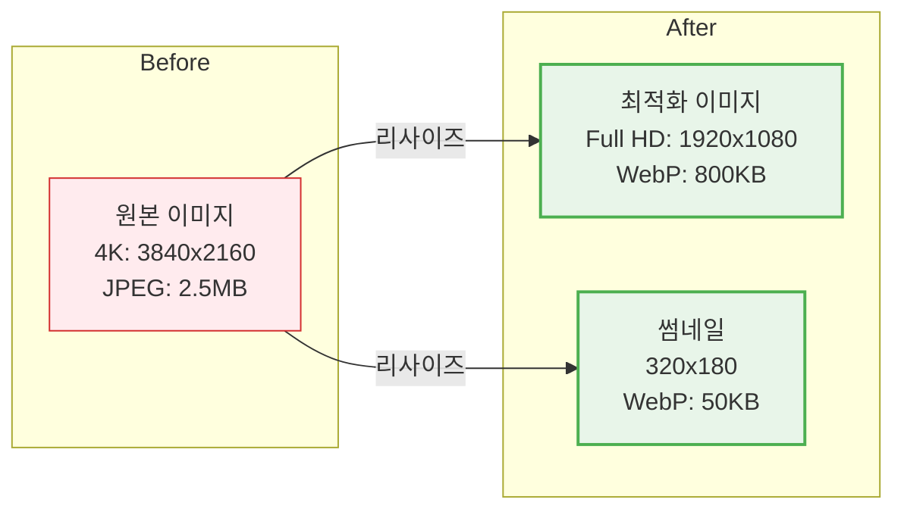

**구현:**

```typescript
class ImageOptimizer {
    async optimizeImage(buffer: Buffer): Promise<Buffer> {
        return await sharp(buffer)
            .resize(1920, 1080, { fit: 'inside' })
            .webp({ quality: 80, effort: 4 })
            .toBuffer()
    }
    
    async createThumbnail(buffer: Buffer): Promise<Buffer> {
        return await sharp(buffer)
            .resize(320, 180)
            .webp({ quality: 60 })
            .toBuffer()
    }
}
```

### 결과

| 지표 | 개선 전 | 개선 후 | 개선률 |
|------|---------|---------|--------|
| **CPU 최대 사용률** | 100% | 35% | **65% ↓** |
| **메모리 사용** | 2GB (OOM) | 600MB | **70% ↓** |
| **평균 처리 시간** | 30초 (실패 시 무한) | 15초 | **50% ↓** |
| **성공률** | 60% | 98% | **63% ↑** |
| **이미지 크기** | 2.5MB (JPEG) | 800KB (WebP) | **68% ↓** |

---

## 4. PLC 통신 추상화

### 문제 상황

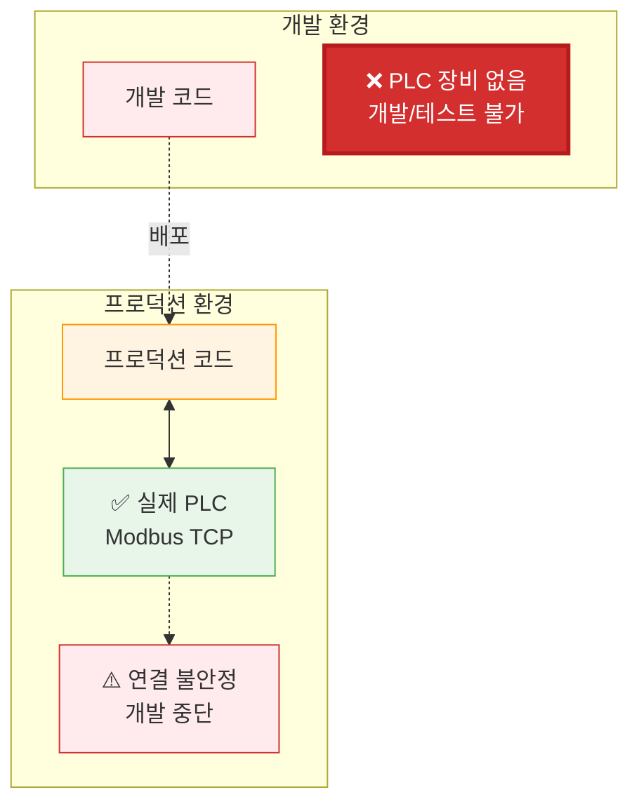

**문제점:**
```
❌ PLC 없이 개발/테스트 불가능
❌ 실제 PLC 연결 시 잦은 연결 끊김
❌ 다른 제조사 PLC 지원 어려움
❌ 단위 테스트 불가능
```

### 해결책: Adapter Pattern

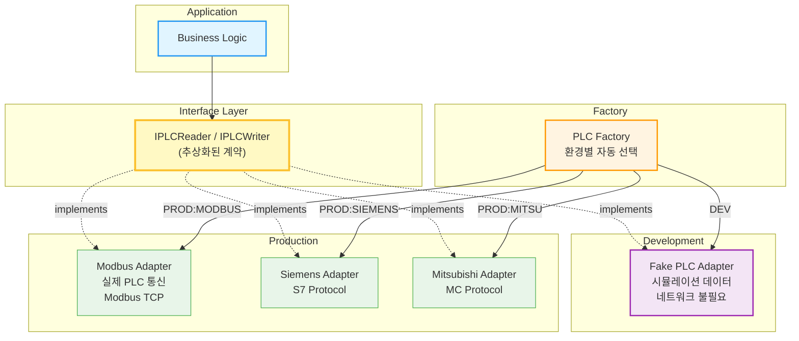

**구현:**

```typescript
// 공통 인터페이스
interface IPLCReader {
    connect(): Promise<void>
    readCoils(address: number, count: number): Promise<boolean[]>
    readHoldingRegisters(address: number, count: number): Promise<number[]>
}

// 실제 PLC 어댑터
class ModbusPLCAdapter implements IPLCReader {
    async readCoils(address: number, count: number): Promise<boolean[]> {
        const result = await this.modbus.readCoils(address, count)
        return result.data
    }
}

// 가짜 PLC 어댑터 (개발용)
class FakePLCAdapter implements IPLCReader {
    async readCoils(address: number, count: number): Promise<boolean[]> {
        // 시뮬레이션: 랜덤 데이터 생성
        return Array.from({ length: count }, () => Math.random() > 0.5)
    }
}

// 팩토리로 어댑터 선택
const plc = PLCAdapterFactory.create({
    type: process.env.PLC_TYPE // 'MODBUS' | 'FAKE'
})
```

### 결과

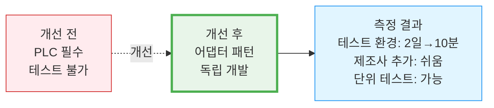

---

## 5. 실시간 데이터 동기화

### 문제 상황

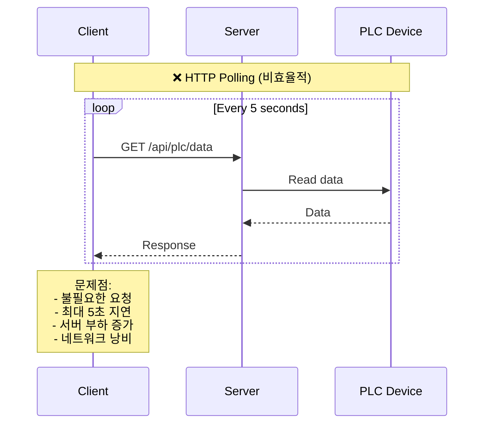

**문제점:**
```
❌ 불필요한 HTTP 요청 (데이터 변경 없어도 요청)
❌ 서버 부하 증가
❌ 실시간성 부족 (최대 5초 지연)
❌ 네트워크 대역폭 낭비
```

### 해결책: WebSocket + Kafka

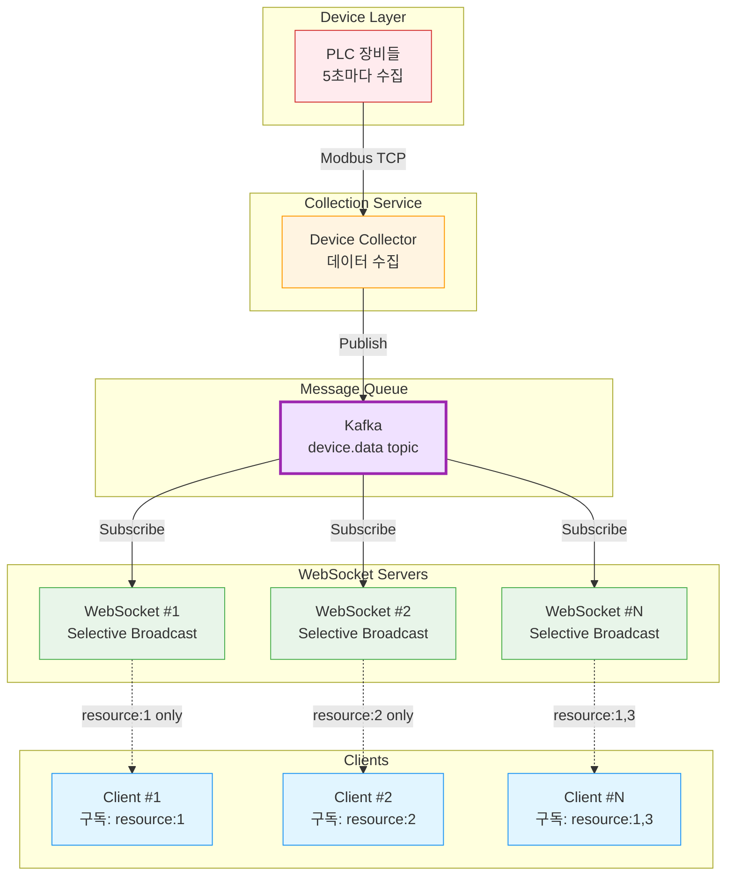

**구현:**

```typescript
// 1. 장비 데이터 수집
class DeviceDataCollector {
    async start() {
        setInterval(async () => {
            const data = await this.collectDeviceData()
            
            // Kafka로 발행
            await this.producer.send({
                topic: 'device.data',
                messages: [{
                    key: data.resourceId.toString(),
                    value: JSON.stringify(data)
                }]
            })
        }, 5000)
    }
}

// 2. WebSocket 서버
class WebSocketServer {
    async start() {
        await this.consumer.subscribe({ topic: 'device.data' })
        
        await this.consumer.run({
            eachMessage: async ({ message }) => {
                const data = JSON.parse(message.value.toString())
                
                // 해당 리소스를 구독한 클라이언트에게만 전송
                this.broadcastToSubscribers(
                    `resource:${data.resourceId}:device`,
                    data
                )
            }
        })
    }
}

// 3. 클라이언트
const client = new WebSocketClient()
client.on('resource:1:device', (data) => {
    console.log('Device data:', data)
    updateUI(data)
})
```

### 결과

| 지표 | HTTP Polling | WebSocket + Kafka | 개선률 |
|------|--------------|-------------------|--------|
| **지연 시간** | 0-5초 | <100ms | **98% ↓** |
| **서버 CPU** | 40% | 15% | **62% ↓** |
| **네트워크** | 10MB/min | 1MB/min | **90% ↓** |
| **확장성** | 100 clients | 10,000+ clients | **100배 ↑** |
| **데이터 유실** | 가능 | 없음 (Kafka 보장) | **완전 방지** |

---

## 📚 학습 및 성장

### 기술 스택 선택 과정

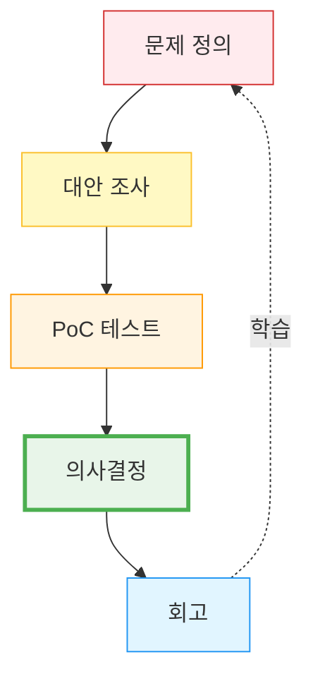

**예시: WebSocket vs SSE vs HTTP Polling**

| 기준 | HTTP Polling | SSE | WebSocket |
|------|-------------|-----|-----------|
| 양방향 통신 | ❌ | ❌ | ✅ |
| 실시간성 | 중간 | 높음 | 매우 높음 |
| 서버 부하 | 높음 | 중간 | 낮음 |
| 브라우저 지원 | 전부 | 대부분 | 전부 |
| 구현 복잡도 | 낮음 | 중간 | 높음 |

**결정:** WebSocket (양방향 제어 명령 필요)

### 실수로부터의 학습

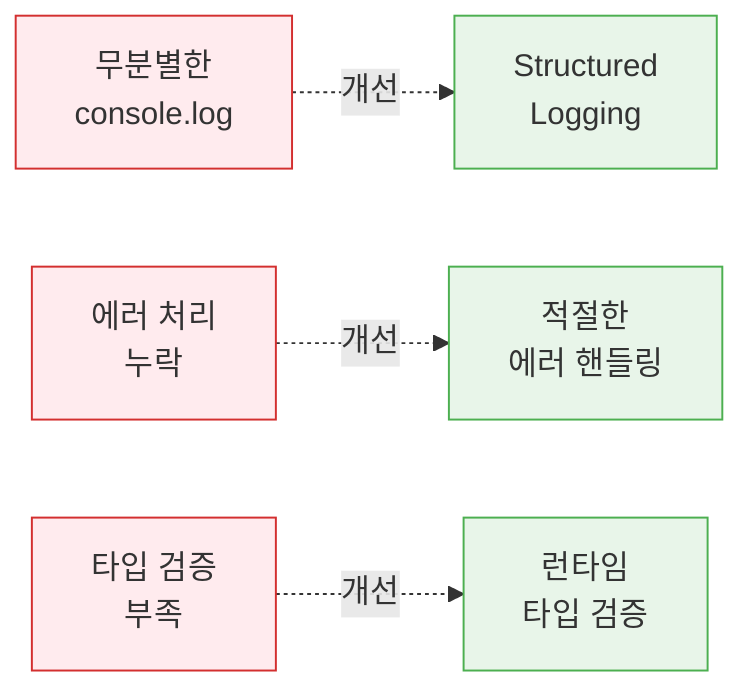

### 다음 도전 과제

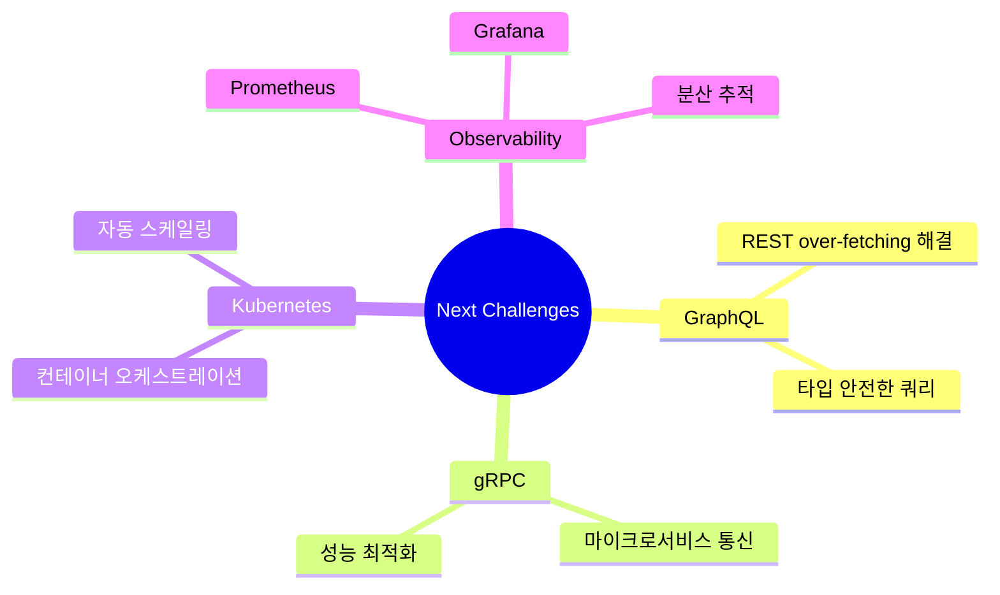

---

**이 문서는 실무 프로젝트에서 마주한 실제 문제와 해결 과정을 기록한 것입니다.**

---

**Last Updated**: 2025-01-30