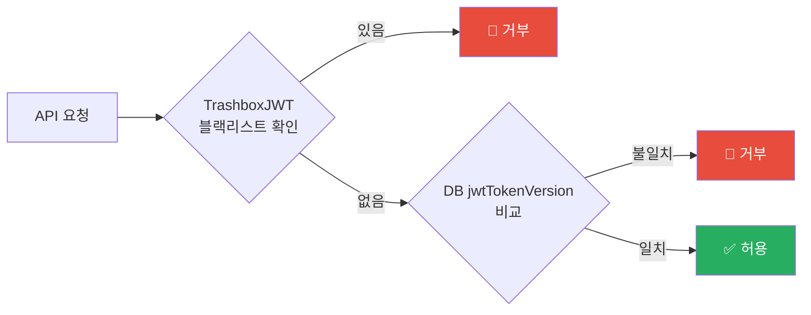
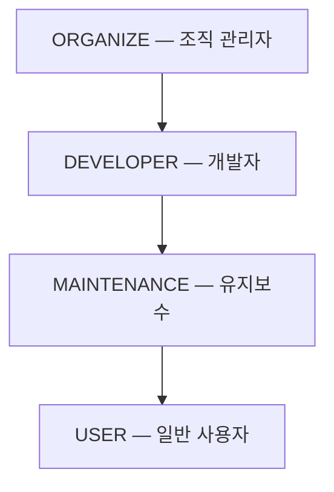
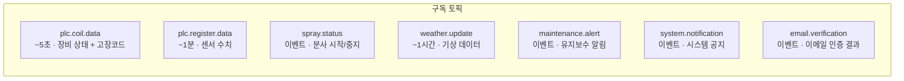

# API 계약 — Production IoT Backend

[← README](../README.md)

**Version**: 3.8.0 | **Last Updated**: 2026-03-04

---

## 📋 목차

1. [공통 규칙](#공통-규칙)
2. [API 그룹 구성](#api-그룹-구성)
3. [인증 구조](#인증-구조)
4. [에러 코드 체계](#에러-코드-체계)
5. [WebSocket 토픽 구성](#websocket-토픽-구성)
6. [버전별 주요 변경사항](#버전별-주요-변경사항)

---

## 공통 규칙

**HTTP Status는 항상 200입니다.** 응답 body의 `code` 필드로 성공/실패를 구분합니다.

- 성공: `{ "code": 0, "data": { ... } }`
- 실패: `{ "code": 에러코드 }`

**인증**: `Authorization: Bearer <JWT>` 헤더  
**JWT 구조**: `{ userid, role, version }` — HS512 서명, 단일 세션 정책

---

## API 그룹 구성

| 그룹 | 인증 필요 | 주요 역할 |
|------|---------|---------|
| **Auth API** | 일부 | 회원가입·로그인·로그아웃·비밀번호 관리·프로필 |
| **MFA API** | 일부 | TOTP 기반 2차 인증 설정·등록·검증 |
| **Admin API** | ✅ ORGANIZE | 소속 사용자 관리, API/MFA/에러/분사 로그 조회 |
| **CoolingRoad API** | ✅ USER | 사이트 조회, 분사 제어, 이력/날씨/센서 데이터 |
| **Maintenance API** | ✅ MAINTENANCE / ORGANIZE | 유지보수 이력 등록·조회 |
| **Notice API** | 일부 | 공지사항 조회·작성·수정 |
| **WebSocket** | ✅ | 실시간 센서·분사·날씨 데이터 스트리밍 |
| **Health Check** | ❌ | 서비스 상태 확인 (localhost 전용) |
| **CCTV 스트리밍** | ❌ Nginx | Nginx 직접 처리 — 백엔드 코드 없음 |
| **MinIO 프록시** | ❌ Nginx | Nginx 직접 처리 — 24h 캐시 |

---

## 인증 구조

### JWT 이중 무효화

로그아웃 즉시 무효화 (TrashboxJWT) + 새 로그인 시 기존 기기 세션 자동 만료 (jwtTokenVersion).

### RBAC 역할 계층

### MFA 흐름

로그인 후 MFA 활성화된 계정은 TOTP 2차 인증 필요.

- RFC 6238 기반 TOTP (30초 유효)
- 타이밍 공격 방지 (상수 시간 비교)
- 재시도 제한 (Redis 기반)

---

## 에러 코드 체계

### 인증 에러 (1xxx)

| code | 설명 |
|------|------|
| 1001 | 이메일 미인증 |
| 1002 | 비밀번호 불일치 |
| 1003 | 유효하지 않은 JWT |
| 1004 | 만료된 JWT |
| 1005 | 권한 없음 |
| 1006 | 정지된 계정 |
| 1007 | 허용되지 않는 이메일 도메인 |
| 1008 | 이미 가입된 계정 (v3.8.0 추가) |
| 1009 | 가입된 계정 없음 (v3.8.0 추가) |

### 요청 에러 (2xxx)

| code | 설명 |
|------|------|
| 2001 | 잘못된 요청 형식 |
| 2002 | 필수 파라미터 누락 |
| 2003 | 유효하지 않은 파라미터 |

### DB 에러 (11xxx) — v3.8.0 분화

| code | 설명 |
|------|------|
| 11000 | DB 쿼리 자체 실패 |
| 11001 | owned_group 미설정 |
| 11010 | 쿼리 성공 + 빈 배열 |
| 11011 | 소속 관리 사용자 없음 |
| 11012 | 소속 관리 사이트 없음 |

**프론트엔드 처리 분기 원칙:**

- `11000` → 서버 오류 메시지 + 재시도 유도
- `11010` → 빈 상태 UI (데이터 없음)
- `11011` → 빈 상태 UI (관리 사용자 없음)
- `11012` → 빈 상태 UI (등록된 사이트 없음)

**설계 의도**: `11000`은 실제 DB 장애에만 사용. 데이터 없음과 장애를 프론트엔드에서 구분 처리 가능하도록 v3.8.0에서 분화.

---

## WebSocket 토픽 구성

- 연결 시 `subscribe` 메시지로 토픽 선택적 구독
- 사이트 소유 그룹 기반 라우팅 — 다른 그룹의 데이터는 수신되지 않음
- Ping/Pong keepalive (30초 간격, 90초 타임아웃)

상세 통합 가이드 → [WEBSOCKET_GUIDE.md](./WEBSOCKET_GUIDE.md)

---

## 버전별 주요 변경사항

### v3.8.0 — 에러 코드 분화

DB 쿼리 성공 + 빈 배열 상황을 `11000 DATABASE_EXCEPTION`에서 분화.  
Admin, CoolingRoad, Maintenance API 전반에 적용.

### v3.7.1 — Admin 로그 조회 API 변경 (Breaking)

소속 사용자 로그 조회 방식이 단일 사용자 지정 → 소속 전체 일괄 조회로 전환.

### v3.7.0 — 내 정보 조회 응답 변경

USER / MAINTENANCE / DEVELOPER 역할 한정으로 소속 기관명(`organizeName`) 필드 추가.

### v3.5.0 — 환경 분리 (Breaking)

Docker Compose 환경 분리 적용. 개발/프로덕션 포트 및 설정이 분리됨.

---

[← README](../README.md)

**Last Updated**: 2026-03-04 | **Version**: 3.8.0