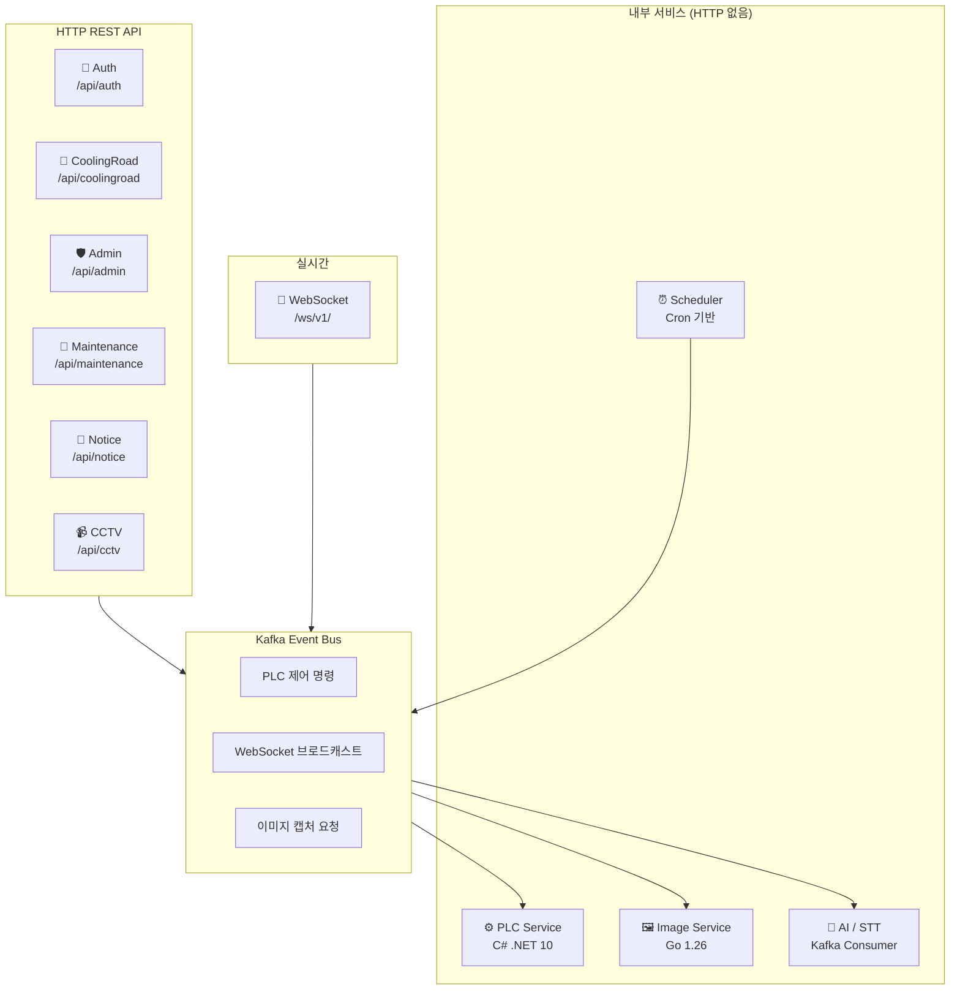

# 📡 API Overview — Production IoT Backend

[← README](../README.md) | [← ARCHITECTURE](./ARCHITECTURE.md)

**Version**: 4.4.0 | **Last Updated**: 2026-03-19

> ⚠️ **엔드포인트 경로·파라미터·요청/응답 스키마는 내부 API 계약서에서 관리합니다.**  
> 이 문서는 각 서비스의 설계 의도, 기능 범위, 주요 설계 결정을 기록하는 포트폴리오 문서입니다.

---

## 📋 목차

1. [API 구성 개요](#1-api-구성-개요)
2. [🔐 Auth — 인증·계정 관리](#2--auth--인증계정-관리)
3. [🌊 CoolingRoad — 분사 제어·이력](#3--coolingroad--분사-제어이력)
4. [⚙️ PLC Service — Modbus 제어 (C# MSA)](#4--plc-service--modbus-제어-c-msa)
5. [🔌 WebSocket — 실시간 통신](#5--websocket--실시간-통신)
6. [⏰ Scheduler — 자동화](#6--scheduler--자동화)
7. [📹 CCTV — 스트리밍](#7--cctv--스트리밍)
8. [🛡️ Admin — 조직 관리](#8--admin--조직-관리)
9. [🔧 Maintenance — 유지보수 이력](#9--maintenance--유지보수-이력)
10. [📢 Notice — 공지사항](#10--notice--공지사항)
11. [🤖 AI — 자동화 파이프라인](#11--ai--자동화-파이프라인)
12. [📧 Email Service — 이메일 인증](#12--email-service--이메일-인증)
13. [🔑 MFA Service — 2차 인증](#13--mfa-service--2차-인증)
14. [📨 Kafka 이벤트 계약](#14--kafka-이벤트-계약)
15. [🚨 에러 코드 체계](#15--에러-코드-체계)

---

## 1. API 구성 개요

**모든 HTTP 응답은 Status 200을 반환하며, 결과는 body의 `code` 필드로 구분한다.**

---

## 2. 🔐 Auth — 인증·계정 관리

**Base Path**: `/api/auth` | > 📝 **v4.2.1**: `POST /signin/organize` role 검증, `GET /mfa/setup/:id` 인증 필수화(BUG-59), Controller/Service DI 분리.  
> 📝 **v3.9.2**: 이메일 미인증 계정 JWT 발급 차단(BUG-34), 이메일 인증 시 status 자동 ACTIVE 전환.

### 설계 포인트

JWT 이중 무효화 구조(`jwt_token_version` + `TrashboxJWT` 블랙리스트)는 계정당 단일 세션을 강제한다. 새 기기 로그인 시 이전 기기의 JWT가 즉시 무효화된다. PLC 제어 같은 민감한 작업에 동시 접근을 구조적으로 방지하기 위한 설계다.

### 기능 범위

회원가입·로그인·로그아웃, 이메일 인증, 비밀번호 재설정, 프로필 관리, JWT 단일 세션 강제

### 역할 체계

| 역할 | 설명 | 가입 방식 |
|------|------|---------|
| `USER` | 일반 사용자 | signup → 이메일 인증 |
| `MAINTENANCE` | 유지보수 담당 | signup → 이메일 인증 |
| `DEVELOPER` | 개발자 | signup → 이메일 인증 |
| `ORGANIZE` | 관리 기관 | 별도 로그인 (signin/organize) |

### 주요 설계 결정

- **JWT 이중 무효화** — `jwt_token_version`(DB) + `TrashboxJWT` 블랙리스트(MongoDB)
- **이메일 미인증 계정 로그인 차단** — v3.9.2, BUG-34 코드 리뷰에서 발견
- **토큰 교차 사용 차단** — `token_type` 검증으로 이메일/비밀번호 재설정 토큰 분리
- **역할별 가입 경로 분리** — USER/MAINTENANCE/DEVELOPER vs ORGANIZE

---

## 3. 🌊 CoolingRoad — 분사 제어·이력

**Base Path**: `/api/coolingroad` | **허용 역할**: `USER` 전용 | > 📝 **v4.4.0**: `POST /spray` 명령이 Kafka 토픽으로 발행되고 C# PLC Service가 처리하는 구조로 변경. API 계약 동일 유지.  
> 📝 **v4.2.1**: Controller/Service DI 분리.

### 설계 포인트

분사 시작/중지 명령은 직접 PLC를 호출하지 않는다. Kafka 토픽에 메시지를 발행하고 즉시 응답한다. C# PLC Service가 Kafka를 구독해 실제 Modbus TCP 명령을 처리한다. API가 PLC 상태에 의존하지 않으므로, PLC Service가 재시작 중이어도 API는 즉시 응답한다.

### 기능 범위

소속 사이트 조회, 분사 설정 관리, 수동 분사 명령, 분사·날씨·센서 이력 조회 (커서 기반 페이징), CCTV 이미지 조회

### 주요 설계 결정

- **분사 명령 → Kafka 발행 → C# PLC Service 처리** (Fire-and-Forget, v4.4.0)
- **커서 기반 페이징** — 날씨·센서·분사이력 대용량 데이터 처리 (v3.3.7)
- **TimescaleDB hypertable** — 시계열 날씨·센서 데이터 최적화 조회 (v4.0.0)
- **`duration` 단위 주의** — 분사 설정(`sprayTime`)은 분 단위, 분사 이력(`spray_duration`)은 밀리초 단위

---

## 4. ⚙️ PLC Service — Modbus 제어 (C# MSA)

(C# .NET 10 독립 마이크로서비스) | **HTTP 엔드포인트 없음**

> 📝 **v4.4.0**: TypeScript 모듈(PLC 컨트롤러 모듈, PLC 서비스 모듈, PLC Modbus 어댑터 모듈, PLC 명령 모듈) 제거 후 C# 독립 서비스로 전환.

### 설계 포인트

TypeScript `setInterval` 기반 폴링에서 C# 백그라운드 서비스 기반 주기 타이머로 전환한 이유는 정밀한 주기 실행이다. Node.js 타이머는 이벤트 루프 부하에 따라 타이밍이 밀리지만, C# 주기 타이머는 OS 레벨에서 정밀한 주기를 보장한다.

Kafka Consume → Kafka Produce 방향으로만 동작한다. Main API와 직접 HTTP 통신이 없으므로 PLC Service 크래시가 Main API에 전파되지 않는다.

### 기능 범위

Kafka 구독으로 분사 명령 수신, Modbus TCP PLC 제어, Coil/Register 센서 폴링, WebSocket 이벤트 Kafka 발행, 이미지 캡처 요청 Kafka 발행

### 백그라운드 서비스 구성

| Worker | 주기 | 역할 |
|--------|------|------|
| `Kafka 소비 워커` | 2초 | 분사 명령 소비 |
| `Coil 폴링 워커` | 5초 | 장비 상태 읽기 |
| `Register 폴링 워커` | 60초 | 센서 수치 읽기 |
| `PLC 명령 큐 워커` | 1초 | Modbus 명령 순차 처리 |
| `생존 확인 워커` | 60초 | 연결 재시도 |

### 주요 설계 결정

- **C# .NET 10 백그라운드 서비스 × 5** — 주기 타이머 OS 레벨 정밀 주기
- **PLC 읽기/쓰기 인터페이스 Adapter** — REAL(Modbus TCP 라이브러리) / FAKE(Random) 런타임 교체
- **Redis + MySQL 이중 멱등성 체크** — 분사 명령 중복 실행 방지
- **Kafka Fire-and-Forget** — 이미지 캡처·WebSocket 이벤트 비동기 발행

상세 아키텍처 → [ARCHITECTURE.md §4 PLC MSA](./ARCHITECTURE.md#4-v440-plc-msa-아키텍처)

---

## 5. 🔌 WebSocket — 실시간 통신

**Endpoint**: `ws://{HOST}:{PORT}/ws/v1/?userId={ID}&role={ROLE}` | > 📝 **v4.4.0**: PLC Service(C#)가 Kafka `websocket_messages` 토픽에 센서 데이터를 직접 발행. WebSocket Controller는 동일하게 Kafka를 구독해 클라이언트에 브로드캐스트.  
> 📝 **v4.2.1**: `sendToUser` O(n) → O(1) 보조 인덱스(CQ-32), ping 갱신(BUG-62).

### 설계 포인트

`sendToUser`는 v4.2.1 이전 O(n) 순회 방식이었다. `Map<userId, WebSocket>` 보조 인덱스를 추가해 O(1) 직접 조회로 개선했다. 사이트-사용자 관계는 Redis SET 인덱스로 캐싱(v3.9.9)해 분당 360건 DB 쿼리를 0으로 감소시켰다.

MSA 서비스 → Kafka `websocket_messages` 토픽 → WebSocket Controller 소비 → 클라이언트 브로드캐스트. WebSocket Controller가 MSA 서비스의 상태를 직접 알 필요가 없다.

### 기능 범위

실시간 양방향 통신, 토픽 구독/해제, PLC 센서 데이터·분사 상태·날씨 업데이트·알림 수신

### Keepalive 정책

| 항목 | 값 |
|------|-----|
| 서버 → 클라이언트 Ping 간격 | 30초 |
| 응답 없으면 연결 종료 | 90초 |
| Idle Timeout | 120초 |

### 주요 설계 결정

- **sendToUser O(1)** — `Map<userId, WebSocket>` 보조 인덱스 (v4.2.1, CQ-32)
- **Redis SET 인덱스** — 사이트-사용자 관계 캐싱, WS 라우팅 DB 쿼리 제거 (v3.9.9)
- **Kafka 경유 아키텍처** — MSA 서비스와 WebSocket Controller 간 결합 없음

---

## 6. ⏰ Scheduler — 자동화

> 📝 **v4.4.0**: AutoSpray Cron이 Kafka 토픽에 메시지를 발행하고 C# PLC Service가 처리.  
> 📝 **v4.2.1**: KMA API timeout 적용(BUG-55), Date mutation 방지(BUG-60).

### 설계 포인트

자동 분사 Cron은 Main API에 유지하고, 실제 PLC 제어만 C# Service로 분리했다. "언제 분사할지 결정(비즈니스 로직)은 Main API에, 어떻게 PLC를 제어할지(하드웨어)는 PLC Service에"라는 서비스 경계를 명확히 한다.

### 기능 범위

기상청 데이터 자동 수집(1시간), COOLINGROAD/CLEANROAD 타입별 자동 분사 조건 평가, 조건 충족 시 Kafka 발행

### Cron 스케줄

| 스케줄 | 주기 | 역할 |
|--------|------|------|
| Weather | 1시간 | 기상청 API 데이터 수집 |
| AutoSpray_CoolingRoad | 매 시 15분 | COOLINGROAD 자동 분사 조건 평가 |
| AutoSpray_CleanRoad | 매 시 20분 | CLEANROAD 자동 분사 조건 평가 |

### 주요 설계 결정

- **자동 분사 → Kafka 발행 → C# PLC Service 처리** (비즈니스 로직/하드웨어 제어 분리)
- **KMA API withTimeout(10000)** — 기상청 장애 시 이벤트 루프 블로킹 방지 (BUG-55)
- **조건 평가 로직** — 기온·습도·노면온도·PM10 임계값 비교, Main API에 유지

---

## 7. 📹 CCTV — 스트리밍

**Base Path**: `/api/cctv` | > 📝 **v4.4.0**: 이미지 캡처 요청은 Kafka 토픽으로 발행되고 Go Image Service가 처리. CCTV API 자체 변경 없음.  
> 📝 **v4.2.3**: RTSP credential 퍼센트 인코딩, 클라이언트 IP 감지 수정(BUG-69).  
> 📝 **v4.2.0**: Nginx MJPEG 프록시 → MediaMTX WebRTC 전환.

### 설계 포인트

Main API는 인증 게이트웨이 역할만 한다. JWT + 사이트 소유권 검증 후 MediaMTX에 스트림을 등록하고 URL을 발급한다. 실제 영상 전송은 MediaMTX가 독립 처리한다. 카메라 추가 시 nginx.conf 수정·재시작이 필요하던 방식에서, DB의 RTSP 주소를 기반으로 REST API로 동적 관리하는 방식으로 전환했다.

### 기능 범위

CCTV 스트리밍 URL 발급(WebRTC WHEP / HLS 폴백), 스트리밍 서버 상태 조회

### 주요 설계 결정

- **인증 게이트웨이** — JWT + 사이트 소유권 검증 후 MediaMTX 스트림 등록
- **클라이언트 IP 기반 내부/외부 URL 자동 분기** — BUG-69 수정 포함 (v4.2.3)
- **sourceOnDemand** — 시청자 없으면 카메라 연결 자동 해제, 리소스 절약
- **RTSP credential 퍼센트 인코딩** — 특수문자 포함 비밀번호 처리 (v4.2.3)

---

## 8. 🛡️ Admin — 조직 관리

**Base Path**: `/api/admin` | **허용 역할**: `ORGANIZE` 전용 | > 📝 **v4.2.1**: Controller/Service DI 분리. RBAC async 버그 수정 이후 역할 검증 실제 동작.

### 설계 포인트

RBAC 구현에서 `async checkRole()` 반환값이 `Promise<boolean>`으로 항상 truthy 판정되던 Critical 버그(v3.5.0 코드 리뷰로 발견)를 수정한 이후, 역할 검증이 실제로 동작하는 구조다.

### 기능 범위

사용자 계정 상태 관리, 소속 사용자 목록 조회, API 로그 조회, MFA 로그 조회

### 주요 설계 결정

- **ORGANIZE 역할 전용** — RBAC으로 접근 제한 (Critical 버그 수정 후 실제 동작)
- **커서 기반 페이징** — 대용량 로그 조회
- **MongoDB 인덱스 최적화** — 로그 검색 성능

---

## 9. 🔧 Maintenance — 유지보수 이력

**Base Path**: `/api/maintenance` | > 📝 **v3.9.2**: 등록/조회 시 사이트 소유권 검증 추가. 이전에는 누구나 어떤 사이트에도 이력 등록 가능했음.

### 설계 포인트

유지보수 이력 등록 시 MAINTENANCE 역할 사용자의 소속 기관 사이트인지 검증한다. 타 기관 사이트로 등록 시도 시 소유권 불일치 에러를 반환한다. 소유권 검증은 코드 리뷰(v3.9.2)에서 추가됐다.

### 기능 범위

유지보수 이력 등록(이미지 첨부), 소속 사이트 유지보수 이력 조회

### 주요 설계 결정

- **소유권 검증** — MAINTENANCE 사용자 소속 기관 사이트만 등록 가능 (v3.9.2)
- **이미지 MinIO 저장** — WebP 변환 후 오브젝트 스토리지

---

## 10. 📢 Notice — 공지사항

**Base Path**: `/api/notice` | ### 설계 포인트

공지사항 상태는 `DRAFT → PUBLISHED → ARCHIVED` 단방향 흐름이다. 작성 권한(MAINTENANCE/DEVELOPER)과 조회 권한(모든 역할)이 분리된다. PUBLISHED 상태의 공지사항이 없어도 `성공 응답`을 반환한다 — 빈 결과는 에러가 아니다.

### 기능 범위

공지사항 작성·수정·상태 변경, 전체 공지 조회

### 주요 설계 결정

- **상태 관리** — `DRAFT → PUBLISHED → ARCHIVED` 단방향 흐름
- **역할별 권한 분리** — 작성(MAINTENANCE/DEVELOPER), 조회(전체)
- **빈 결과는 `성공 응답`** — 공지 없음이 정상 상태

---

## 11. 🤖 AI — 자동화 파이프라인

> 📝 **v4.2.1**: Kafka Consumer + Ollama 연동 로직 AI 서비스로 분리.

### 설계 포인트

현재 Kafka 토픽 구독 구조만 구현되어 있고 처리 로직은 비활성 상태다. 이는 의도적인 설계다 — Kafka Consumer를 먼저 구축해 메시지 파이프라인을 확보하고, 처리 로직은 이후 추가한다. 빈 Consumer 구조는 기능을 추가할 때 파이프라인 자체를 변경하지 않아도 된다.

### 기능 범위

Kafka 기반 AI 의사결정 수신, STT 결과 처리 (현재 구조만 구현, 처리 로직 비활성)

### 주요 설계 결정

- **빈 Consumer 구조** — 파이프라인 먼저 확보, 처리 로직은 이후 추가
- **Kafka Consumer Group 분리** — 독립 배포 가능

---

## 12. 📧 Email Service — 이메일 인증

> 📝 **v4.2.1**: `jwt_token_version++` 메모리 mutation 제거, DB `UPDATE(version+1)` 패턴으로 변경 (BUG-58 보안 수정).

### 설계 포인트

`jwt_token_version++`는 메모리 상의 객체를 직접 수정한 후 DB에 저장하는 패턴이다. DB 업데이트가 실패하면 메모리 값만 올라가 불일치가 발생한다. `DB_UPDATE(version + 1)` 방식은 DB 트랜잭션 성공 여부로만 상태를 결정한다. BUG-58 코드 리뷰에서 발견됐다.

### 기능 범위

이메일 인증 토큰 발급·검증, 비밀번호 재설정 토큰 발급·검증

### 주요 설계 결정

- **DB mutation 방지** — `jwt_token_version++` → `DB UPDATE(version+1)` 패턴 (BUG-58)
- **token_type 검증** — 이메일/비밀번호 재설정 토큰 교차 사용 차단
- **HTML 이메일 전송** + WebSocket 인증 완료 실시간 알림

---

## 13. 🔑 MFA Service — 2차 인증

**Base Path**: `/api/mfa` | > 📝 **v4.2.1**: `GET /mfa/setup/:id` JWT 인증 필수화 + 본인 확인 검증(BUG-59).  
> 📝 **v4.0.2**: MFA 키 로테이션 지원(CQ-18).

### 설계 포인트

MFA setup 엔드포인트는 TOTP 시크릿을 생성한다. v4.2.1 이전에는 인증 없이 누구나 호출할 수 있어, 타인의 TOTP 시크릿을 생성해 MFA를 무력화할 수 있었다(BUG-59). JWT 인증 + `:id == JWT.userId` 일치 검증으로 수정됐다.

### 기능 범위

TOTP 기반 MFA 설정·등록·인증, MFA 키 로테이션

### 주요 설계 결정

- **setup 엔드포인트 JWT 인증 필수 + 본인 확인** — 타인 TOTP 시크릿 생성 차단 (BUG-59)
- **타이밍 공격 방지** — constant-time 비교 + 연속 실패 시 계정 잠금
- **키 로테이션** — `tryDecryptWithFallback()`으로 이전 키 자동 폴백 후 현재 키 재암호화 (v4.0.2)

---

## 14. 📨 Kafka 이벤트 계약

**Version**: 1.2.0 | **Status**: Source of Truth — MSA 서비스 간 계약 문서

이 명세는 서비스 경계를 코드가 아닌 메시지 계약으로 정의한다. TypeScript, Go, C# 세 언어로 작성된 서비스가 Kafka를 통해 통신할 때, 각 서비스는 이 문서를 기준으로 자체 타입을 정의한다.

### 공통 메시지 구조 (Envelope)

모든 Kafka 메시지는 아래 구조를 따른다.

| 필드 | 설명 |
|------|------|
| `meta.messageId` | ULID 기반 고유 ID (26자, 타임스탬프 정렬 가능) |
| `meta.messageType` | 메시지 타입 식별자 |
| `meta.timestamp` | 메시지 생성 시각 (ISO 8601) |
| `meta.version` | 스키마 버전 (semver) |
| `meta.source` | 발신 서비스/모듈명 |
| `payload` | 메시지 타입별 실제 데이터 |

WebSocket 브로드캐스트 메시지는 `routing` 필드를 추가로 포함한다 (`targetUserId`, `broadcastToAll`, `topic`).

> ⚠️ **상세 계약 (토픽명·메시지 스키마·필드 명세·매핑표)은 내부 계약서에서 관리합니다.**  
> 이 문서는 설계 의도와 구조 파악을 위한 포트폴리오 문서입니다.

## 15. 🚨 에러 코드 체계

**모든 API 응답은 HTTP Status 200을 반환한다.** 에러 구분은 body의 `code` 필드로 수행한다.

### 코드 범위

| 범위 | 카테고리 |
|------|---------|
| 성공 코드 | 요청 처리 완료 |
| 인증 에러 계층 | JWT·계정 상태·MFA·이메일 인증 관련 |
| 요청 데이터 에러 계층 | 파라미터·바디·날짜범위 등 (v3.9.2 통합) |
| 외부 서비스 에러 계층 | 파일 스토리지·스트리밍 서버 연동 |
| 데이터베이스 에러 계층 | 쿼리 실패·빈 결과·소속 미설정 세분화 |
| 장비 에러 계층 | PLC 연결 실패 |
| 리소스 미존재 계층 | 필수 설정 누락 (카메라 주소 등) |
| 미구현 서비스 계층 | 구현 예정 기능 |

> ⚠️ **에러 코드 상세 (전체 목록·처리 패턴·MFA 원인)는 내부 계약서에서 관리합니다.**  
> 이 문서는 코드 체계와 설계 의도 파악을 위한 포트폴리오 문서입니다.

---

**Last Updated**: 2026-03-19 | **Version**: 4.4.0
