# 🏛️ 시스템 아키텍처 — Production IoT Backend

[← README](../README.md)

**Version**: 4.4.0 | **Last Updated**: 2026-03-19

---

## 이 문서의 역할

이 문서는 시스템이 어떻게 생겼는지를 설명하지 않는다. **왜 이 구조가 됐는지** — 어떤 제약이 결정을 제한했고, 어떤 대안을 기각했으며, 어떤 비용을 수용했는지를 기록한다.

구조 그 자체는 결과다. 이 문서는 그 결과가 만들어진 과정을 다룬다.

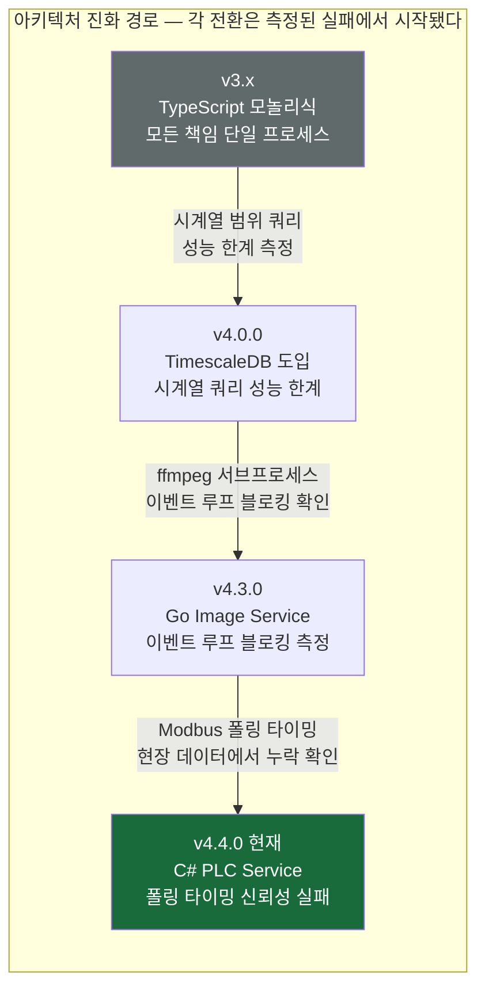

> 교체·폐기된 패턴의 상세 기록 → [LEGACY_ARCHITECTURE.md](./LEGACY_ARCHITECTURE.md)

---

## 📋 목차

1. [마이그레이션 경위 — 경계는 사전에 설계하지 않았다](#1-마이그레이션-경위--경계는-사전에-설계하지-않았다)
2. [현재 시스템 전체 구조](#2-현재-시스템-전체-구조)
3. [서비스 경계와 책임 — 소유하지 않는 것이 더 중요하다](#3-서비스-경계와-책임--소유하지-않는-것이-더-중요하다)
4. [v4.4.0 PLC MSA — 타이밍 신뢰성과 장애 격리](#4-v440-plc-msa--타이밍-신뢰성과-장애-격리)
5. [v4.3.0 Image MSA — 이벤트 루프 격리](#5-v430-image-msa--이벤트-루프-격리)
6. [Kafka 이벤트 버스 — 장애 격리와 전환 전략의 기반](#6-kafka-이벤트-버스--장애-격리와-전환-전략의-기반)
7. [Polyglot Persistence — 접근 패턴별 최적화](#7-polyglot-persistence--접근-패턴별-최적화)
8. [Nginx 인프라 아키텍처](#8-nginx-인프라-아키텍처)
9. [CCTV 스트리밍 아키텍처](#9-cctv-스트리밍-아키텍처)
10. [보안 아키텍처 — 운영 신뢰성의 기반](#10-보안-아키텍처--운영-신뢰성의-기반)
11. [성능 최적화 — 측정 기반 결정](#11-성능-최적화--측정-기반-결정)
12. [배포 독립성과 확장 전략](#12-배포-독립성과-확장-전략)

---

## 1. 마이그레이션 경위 — 경계는 사전에 설계하지 않았다

### 왜 모놀리식으로 시작했는가

MSA로 바로 시작하지 않은 것은 방법론적 선택이 아니라 제약에서 나온 결정이다.

- **도메인 불확실성**: 어떤 컴포넌트가 얼마나 복잡해질지 초기에 알 수 없었다. 잘못된 경계를 가진 MSA는 잘못된 모놀리식보다 수정 비용이 높다.
- **운영 중단 불가**: 배포 후 도로 제어 시스템은 24시간 운영해야 한다. 대규모 초기 설계에 시간을 쓰는 것은 실제 운영을 늦추는 것이다.
- **단독 개발**: 복잡도를 팀 간에 분산할 수 없었다. 초기 분리는 관리 가능한 복잡도를 초과할 위험이 있었다.

결론: 도메인을 완전히 이해하기 전에 경계를 고정하는 것은 위험하다. 운영에서 병목이 측정된 후에야 분리를 결정했다.

### 전환 트리거 — 각 결정이 시작된 실패

| 버전 | 발생한 실패 | 단순 수정 시도 | 수정 실패 이유 | 구조 결정 |
|------|-----------|-------------|-------------|---------|
| v4.0.0 | 시계열 데이터 증가에 따른 범위 쿼리 성능 저하 | MySQL 인덱스 최적화 | 시간 기반 파티셔닝은 MySQL 구조로 한계 | DB 계층 분리 → TimescaleDB |
| v4.3.0 | ffmpeg이 이벤트 루프를 점유해 API 응답 지연이 분사 빈도에 비례 | 동시성 제한 강화 | 처리량 감소만 가능. 근본 원인(이벤트 루프 점유) 미해결 | Image Service 분리 → Go |
| v4.4.0 | 이미지 캡처 처리 중 Modbus 폴링 타이밍 밀림 → 현장 센서 데이터 누락 | 타이머 최적화 | Node.js 타이머는 이벤트 루프 기반. 구조적으로 정밀 주기 보장 불가 | PLC Service 분리 → C# |

### 전환 중 발생한 예상 외 복잡도

전환은 선형적으로 진행되지 않았다. 각 분리에서 사전에 설계하지 않은 문제가 발생했다.

**공유 DB 접근 충돌**: 신규 서비스가 같은 DB를 읽고 쓰면서 기존 서비스와 동시 쓰기 충돌 가능성이 생겼다. 서비스 분리만으로는 부족했고, 멱등성 레이어를 추가해야 했다.

**언어 간 환경변수 호환성**: 새 서비스가 기존 환경변수 파일을 공유해야 했으나, 언어별 바인딩 방식이 달라 래핑 레이어가 필요했다. 설정 불일치는 침묵하는 버그를 만든다.

**토픽 네이밍 일관성**: 환경별 접미사 규칙을 신규 서비스에 일관되게 적용하는 것을 초기에 빠뜨렸다. 개발 환경에서 프로덕션 토픽에 연결되는 잠재적 위험이 있었다. 이것이 실제로 초기에 발생했다.

**병렬 운영 종료 기준 부재**: "언제 기존 서비스를 내려도 안전한가"의 명시적 기준이 없었다. 암묵적 판단에 의존했고 전환 시점이 불필요하게 늦어졌다.

---

## 2. 현재 시스템 전체 구조

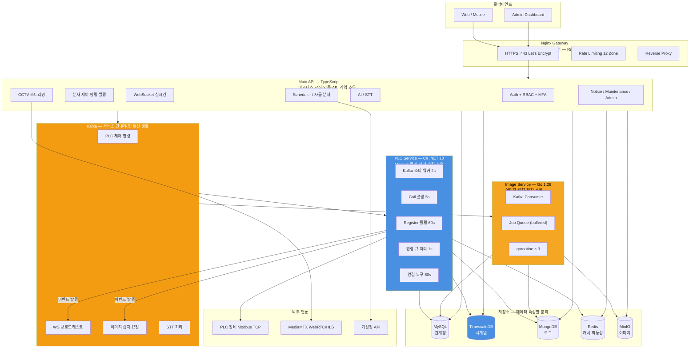

### 시스템 통계 (v4.4.0)

```
MSA 서비스:    3개 (TypeScript API · Go Image · C# PLC)
API 엔드포인트: 40+개
저장소:        5종 (MySQL · TimescaleDB · MongoDB · Redis · MinIO)
코드 라인:    ~13,000 lines (TypeScript Main API 기준)
```

---

## 3. 서비스 경계와 책임 — 소유하지 않는 것이 더 중요하다

경계를 설계할 때 "어떤 기능을 포함할지"보다 "어떤 기능을 배제할지"를 먼저 정의했다. 한 서비스가 다른 서비스의 내부 상태를 알게 되는 순간, 그 서비스의 배포나 변경이 다른 서비스에 전파된다.

### 서비스별 의도적 배제 경계

| 서비스 | 소유하는 것 | **의도적으로 소유하지 않는 것** | 배제 이유 |
|--------|-----------|--------------------------|---------|
| **Main API** | 비즈니스 규칙, API 계약, 인증, 조건 평가, 분사 결정 | Modbus TCP 통신, PLC 레지스터 값, 이미지 캡처 실행 | PLC 상태를 알면 PLC 장애가 API 응답에 직접 전파됨 |
| **PLC Service** | Modbus 연결 관리, 센서 폴링 주기, 분사 명령 실행 | 언제 분사할지 결정, API 요청 처리, 이미지 캡처 | 비즈니스 조건이 들어오면 Main API와 결합 발생 |
| **Image Service** | RTSP 캡처, ffmpeg 처리, MinIO 업로드, 이미지 로그 | 캡처 시점 결정, PLC 상태 인지, 분사 이력 관리 | 결정 로직이 들어오는 순간 Main API와 의존 관계 생성 |

### 분리 기준 — 언제 서비스를 나누는가

서비스 분리는 네 가지 조건이 함께 충족될 때만 결정했다.

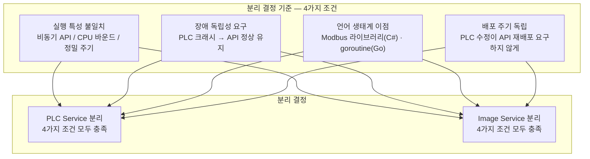

### 통신 방식 선택 — 동기 vs 비동기

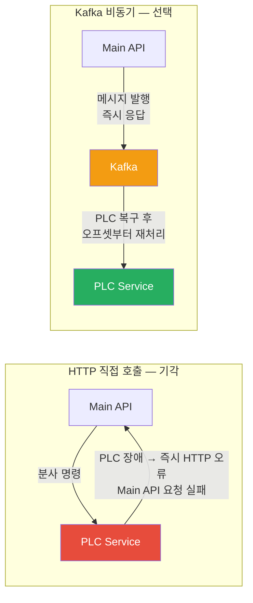

**수용한 트레이드오프**: 분사 명령이 실제로 PLC에 전달됐는지 즉시 확인할 수 없다. 명령 발행과 PLC 실행 사이에 Kafka 처리 시간이 존재한다. 현장 운영 요구사항에서 수초 이내 처리가 허용 범위였기 때문에 이 지연을 수용했다.

---

## 4. v4.4.0 PLC MSA — 타이밍 신뢰성과 장애 격리

### 왜 TypeScript로 유지할 수 없었는가

Modbus 폴링의 타이밍 문제는 성능 문제가 아니라 신뢰성 문제였다. 현장 운영자와 합의된 폴링 주기(Coil 5초, Register 60초)는 협상 불가능한 요구사항이었다. Node.js 타이머는 이벤트 루프 상태에 따라 지연된다.

타이머 최적화로 해결을 시도했지만, 이미지 캡처가 진행 중일 때 폴링이 수초 밀리는 현상이 반복됐다. 이것은 코드 수준의 문제가 아니라 런타임 선택의 문제였다.

**검토한 대안:**

| 대안 | 기각 이유 |
|------|---------|
| Node.js 타이머 최적화 | 이벤트 루프 기반. 구조적으로 정밀 주기 보장 불가 |
| 별도 Node.js 프로세스 | 동일 런타임 문제 지속. 관리 복잡도만 증가 |
| Python + APScheduler | Modbus TCP 생태계 약함. 학습 비용 대비 이점 불명확 |
| **C# .NET 10** | **선택**: OS 레벨 주기 타이머. Modbus 라이브러리 성숙도 높음 |

### 전환 전후 구조 비교

```mermaid
graph TB
    subgraph Before["v4.3.x — TypeScript 모놀리식 PLC"]
        MAIN1["Main Backend (TS)"]
        PLC1["PLC 제어 모듈"]
        CRON1["setInterval × 5\n이벤트 루프 종속 타이밍"]
        MB1["Modbus TCP"]
        MAIN1 --> PLC1 --> CRON1 --> MB1
    end

    subgraph After["v4.4.0 — C# 독립 서비스"]
        MAIN2["Main Backend (TS)"]
        KFK["Kafka PLC 제어 토픽"]
        PLCMSA["coolroad-plc-service (C#)"]
        BG["백그라운드 서비스 × 5\nOS 레벨 정밀 주기"]
        MB2["Modbus TCP"]
        MAIN2 -->|"메시지 발행"| KFK --> PLCMSA --> BG --> MB2
    end

    style CRON1 fill:#e74c3c,color:#fff
    style PLC1 fill:#e74c3c,color:#fff
    style PLCMSA fill:#4A90E2,color:#fff
    style BG fill:#4A90E2,color:#fff
```

### 백그라운드 서비스 구성

각 워커는 독립된 수명주기를 가진다. 하나의 워커 실패가 다른 워커에 전파되지 않는다.

| Worker | 주기 | 역할 | TypeScript 대응 |
|--------|------|------|----------------|
| Kafka 소비 워커 | 2초 poll | 분사 명령 수신 → 처리 | kafka-plc cron |
| Coil 폴링 워커 | 5초 | 장비 상태 읽기 → WS 발행 | FastPoll_PLCData cron |
| Register 폴링 워커 | 60초 | 센서 수치 읽기 → WS + TimescaleDB | Poll_PLCData cron |
| PLC 명령 큐 워커 | 1초 | Modbus 명령 순차 처리 | PLC_QUEUE_WORKER cron |
| Modbus 생존 확인 워커 | 60초 | 연결 끊기면 재시도 | PLC_LifeCheck cron |

### PLC 읽기/쓰기 인터페이스 — 제약이 강제한 패턴

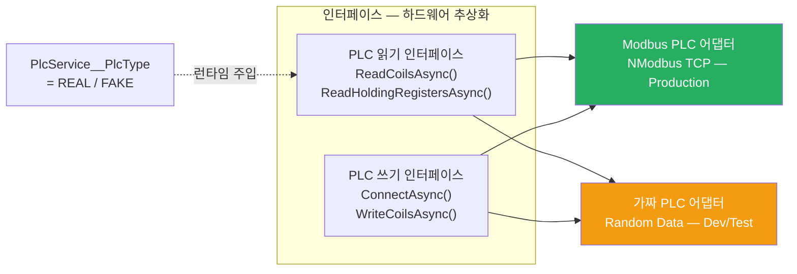

### 분사 명령 처리 흐름 — 멱등성 포함

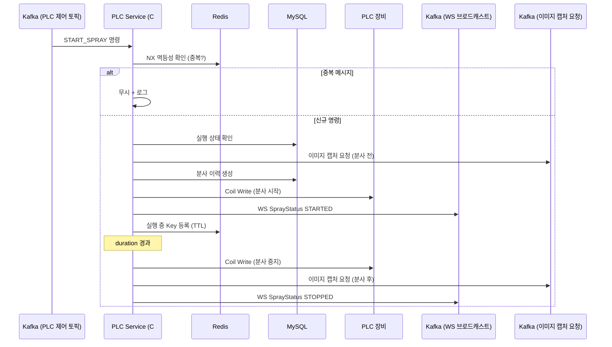

**멱등성이 필요한 이유**: Kafka at-least-once 전달 보장으로 동일 메시지가 두 번 처리될 수 있다. 분사 명령의 중복 처리는 현장 장비에 명령이 두 번 전달되는 것으로, 단순한 데이터 중복 문제가 아니다. Redis(빠른 1차) + DB 상태(영속적 2차) 이중 검증으로, Redis 장애 시에도 DB 검증으로 안전을 보장한다.

---

## 5. v4.3.0 Image MSA — 이벤트 루프 격리

### 왜 Go를 선택했는가

ffmpeg 서브프로세스 실행은 CPU 바운드 작업이다. Node.js의 이벤트 루프는 비동기 I/O를 처리하도록 설계됐다. CPU 바운드 작업이 이 루프에서 실행되면 다른 모든 처리를 차단한다.

Worker Thread를 도입하는 방식도 검토했다. 이미지 처리를 이벤트 루프 밖으로 보낼 수는 있지만, ffmpeg 서브프로세스 관리와 메시지 패싱 비용이 추가된다. 분사 이벤트가 많아질수록 Worker 간 메시지 큐 자체가 새로운 병목이 된다. Go의 goroutine은 OS 스레드를 직접 활용해 이벤트 루프 개념이 없다.

### 전환 전후 장애 범위 비교

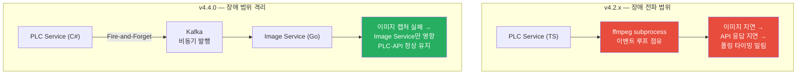

### Worker Pool 내부 구조

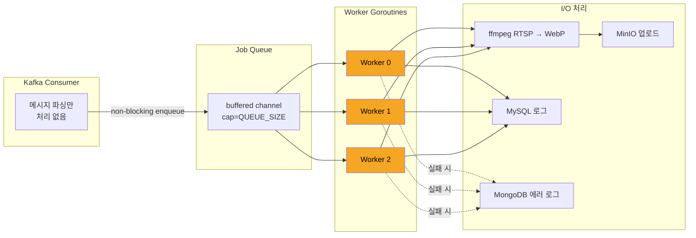

### 주요 설계 결정

**Consumer와 Worker를 분리한 이유**: Consumer가 처리까지 담당하면, 처리 지연이 Kafka poll 루프를 막아 `max.poll.interval.ms` 초과로 리밸런싱이 발생한다.

**큐 가득 차면 drop하는 이유**: Consumer가 enqueue에서 블로킹되면 Kafka 연결이 끊긴다. 이미지 캡처는 "현재 시점의 스냅샷"이 목적이다. 지연된 캡처보다 최신 캡처가 운영 가치가 더 높다. drop 시 에러 로그를 남겨 누락 이미지를 추적 가능하게 한다.

**Dangling 이미지 방지**: MinIO 업로드 성공 후 MySQL INSERT가 실패하면, DB 레코드 없는 오브젝트가 스토리지에 남는다. MySQL 실패 즉시 MinIO 업로드를 삭제한다.

---

## 6. Kafka 이벤트 버스 — 장애 격리와 전환 전략의 기반

### 왜 Kafka가 필요했는가

Kafka 선택은 단순히 비동기 메시징이 필요해서가 아니었다. **운영 중단 없는 서비스 분리 전략을 실행하는 데 Kafka가 필수적이었다.**

Consumer Group을 분리하면 기존 서비스와 신규 서비스가 독립적으로 소비한다. Kafka가 없었다면 기존 서비스를 내리지 않고 신규 서비스를 동시에 실행할 수 없었다. 운영 중단 없는 전환 전략 전체가 이 특성에 의존했다.

### 검토한 대안과 기각 이유

| 대안 | 검토한 내용 | 기각 이유 |
|------|-----------|---------|
| **Redis Pub/Sub** | 가벼움, 이미 인프라에 존재 | 소비자 다운 중 발행된 메시지 유실. 병렬 운영 전략 지원 불가 |
| **RabbitMQ** | 성숙한 AMQP 구현 | 오프셋 기반 재처리와 Consumer Group 분리 지원 약함 |
| **직접 HTTP 호출** | 타입 안전, 구현 단순 | 동기 결합. 수신자 장애가 즉시 송신자로 전파 |
| **gRPC** | 타입 안전한 RPC | 동기 결합. 서비스 인터페이스 변경 시 양쪽 동시 배포 강제 |

### 수용한 운영 비용

Kafka 운영 복잡도는 예상보다 실제로 더 높았다.

- 로컬 개발 환경에서 Kafka 클러스터를 실행해야 한다. 새 서비스 추가 시 진입 비용이 존재한다.
- 토픽 네이밍 규칙을 모든 서비스에 일관되게 적용해야 한다. 규칙 불일치로 개발 환경에서 프로덕션 토픽에 연결되는 위험이 초기에 실제로 발생했다.
- Consumer Group 상태 관리가 추가된다. 리밸런싱, lag 모니터링이 운영 부담으로 추가된다.

### 토픽 구조와 데이터 흐름

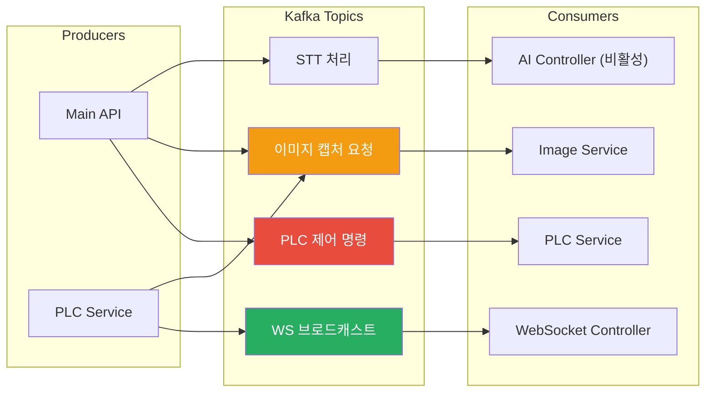

### 프로듀서 — 배치 전송과 DLQ

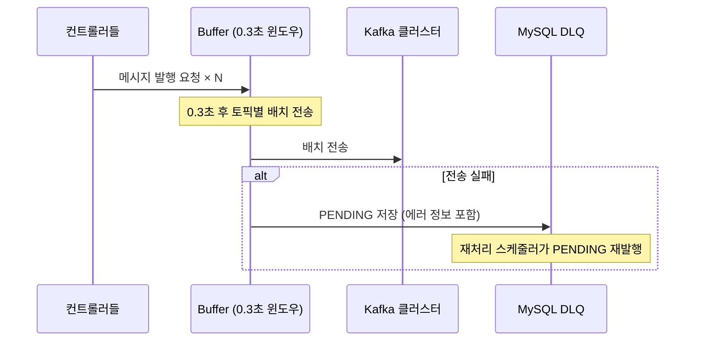

### 멱등성 — at-least-once의 위험 대응

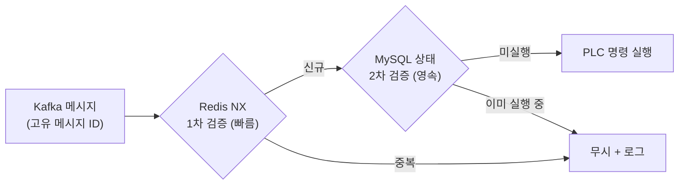

---

## 7. Polyglot Persistence — 접근 패턴별 최적화

단일 DB로 시작하는 것은 합리적이었다. 하지만 운영이 진행되면서 각 데이터 유형이 서로 다른 접근 패턴을 요구한다는 것이 드러났다.

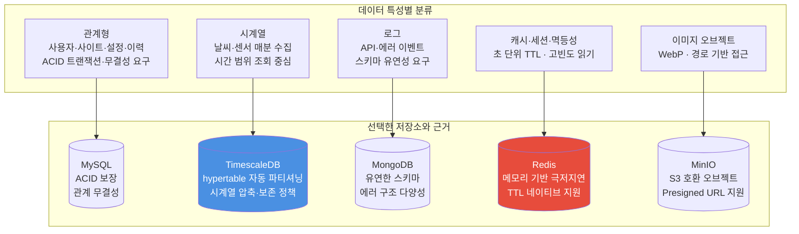

### TimescaleDB — 검토한 대안

MySQL 유지(인덱스 최적화), InfluxDB(전용 시계열), TimescaleDB(PostgreSQL 확장) 세 가지를 검토했다. InfluxDB는 별도 쿼리 언어 학습이 필요하고 관계형 데이터와 결합 쿼리가 불가능하다. TimescaleDB는 기존 SQL 쿼리를 대부분 재사용할 수 있어 이관 비용이 가장 낮았다.

### TimescaleDB hypertable 정책

| 정책 | 설정 | 운영 효과 |
|------|------|---------|
| chunk_time_interval | 1개월 | 시간 범위 쿼리가 해당 청크만 스캔 |
| compress_segmentby | site_id | 사이트별 압축으로 조회 성능 유지 |
| compression_policy | 6개월 후 자동 압축 | 운영 개입 없이 스토리지 비용 감소 |
| retention_policy | 10년 TTL | DB 레벨 자동 삭제 |

### Redis — 알고리즘 복잡도 변경

WebSocket 메시지 라우팅에서 사이트별 접속 사용자를 Redis SET으로 인덱싱해 탐색을 O(n)에서 O(1)로 전환했다. 분당 360건 DB 조회가 0으로 감소했다 (v3.9.9, CQ-7). 이것은 캐싱이 아니라 알고리즘 구조 변경이다.

| 캐시 대상 | TTL | 선택 근거 |
|----------|-----|---------|
| 사용자 데이터 | 24시간 | 변경 빈도 낮음 |
| 사이트 데이터 | 5분 | 설정 변경 가능성 존재 |
| Presigned 이미지 URL | 6시간 | URL 만료 전 갱신 필요 |
| PLC 멱등성 Key | 60초 | 중복 명령 방지 윈도우 |
| 사이트-사용자 인덱스 | 5분 | WebSocket O(1) 라우팅 |

---

## 8. Nginx 인프라 아키텍처

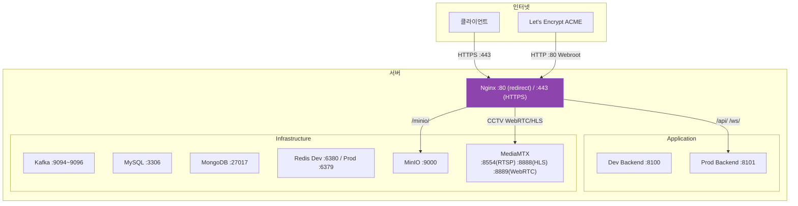

### Rate Limiting — 12개 Zone 독립 설정

동일 IP의 인증 엔드포인트와 일반 API를 같은 제한으로 묶으면 안 된다. 인증 엔드포인트에 대한 brute-force 공격이 일반 API 사용을 차단해서는 안 되기 때문이다.

| Zone 그룹 | 적용 대상 | 목적 |
|---------|---------|------|
| 인증 Zone | 로그인 · 회원가입 | Brute-force 방어 (가장 엄격) |
| PLC 제어 Zone | 분사 명령 API | 과도한 명령 방지 |
| 일반 API Zone | 나머지 API | 일반 요청 제한 |
| WebSocket Zone | WS 연결 | 연결 폭주 방어 |
| CCTV Zone | WebRTC / HLS | 스트리밍 연결 제한 |

### SSL/TLS — Certbot Webroot를 선택한 이유

Nginx를 중단하지 않고 인증서를 갱신할 수 있다. 12시간 주기로 실행해 만료 30일 전부터 자동 갱신한다. Nginx 재시작이 필요한 방식은 운영 중단 제약에 맞지 않는다.

- **HSTS**: `max-age=31536000; includeSubDomains`
- **OCSP Stapling**: 인증서 유효성 응답 캐싱
- **환경 분리**: dev/prod Docker Compose 오버라이드로 포트와 설정 분리

---

## 9. CCTV 스트리밍 아키텍처

### 전환 이유 — 운영 중 카메라 관리 불가

기존 구조에서 카메라를 추가하려면 Nginx 설정 파일을 수정하고 재시작해야 했다. 운영 중단 없이 카메라를 관리할 수 없었고, 인증도 없었다.

| 항목 | 이전 (Nginx MJPEG 직접 프록시) | 현재 (MediaMTX WebRTC) |
|------|------------------------------|----------------------|
| 카메라 추가 | nginx.conf 수정 + Nginx 재시작 | DB에 RTSP 주소 등록 (운영 중 가능) |
| 인증 | 없음 | JWT + 사이트 소유권 검증 |
| 리소스 관리 | 항상 연결 유지 | sourceOnDemand — 시청자 없으면 자동 해제 |
| 프로토콜 | MJPEG | WebRTC (저지연) + HLS (폴백) |

### Main API의 역할 — 인증 게이트웨이만

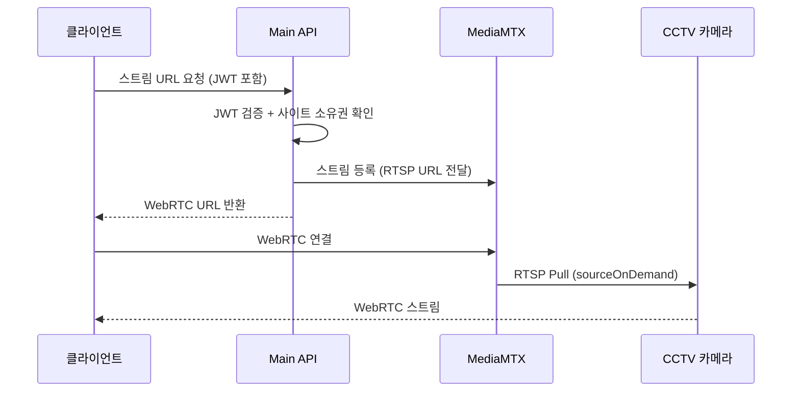

Main API는 인증과 URL 발급만 담당한다. 실제 영상 전송은 MediaMTX가 독립적으로 처리한다. Main API가 스트리밍 상태를 알 필요가 없다.

---

## 10. 보안 아키텍처 — 운영 신뢰성의 기반

### 보안 버그는 아키텍처가 막지 못한다

MSA 전환을 진행하는 동안 코드 리뷰에서 아키텍처 설계로는 방지할 수 없는 버그들을 발견했다.

```
코드 리뷰에서만 발견된 보안 버그:
- RBAC 우회 — async 함수 반환값이 항상 truthy로 판정 (기능 테스트 통과)
- MFA setup 인증 없음 — 타인의 TOTP 시크릿 생성 가능
- 자동 분사 조건 자기비교 — 항상 분사 조건 충족
- DB mutation 경쟁 조건 — 메모리 상태와 DB 상태 불일치
```

아키텍처가 아무리 잘 설계되어도 코드 레벨 검증 없이는 운영 신뢰성을 보장할 수 없다.

### JWT 이중 무효화 — 단일 세션 강제

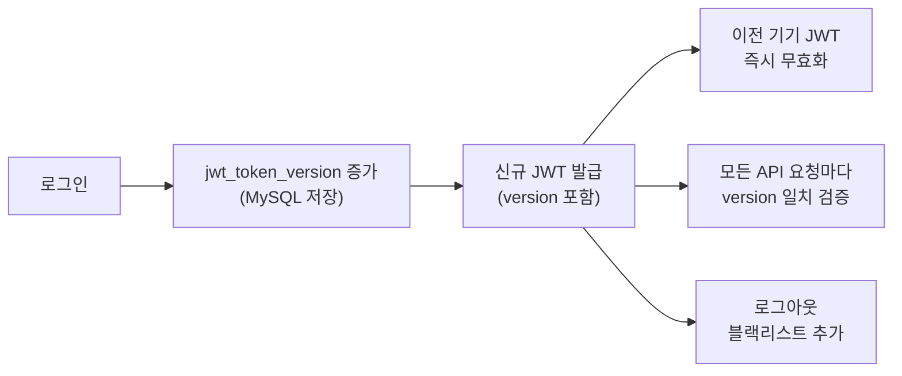

계정당 단일 활성 세션을 강제한다. PLC 제어 같은 민감한 작업에 복수 기기 동시 접근을 구조적으로 방지한다.

### 보안 레이어 요약

| 레이어 | 구현 방식 | 목적 |
|--------|---------|------|
| 인증 | JWT + version 검증 | 단일 세션 강제 |
| 이중 무효화 | jwt_token_version + 블랙리스트 | 즉시 무효화 |
| 권한 제어 | RBAC (4개 역할) | 역할별 API 분리 |
| 2차 인증 | TOTP MFA + 재시도 제한 | 민감 작업 추가 인증 |
| 이메일 인증 | 가입 후 필수 | 계정 무결성 |
| Rate Limiting | Nginx 12개 Zone 독립 | Brute-force / DDoS 방어 |
| TLS | HSTS + OCSP Stapling | 전송 계층 보안 |

---

## 11. 성능 최적화 — 측정 기반 결정

성능 최적화는 추정이 아니라 측정된 병목에서 시작됐다.

**WebSocket 라우팅 O(n) → O(1)**: 사이트별 사용자 탐색을 `Map<userId, WebSocket>` 보조 인덱스와 Redis SET 인덱스로 O(1)로 전환했다 (v4.2.1, CQ-32). 분당 360건 DB 조회가 0으로 감소했다 (v3.9.9, CQ-7).

**Kafka 배치 전송**: 0.3초 버퍼에 메시지를 모아 토픽별로 배치 전송한다. 개별 전송 대비 네트워크 요청 수를 줄이고, try-finally 보장으로 처리 플래그가 항상 해제된다.

**TimescaleDB 청크 조회**: 시간 기반 파티셔닝으로 범위 쿼리가 전체 테이블 스캔 대신 해당 기간 청크만 스캔한다.

**Redis 캐시 계층**: 사용자·사이트 데이터 캐싱으로 DB 조회를 줄이는 것 외에, 알고리즘 수준의 복잡도 개선에 활용했다.

---

## 12. 배포 독립성과 확장 전략

### 각 서비스가 독립적으로 배포 가능해야 한다

PLC 로직을 수정할 때 Main API를 재배포할 필요가 없어야 한다. 이것은 운영 중단 없이 각 서비스를 개별적으로 업데이트할 수 있다는 의미다.

```bash
# 서비스별 독립 배포
# Main API
docker compose -f docker-compose.yml -f docker-compose.prod.yml up -d backend

# PLC Service (Main API 영향 없음)
docker compose -f ../coolroad-plc-service/docker-compose.prod.yml up -d

# Image Service (Main API 영향 없음)
docker compose -f ../coolroad-image-service/docker-compose.prod.yml up -d

# 전체 스택
docker compose \
  -f docker-compose.yml \
  -f ../coolroad-image-service/docker-compose.prod.yml \
  -f ../coolroad-plc-service/docker-compose.prod.yml up -d
```

### 환경 분리 전략

```
docker-compose.yml          # 베이스 — 공통 서비스 정의
docker-compose.dev.yml      # 개발 (port 8100, Redis :6380, TimescaleDB :5433)
docker-compose.prod.yml     # 프로덕션 (port 8101, Redis :6379, TimescaleDB :5432)
```

### 수평 확장 설계

| 서비스 | 확장 방식 | 전제 조건 |
|--------|---------|---------|
| Main API | Nginx 로드밸런서 + 다중 인스턴스 | Redis 세션 공유 이미 적용 |
| PLC Service | 사이트별 Consumer Group 분리 | 사이트별 Kafka 파티션 설계 필요 |
| Image Service | WORKER_CONCURRENCY 환경변수 조정 | 현재 수직 확장만 지원 |

---

## 📧 Contact

**GitHub**: [@1985jwlee](https://github.com/1985jwlee)
**Email**: leejae.w.jl@icloud.com

---

**Last Updated**: 2026-03-19 | **Version**: 4.4.0