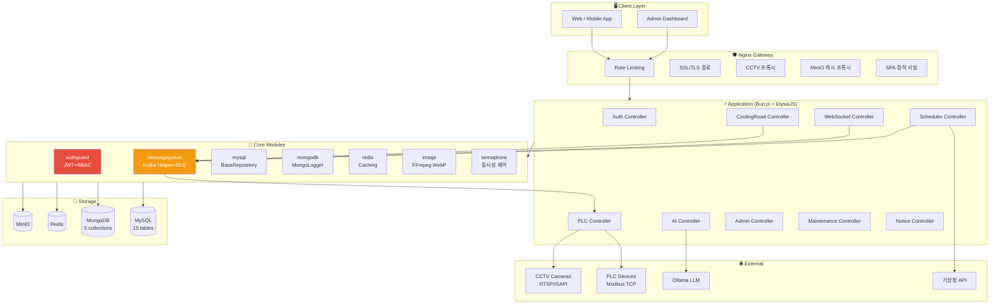
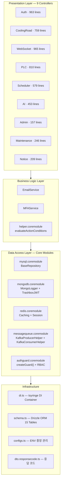
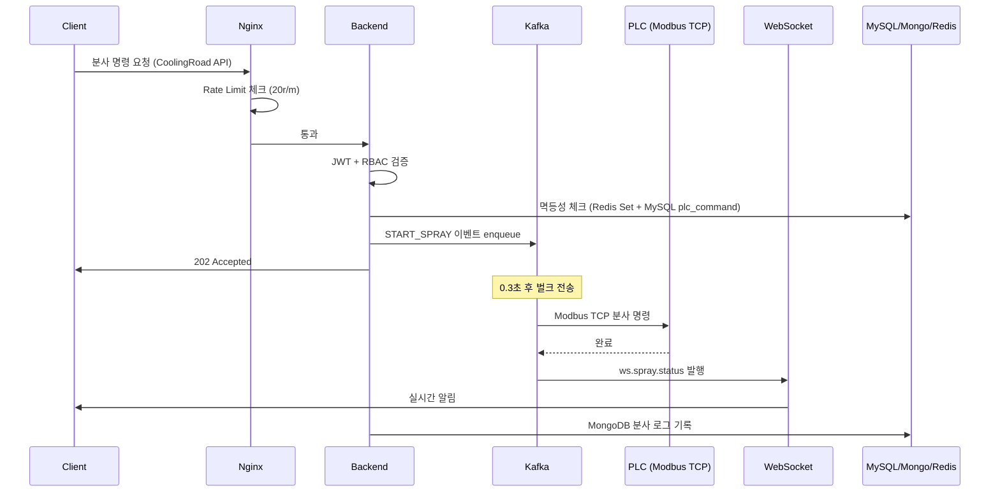
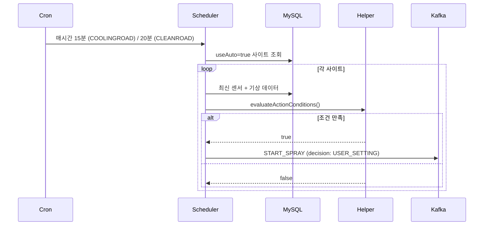
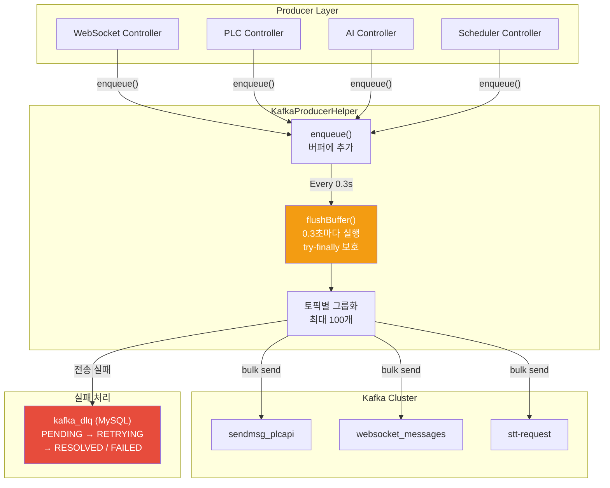
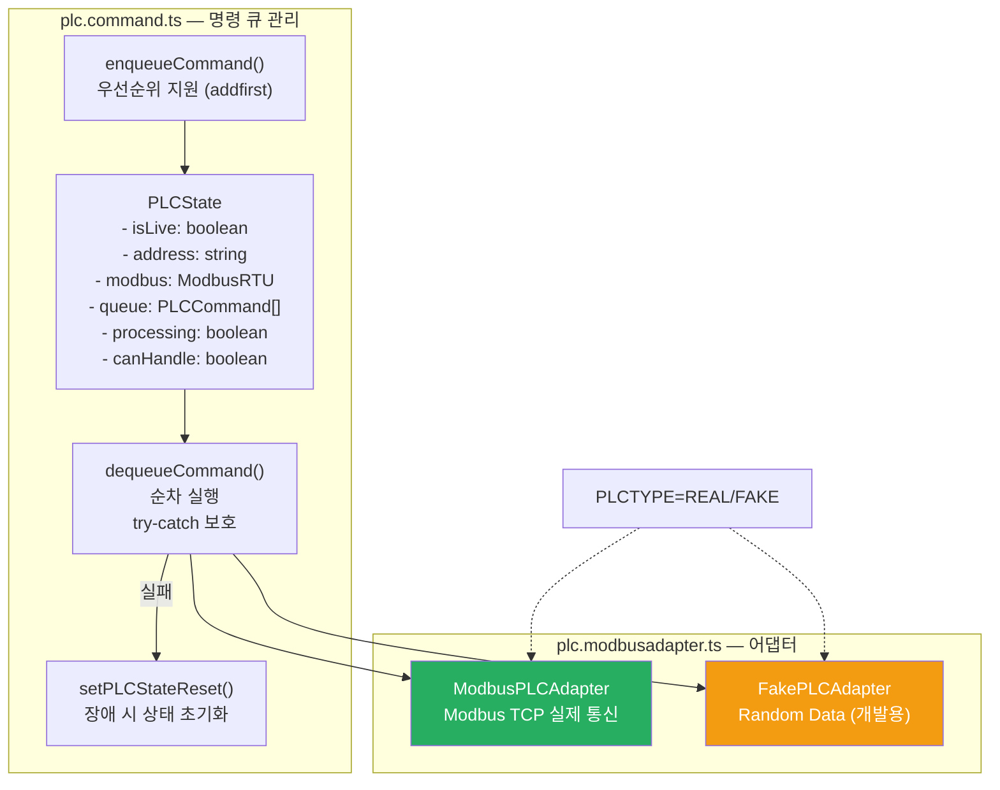
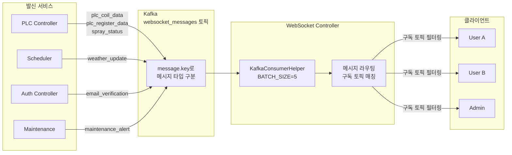
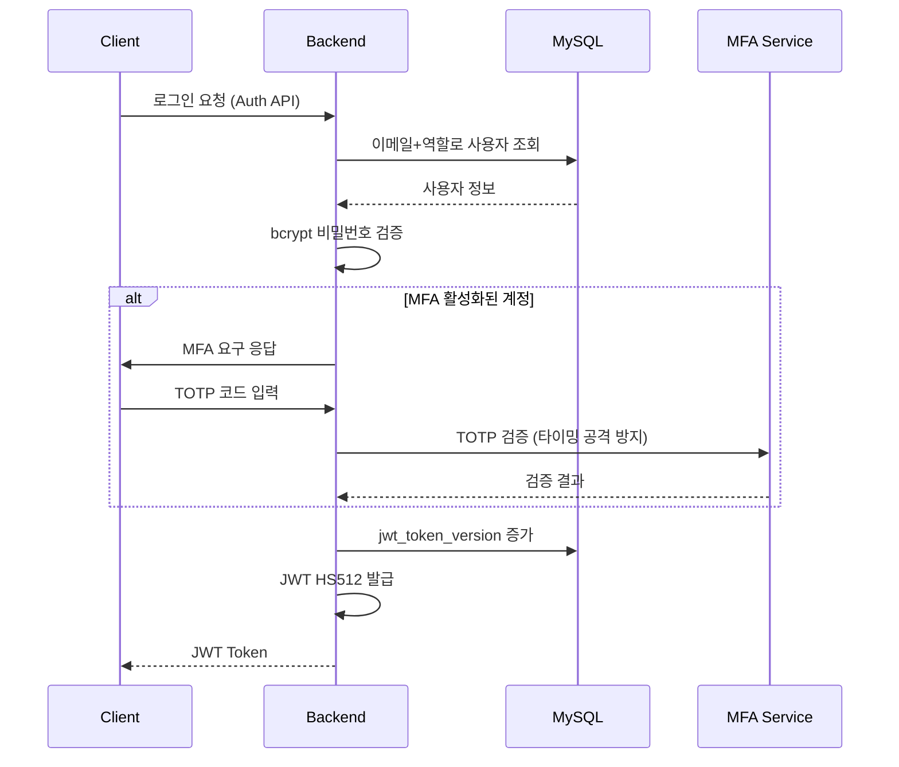

# 아키텍처 — Production IoT Backend

[← README](../README.md)

**Version**: 3.8.0 | **Last Updated**: 2026-03-04

---

## 📋 목차

1. [전체 시스템 구조](#전체-시스템-구조)
2. [레이어 구조](#레이어-구조)
3. [Coremodules 구성](#coremodules-구성)
4. [핵심 데이터 흐름](#핵심-데이터-흐름)
5. [Kafka 벌크 전송 아키텍처](#kafka-벌크-전송-아키텍처)
6. [PLC 명령 처리 흐름](#plc-명령-처리-흐름)
7. [WebSocket 메시지 흐름](#websocket-메시지-흐름)
8. [보안 아키텍처](#보안-아키텍처)
9. [성능 최적화 전략](#성능-최적화-전략)

---

## 전체 시스템 구조



---

## 레이어 구조



### BaseRepository 패턴

모든 DB 접근은 제네릭 `BaseRepository<T>`를 통해 일관된 인터페이스로 처리:

```typescript
class BaseRepository<TTable extends MySqlTable> {
    async create(data: TTable['_']['inferInsert']): Promise<DBResult>
    async readById(id: bigint): Promise<DBResult<TTable['_']['inferSelect']>>
    async readByCondition<K>(
        where?: (t: TTable) => SQL | undefined,
        orderby?: { column: K; direction: 'asc' | 'desc' },
        limit?: number
    ): Promise<DBResult<Array<TTable['_']['inferSelect']>>>
    async updateById(id: bigint, data: Partial<...>): Promise<DBResult>
    async deleteById(id: bigint): Promise<DBResult>
}
```

---

## Coremodules 구성

```
src/coremodules/
├── authguard.coremodule.ts     JWT 인증 + RBAC (createGuard 통합)
├── avatar.coremodule.ts        아바타 리소스 관리
├── datetime.coremodule.ts      날짜/시간 헬퍼
├── idgenerator.coremodule.ts   Snowflake ID 생성 (7개 인스턴스, worker별 분리)
├── image.coremodule.ts         FFmpeg → WebP 직접 인코딩
├── helper.coremodule.ts        evaluateActionConditions / withTimeout / LogBuffer
├── semaphore.coremodule.ts     Semaphore 동시성 제어
├── stream.coremodule.ts        ByteStream 헬퍼
└── database/
    ├── mysql.coremodule.ts     MySQL + BaseRepository
    ├── mongodb.coremodule.ts   MongoDB + MongoLogger + TrashboxJWT
    └── redis.coremodule.ts     Redis + 캐싱/세션
messagequeue/
    ├── messagequeue.coremodule.ts  KafkaProducerHelper + KafkaConsumerHelper + DLQ
    └── kafka.messagetypes.ts       토픽 정의 + ULID + 타입가드
```

**DI 컨테이너 (tsyringe)**:
```typescript
// di.ts — 모든 의존성 싱글턴 등록
container.registerSingleton(MySqlConnect)
container.registerSingleton(MongoDBConnect)
container.registerSingleton(RedisConnect)
container.registerSingleton(MongoLogger)
container.registerSingleton(TrashboxJWT)
container.registerSingleton(AuthGuard)
container.registerSingleton(KafkaProducerHelper)

// Snowflake ID — 컨트롤러별 고유 worker-id
container.registerInstance("snowflake_auth",      new Snowflake(1))
container.registerInstance("snowflake_admin",     new Snowflake(2))
container.registerInstance("snowflake_plc",       new Snowflake(3))
container.registerInstance("snowflake_mainservice", new Snowflake(4))
// ...
```

---

## 핵심 데이터 흐름

### 살수 명령 전체 흐름



### 자동 분사 흐름



---

## Kafka 벌크 전송 아키텍처



**Graceful Shutdown 보장**:
```typescript
async gracefullyShutdown() {
    while (this.buffer.length > 0) {
        await this.flushBuffer()  // 버퍼가 완전히 빌 때까지
    }
    clearInterval(this.flushtimer)  // 타이머 먼저 정지
    await this.producer.disconnect()
}
```

---

## PLC 명령 처리 흐름



**PLC LOCAL 모드 차단** (v3.6.8):
```typescript
// canHandle=false (LOCAL 모드)일 때 원격 분사 거부
async startSpray(siteId, ...) {
    if (!plc_state.canHandle) {
        await this.logger.logPLCInstruction({ tags: ['local'], ... })
        return  // 거부
    }
    // 분사 진행
}
```

---

## WebSocket 메시지 흐름



**구현된 WebSocket 메시지 타입 (6가지)**:

| Key | Topic | 설명 |
|-----|-------|------|
| `plc_coil_data` | `ws.plc.coil.data` | PLC 코일 상태 + 고장코드 (~5초) |
| `plc_register_data` | `ws.plc.register.data` | 센서 데이터 (~1분) |
| `weather_update` | `ws.weather.update` | 날씨 데이터 (~1시간) |
| `spray_status` | `ws.spray.status` | 분사 상태 변경 (이벤트) |
| `maintenance_alert` | `ws.maintenance.alert` | 유지보수 완료 알림 (이벤트) |
| `stt_response` | `ws.stt.response` | 음성 명령 결과 (이벤트) |

---

## 보안 아키텍처

### 인증 흐름



### MongoDB 로그 수집 구조

```typescript
// MongoLogger — LogBuffer 배치 처리 (200건 or 1초마다)
class MongoLogger {
    logRequest(channel: LogChannel, log: RequestLog)   // API 요청 로그
    logError(payload: ErrorLogDocument)                 // 에러 로그
    logWS(payload: WebsocketLogDocument)               // WebSocket 로그
    logScheduler(payload: SchedulerLogDocument)        // 스케줄러 로그
    logPLCInstruction(payload: PLCLogDocument)         // PLC 명령 로그
}
```

---

## 성능 최적화 전략

### 1. Cursor 기반 페이지네이션

```typescript
// limit+1 패턴 — 추가 COUNT 쿼리 없이 다음 페이지 여부 판단
const result = await repo.readByCondition(
    (t) => cursor ? lte(t.id, cursor) : undefined,
    { column: 'id', direction: 'desc' },
    limit  // DB에는 limit+1 전달
)
const hasmore = result.data.length > limit
if (hasmore) result.data.pop()
```

### 2. Redis 캐싱 전략

| 캐시 키 | 내용 | TTL |
|---------|------|-----|
| `weather:{siteId}` | 기상청 API 응답 | 1시간 |
| `session:{userId}` | JWT 세션 | 24시간 |
| `spray_site:{id}` | 분사 중인 사이트 (멱등성) | 분사 시간 + 5분 |

### 3. FFmpeg 이미지 파이프라인

```
Before: RTSP → FFmpeg → PNG buffer → Sharp → WebP  (2단계, 중간 버퍼 있음)
After:  RTSP → FFmpeg → WebP 직접 출력             (1단계)

효과: 메모리 40% 감소, 처리 속도 30% 향상, Sharp 의존성 제거
```

### 4. MongoDB 인덱스 전략

```javascript
// 시간순 조회 최적화
db.web_request_logs.createIndex({ timestamp: -1 })
db.web_request_logs.createIndex({ userid: 1, timestamp: -1 })

// 태그별 에러 필터링
db.error_logs.createIndex({ tags: 1, timestamp: -1 })

// PLC 사이트별 이벤트
db.plc_logs.createIndex({ siteId: 1, timestamp: -1 })
```

---

[← README](../README.md)

**Last Updated**: 2026-03-04 | **Version**: 3.8.0