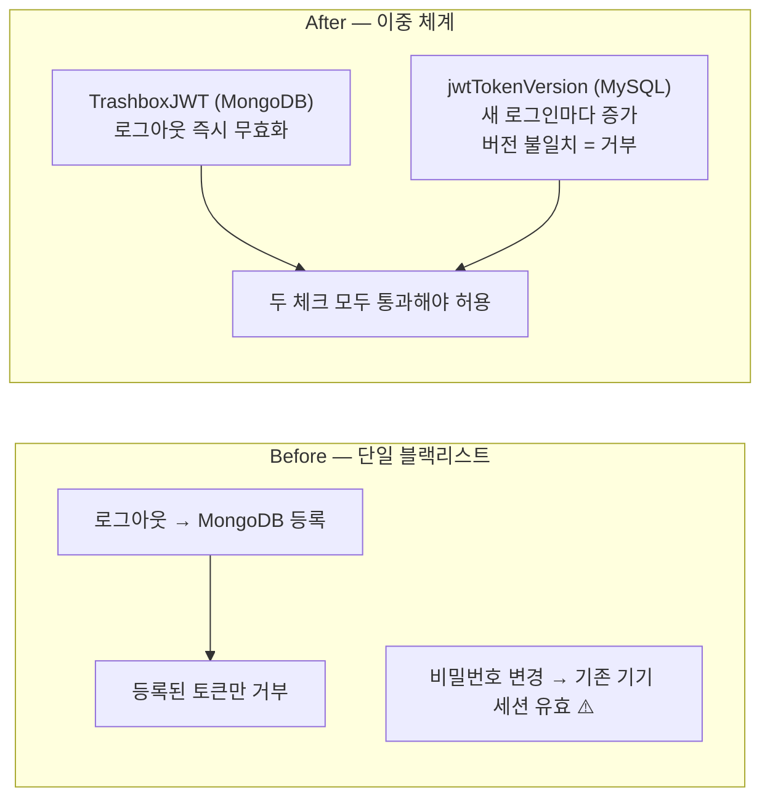
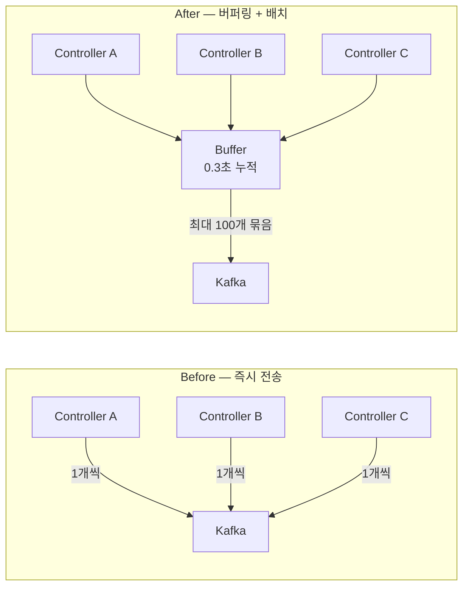
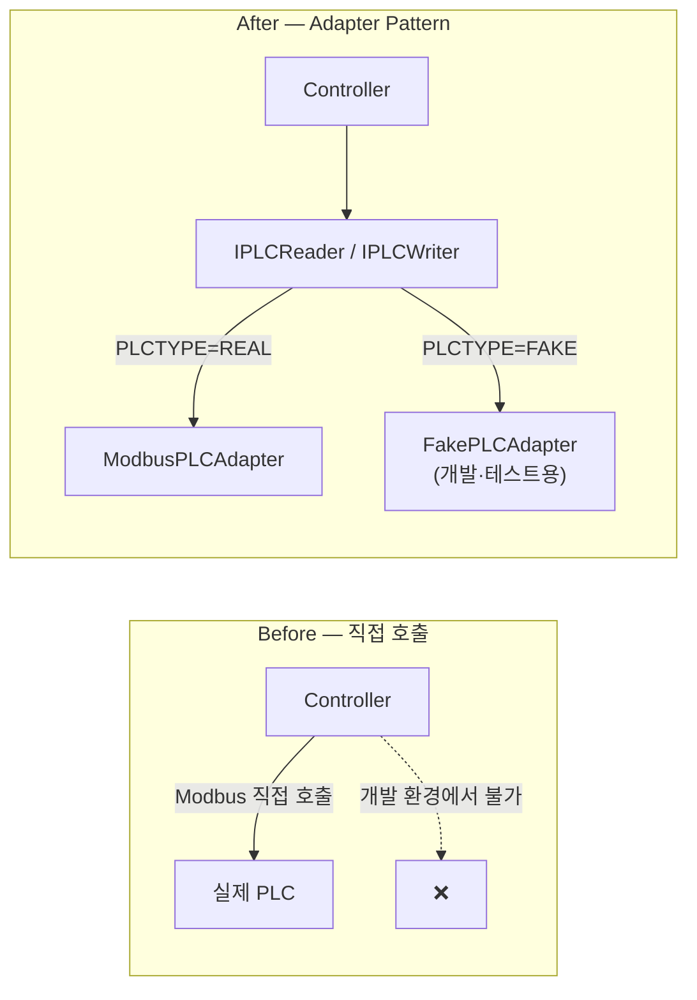
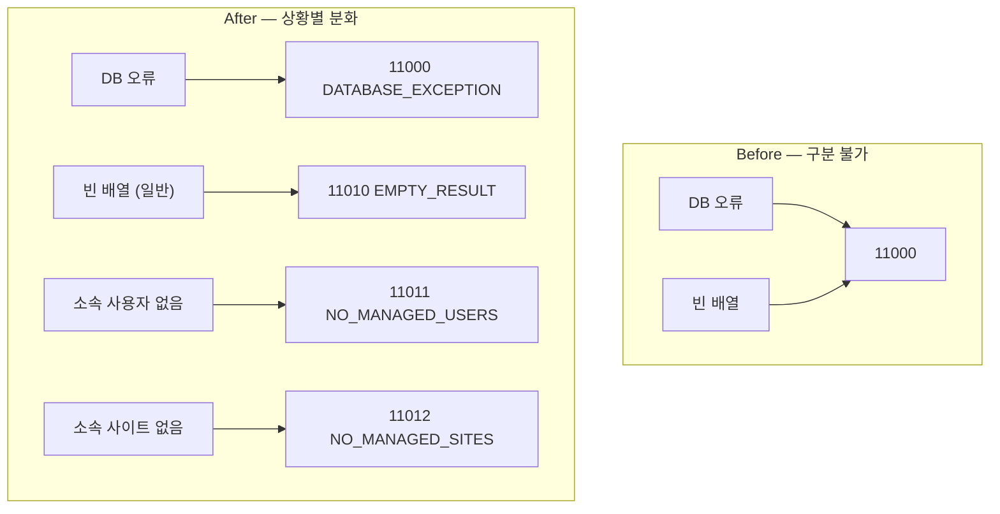

# 코드 개선 이력 — Production IoT Backend

[← README](../README.md)

> 버전 나열이 아닌, **구조가 어떻게 바뀌었는가**의 기록입니다.  
> 각 개선은 "문제 발견 → 원인 → 구조적 해결" 흐름으로 서술합니다.

---

## 📋 목차

1. [인증 · 보안 구조](#1-인증--보안-구조)
2. [메시지 처리 구조](#2-메시지-처리-구조)
3. [하드웨어 연동 구조](#3-하드웨어-연동-구조)
4. [코드 구조 · 중복 제거](#4-코드-구조--중복-제거)
5. [에러 처리 구조](#5-에러-처리-구조)
6. [성능 개선](#6-성능-개선)
7. [기술 스택 전환](#7-기술-스택-전환)

---

## 1. 인증 · 보안 구조

### 1-1. RBAC 역할 체크 — async 버그로 인한 완전 우회

**문제**: 코드 리뷰 중 발견. `checkRole()`에 `async` 키워드가 붙어 있어 `Promise` 객체를 반환하고 있었음. `!Promise`는 항상 `false`이므로 역할 체크 분기에 절대 진입하지 않음 → 모든 RBAC 보호가 무효화된 상태로 운영.

```
Before: private async checkRole() → !Promise → 항상 false → 역할 체크 통과
After:  private checkRole()       → boolean  → 정상 판단
```

**교훈**: 기능 테스트로는 발견 불가. `async` 한 글자가 보안 체계 전체를 무력화할 수 있음. 코드 리뷰의 필요성을 직접 증명한 사례.

---

### 1-2. JWT 무효화 — 단일 블랙리스트 → 이중 체계

**문제**: 로그아웃 후 토큰을 MongoDB 블랙리스트(TrashboxJWT)에 등록하는 방식만 존재. 비밀번호 변경 시 기존 기기의 세션을 만료시킬 방법이 없었음.



**효과**: 새 기기 로그인 시 `jwtTokenVersion` 증가 → 기존 모든 기기 세션 즉시 만료. PLC 제어처럼 민감한 작업에서의 동시 접근을 구조로 차단.

---

### 1-3. 관리자 인증 — SQL 평문 비밀번호 비교 제거

**문제**: 코드 리뷰 중 발견. 일반 사용자 로그인은 bcrypt 해시 비교를 사용하는데, 관리자 로그인은 SQL WHERE 절에 평문 비밀번호를 포함하고 있었음. SQL 로그에 비밀번호가 그대로 노출.

```
Before: WHERE admin_id = ? AND admin_password_hash = '평문비밀번호'
After:  WHERE admin_id = ?  →  bcrypt.verify(입력값, 해시)
```

---

### 1-4. 접근 제어 — 소유권 검증 누락

**문제**: 코드 리뷰 중 발견. 사이트 데이터 조회 시 JWT에서 추출한 사용자 ID로 인증은 하지만, 조회 대상 사이트가 해당 사용자의 소속 그룹 소유인지 검증하지 않았음 → 다른 그룹의 사이트 데이터 열람 가능.

```
Before: JWT 인증 통과 → 사이트 ID로 바로 조회
After:  JWT 인증 통과 → owned_group 일치 여부 확인 → 조회
```

---

## 2. 메시지 처리 구조

### 2-1. Kafka 전송 — 즉시 전송 → 버퍼링 + 배치

**문제**: 컨트롤러마다 Kafka 메시지를 즉시 개별 전송. PLC 센서 폴링(~5초마다)과 여러 컨트롤러가 동시에 메시지를 발행하면 네트워크 요청이 폭증.



| 지표 | Before | After |
|------|--------|-------|
| 네트워크 요청 | 메시지당 1회 | 100개당 1~2회 |
| CPU 사용률 | ~80% | ~30% |
| 처리량 | 100 msg/s | 5,000+ msg/s |

---

### 2-2. 메시지 손실 — DLQ 없음 → 자동 저장 + 재처리

**문제**: Kafka 전송 실패 시 메시지가 그냥 유실. PLC 명령이 유실되면 실제 장비에 명령이 도달하지 않지만 시스템은 성공으로 간주.

```
Before: 전송 실패 → 예외 무시 → 메시지 유실
After:  전송 실패 → MySQL kafka_dlq 자동 저장
        PENDING → RETRYING → RESOLVED / FAILED
        실패 이력 + errorStack 보존 → 수동 재처리 가능
```

---

### 2-3. Graceful Shutdown — 종료 순서 역전 버그

**문제**: 서버 종료 시 DB 연결을 먼저 닫고 Kafka Producer를 나중에 종료하는 순서였음. Producer가 버퍼에 남은 메시지를 전송하려 해도 이미 DB가 닫혀 있어 DLQ 저장 실패.

```
Before: DB 종료 → Kafka Producer 종료  (버퍼 메시지 유실 가능)
After:  Kafka 버퍼 완전히 비우기 → Producer 종료 → DB 종료
```

추가로 `clearInterval`이 `producer.disconnect()` 이후에 실행되어 닫힌 Producer로 재전송을 시도하는 버그도 함께 수정. 타이머를 먼저 정지한 뒤 연결을 종료하는 순서로 변경.

---

### 2-4. 플래그 안전성 — try-finally 누락

**문제**: `flushBuffer()`에서 배치 전송 중 예외가 발생하면 `process = true` 플래그가 해제되지 않아 이후 모든 메시지 전송이 영구적으로 차단.

```
Before: process = true → 작업 → (예외 발생) → process 해제 안 됨 → 영구 잠금
After:  process = true → try { 작업 } finally { process = false } → 항상 해제
```

---

## 3. 하드웨어 연동 구조

### 3-1. PLC 의존성 — 직접 호출 → Adapter Pattern

**문제**: PLC Modbus TCP 통신 코드가 컨트롤러 로직에 직접 섞여 있었음. 개발 환경에 실제 PLC 장비가 없어 테스트 불가. 통신 프로토콜 변경 시 비즈니스 로직도 함께 수정해야 함.



**효과**: ENV 하나로 전환, 코드 변경 없이 개발·테스트 가능.

---

### 3-2. PLC 명령 중복 — 멱등성 체계 도입

**문제**: 네트워크 지연이나 재시도 상황에서 같은 분사 명령이 두 번 실행될 수 있었음. 실제 도로 살수 장비가 두 번 작동하면 물리적 피해로 이어짐.

또한 쿼리 방향(`gte`/`lte`)이 반전되어 있어 유효한 명령이 있어도 없다고 판단하고 새 명령을 생성하는 버그 발견.

```
After: Redis Set(분사 중인 사이트) + MySQL plc_command(유효 명령) 이중 체크
       → 중복 분사 명령 구조적 차단
```

---

### 3-3. PLC LOCAL 모드 — 원격 명령 차단 누락

**문제**: 현장 작업자가 PLC를 LOCAL 모드로 전환하면 원격 제어를 받지 않도록 해야 하는데, 원격에서 분사 명령이 전달되어 현장 작업자와 충돌 가능성 존재.

```
Before: 원격 분사 명령 → PLC 상태 무관하게 전송
After:  canHandle 필드로 REMOTE/LOCAL 상태 추적
        canHandle=false(LOCAL 모드) → 명령 거부 + 로그 기록
```

---

## 4. 코드 구조 · 중복 제거

### 4-1. AuthGuard — 7개 컨트롤러 중복 → createGuard() 통합

**문제**: JWT 검증, 역할 체크, 요청 로깅을 처리하는 ~70줄 코드가 9개 컨트롤러마다 각자 구현되어 있었음. 인증 로직 변경 시 모든 파일을 수정해야 하는 구조.

```
Before: 컨트롤러마다 JWT 파싱 → 역할 체크 → 로깅 (9곳 중복)
After:  createGuard() 단일 함수 → 모든 컨트롤러가 공유
        MFA가 필요한 라우트는 별도 mfaauthguard()
```

---

### 4-2. 매직 넘버 → 환경변수

**문제**: 기본 분사 시간이 코드 곳곳에 숫자 `3`으로 하드코딩. 현장 상황에 따라 값을 조정하려면 코드를 수정하고 재배포해야 했음.

```
Before: const DEFAULT_DURATION = 3  (컨트롤러 내 하드코딩)
After:  ENV.COOLINGROAD_DEFAULT_DURATION  (환경변수, fallback=3)
```

---

### 4-3. 이미지 처리 파이프라인 — 2단계 → 1단계

**문제**: CCTV 이미지 캡처가 FFmpeg(PNG) → Sharp(WebP 변환) 2단계 파이프라인으로 구성. 중간 PNG 버퍼가 메모리에 상주하며, 여러 사이트 동시 처리 시 메모리 사용량이 급증.

```
Before: FFmpeg → PNG 버퍼 → Sharp → WebP  (2단계, 중간 버퍼 있음)
After:  FFmpeg → WebP 직접 출력            (1단계, Sharp 의존성 제거)

효과: 메모리 40% 감소, 처리 속도 30% 향상
```

---

### 4-4. FFmpeg 동시성 — 무제한 → Semaphore(3)

**문제**: 여러 사이트에서 동시에 이미지 캡처 요청이 들어오면 FFmpeg 프로세스가 무제한으로 생성. 외부 라이브러리 없이 직접 구현한 `Semaphore` 클래스로 최대 3개 동시 실행을 보장.

```
Before: 요청마다 FFmpeg 프로세스 즉시 생성 → N개 동시 실행
After:  Semaphore(3) → 초과 요청은 큐에서 대기 → 순차 실행
```

---

## 5. 에러 처리 구조

### 5-1. DB 에러 코드 — 단일 코드 → 상황별 분화

**문제**: DB 쿼리 실패(`11000 DATABASE_EXCEPTION`)와 쿼리 성공 + 빈 배열이 같은 코드를 반환. 프론트엔드에서 "서버 에러"와 "데이터 없음"을 구분해서 처리할 방법이 없었음.



**효과**: 프론트엔드가 서버 장애와 빈 상태 UI를 독립적으로 처리 가능.

---

### 5-2. 인증 에러 코드 — 혼용 → 분리

**문제**: 비밀번호 불일치, 이미 가입된 계정, 가입되지 않은 계정이 모두 `1002 INVALID_CREDENTIALS` 하나를 사용. 사용자에게 맥락에 맞는 안내를 줄 수 없었음.

```
Before: 1002 — 비밀번호 불일치 / 중복 계정 / 계정 없음 혼용
After:  1002 — 비밀번호 불일치만
        1008 — 이미 가입된 계정 (ALREADY_SIGNED_UP)
        1009 — 가입된 계정 없음 (UNSIGNED_UP_ACCOUNT)
```

---

### 5-3. Redis 캐시 역직렬화 — Map 직렬화 오류

**문제**: 기상청 날씨 데이터를 Redis에 캐시할 때 `Map` 객체를 `JSON.stringify`로 직렬화. `Map`은 JSON 직렬화 시 빈 객체 `{}`가 되므로, 캐시 hit 시 `Map` 메서드(`get`, `set`)를 호출하면 TypeError → 서버 크래시.

```
Before: Map 객체 → JSON.stringify({}) 저장 → 캐시 hit → Map 메서드 호출 → 크래시
After:  Array.from(map.entries()) → JSON 저장 → 캐시 hit → new Map(parsed) 복원
```

---

## 6. 성능 개선

### 6-1. 페이지네이션 — Offset → Cursor

**문제**: 살수 이력, 날씨 이력, 센서 데이터가 누적되면서 Offset 방식의 성능 한계 예상. 뒤쪽 페이지일수록 DB가 앞의 모든 행을 읽고 버려야 함.

```
측정 결과 (1,000,000 rows 기준):
Offset:  LIMIT 20 OFFSET 999980  →  2.5초
Cursor:  WHERE id <= :cursor LIMIT 21  →  0.03초  (83배 차이)
```

`limit+1` 패턴으로 추가 COUNT 쿼리 없이 `hasmore` 판단. 인덱스를 최대한 활용하는 구조.

---

### 6-2. MongoDB 로그 — 건별 저장 → LogBuffer 배치

**문제**: API 요청마다 MongoDB에 즉시 로그를 기록. 고트래픽 상황에서 MongoDB 연결 오버헤드가 응답 지연으로 이어짐.

```
Before: 요청마다 db.insert() 즉시 호출
After:  LogBuffer에 누적 → 200건 또는 1초 간격으로 배치 insertMany
```

---

## 7. 기술 스택 전환

### 7-1. JavaScript → TypeScript + 런타임 교체 (v3.0.0)

**배경**: JavaScript 코드베이스에서 타입 오류가 런타임에 발견되는 빈도가 높아졌고, ORM 없는 Raw SQL 관리가 어려워짐.

| 항목 | Before | After | 이유 |
|------|--------|-------|------|
| 언어 | JavaScript | TypeScript 5.0 | 컴파일 타임 타입 안전성 |
| 런타임 | Node.js | Bun.js | 빌드 없는 TS 직접 실행, 빠른 시작 |
| 프레임워크 | Express.js | ElysiaJS | TypeBox 기반 스키마 검증, 성능 |
| ORM | Raw SQL | Drizzle ORM | 타입 안전 쿼리, 마이그레이션 |
| DI | 없음 | tsyringe | 의존성 역전, 테스트 용이성 |

---

[← README](../README.md)

**Last Updated**: 2026-03-04 | **Version Range**: v1.0.0 ~ v3.8.0