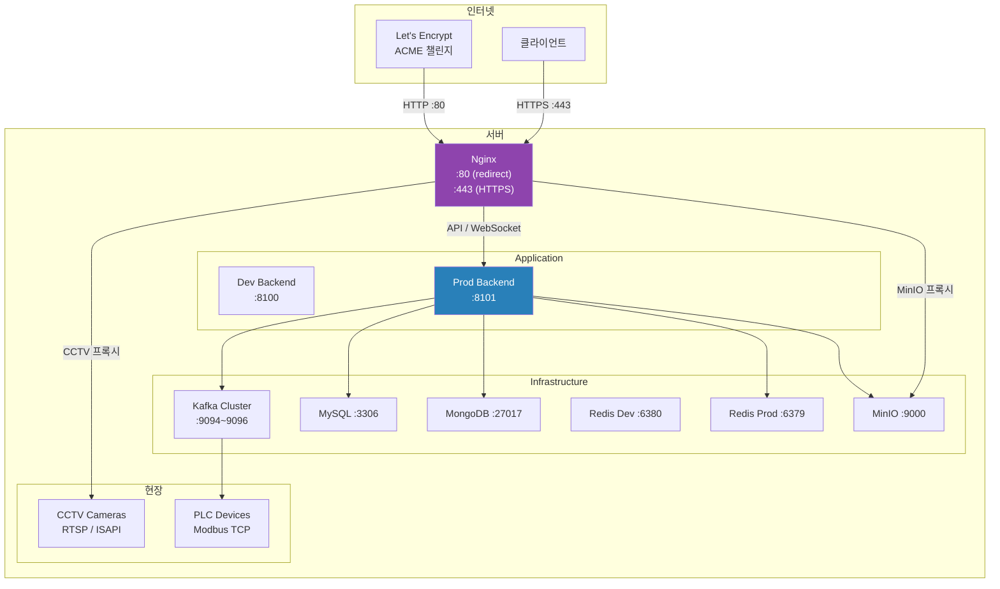
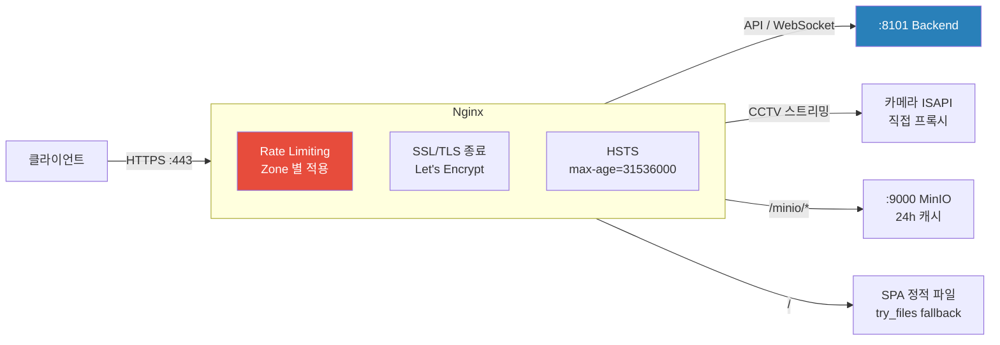
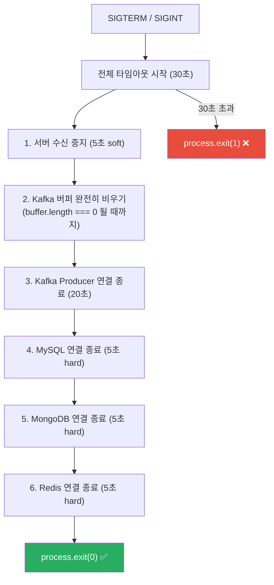

# 배포 가이드 — Production IoT Backend

[← README](../README.md)

**Version**: 3.8.0 | **Last Updated**: 2026-03-04

---

## 📋 목차

1. [인프라 개요](#인프라-개요)
2. [Docker Compose 환경 분리](#docker-compose-환경-분리)
3. [환경변수 설정](#환경변수-설정)
4. [Nginx 구성](#nginx-구성)
5. [SSL/TLS 설정](#ssltls-설정)
6. [Graceful Shutdown](#graceful-shutdown)
7. [Health Check](#health-check)
8. [개발 환경 빠른 시작](#개발-환경-빠른-시작)

---

## 인프라 개요



---

## Docker Compose 환경 분리

3-파일 구조로 환경별 설정 오버라이드:

```
docker-compose.yml          # 베이스 (공통 서비스 정의)
docker-compose_dev.yml      # 개발 오버라이드 (port 8100, Redis :6380)
docker-compose_prod.yml     # 프로덕션 오버라이드 (port 8101, Redis :6379)
```

**개발 환경 실행:**
```bash
docker-compose -f docker-compose.yml -f docker-compose_dev.yml up -d
```

**프로덕션 환경 실행:**
```bash
docker-compose -f docker-compose.yml -f docker-compose_prod.yml up -d
```

**베이스 구성 예시:**
```yaml
services:
  backend:
    build: .
    restart: unless-stopped

  mysql:
    image: mysql:8.0
    volumes:
      - mysql-data:/var/lib/mysql

  mongodb:
    image: mongo:6.0
    volumes:
      - mongodb-data:/data/db

  redis:
    image: redis:7.0

  kafka:
    image: confluentinc/cp-kafka:latest

  minio:
    image: minio/minio
    command: server /data --console-address ":9001"

volumes:
  mysql-data:
  mongodb-data:
  minio-data:
```

---

## 환경변수 설정

```bash
cp _env .env
nano .env
```

**필수 환경변수:**

```env
# 실행 환경
NODE_ENV=production          # development / production
PLCTYPE=REAL                 # FAKE(개발/테스트) / REAL(실제 장비)
USE_SSL=1                    # 0: HTTP, 1: HTTPS

# 서버
DNS_HOST=your-domain.com
LOCAL_HOST=127.0.0.1   # 로컬 바인딩용
APPLICATION_PORT=8101
APPLICATION_PORT_DEV=8100

# 보안 (반드시 강력한 랜덤 값으로 교체)
JWT_SECRET=<강력한-랜덤-시크릿-32자-이상>
JWT_SECRET_DEV=<개발용-시크릿>
JWT_TOKEN_EXPIRE=24h
MFA_SECRET=<MFA-시크릿>
MFA_SECRET_DEV=<개발용-MFA-시크릿>

# MySQL
MYSQL_PORT=3306
DB_SECURITY=user:password

# MongoDB
MONGODB_PORT=27017

# Redis
REDIS_PORT=6379
REDIS_PORT_DEV=6380

# Kafka (KRaft 클러스터 3브로커)
# localhost:9094, localhost:9095, localhost:9096

# MinIO
MINIO_PORT=9000
MINIO_ACCESSKEY=admin
MINIO_SECRETKEY=<강력한-패스워드>
MINIO_BUCKETNAME=coolingroad
MINIO_BUCKETNAME_DEV=coolingroad-dev

# SMTP
SMTP_ID=your-email@gmail.com
SMTP_PASSWORD=<앱-패스워드>
SMTP_HOST=smtp.gmail.com

# PLC
COOLINGROAD_DEFAULT_DURATION=3   # 기본 분사 시간(분)

# CORS (프로덕션, 콤마로 구분)
CORS_ORIGINS=https://your-domain.com

# Ollama (AI LLM)
OLLAMA_PORT=11434
```

> ⚠️ **보안 주의사항**: `JWT_SECRET`, `MFA_SECRET`, MinIO 패스워드는 반드시 충분한 엔트로피를 가진 랜덤값으로 교체하세요. 예시값 그대로 사용 금지.

---

## Nginx 구성



### Nginx가 직접 처리하는 기능 (백엔드 코드 없음)

| 기능 | 처리 주체 | 설명 |
|------|---------|------|
| Rate Limiting | Nginx | IP 기반, 엔드포인트별 다른 Rate |
| SSL/TLS 종료 | Nginx | TLSv1.2/1.3, OCSP Stapling |
| CCTV 스트리밍 | Nginx | 카메라 IP/인증 매핑은 Nginx conf에서만 관리 |
| MinIO 프록시 | Nginx | 이미지 24h 서버 캐시, 파일 60m 캐시 |
| SPA Fallback | Nginx | `try_files $uri /index.html` |
| HTTP→HTTPS 리다이렉트 | Nginx | 301 permanent |

### Rate Limiting 설정

```nginx
# nginx.conf — Zone 정의
limit_req_zone $binary_remote_addr zone=auth_limit:10m          rate=10r/m;
limit_req_zone $binary_remote_addr zone=coolingroad_read_limit:10m  rate=60r/m;
limit_req_zone $binary_remote_addr zone=coolingroad_write_limit:10m rate=20r/m;
limit_req_zone $binary_remote_addr zone=admin_limit:10m          rate=30r/m;
limit_req_zone $binary_remote_addr zone=mfa_limit:10m            rate=15r/m;
limit_req_zone $binary_remote_addr zone=upload_limit:10m         rate=10r/m;

# 429 커스텀 응답
error_page 429 = @rate_limit_exceeded;
location @rate_limit_exceeded {
    default_type application/json;
    return 429 '{"code": 429, "message": "Too many requests."}';
}
```

---

## SSL/TLS 설정

**Let's Encrypt 인증서 발급:**
```bash
# certbot 설치
sudo apt install certbot python3-certbot-nginx

# 인증서 발급
sudo certbot --nginx -d your-domain.com

# 자동 갱신 확인
sudo certbot renew --dry-run
```

**Nginx SSL 설정:**
```nginx
ssl_protocols TLSv1.2 TLSv1.3;
ssl_ciphers ECDHE-ECDSA-AES128-GCM-SHA256:ECDHE-RSA-AES128-GCM-SHA256:...;
ssl_session_cache shared:SSL:10m;
ssl_session_timeout 1d;

# OCSP Stapling
ssl_stapling on;
ssl_stapling_verify on;

# 보안 헤더
add_header Strict-Transport-Security "max-age=31536000; includeSubDomains" always;
add_header X-Frame-Options "DENY" always;
add_header X-Content-Type-Options "nosniff" always;
add_header X-XSS-Protection "1; mode=block" always;
```

---

## Graceful Shutdown



**종료 순서가 중요한 이유:**
- Kafka Producer 먼저 → 버퍼에 남은 메시지를 모두 전송하고 나서 DB 연결 종료
- `clearInterval` 먼저 → `producer.disconnect()` 이후 타이머가 닫힌 producer로 전송 시도 방지 (v3.6.9 수정)

---

## Health Check

Health Check API로 서비스 상태를 확인할 수 있습니다 (localhost 전용).

**응답:**
```json
{
  "status": "ok",
  "mysql": true,
  "mongodb": true,
  "redis": true,
  "kafka_msg": "LIVE"
}
```

**Kafka Health Check**: 10분마다 `health-check` 토픽으로 메시지 송수신 검증
- `INITIALIZE` → `CHECKING` → `LIVE` / `DEAD`

---

## 개발 환경 빠른 시작

```bash
# 1. Bun.js 설치
curl -fsSL https://bun.sh/install | bash

# 2. 의존성 설치
bun install

# 3. 환경변수
cp _env .env
# .env 편집: NODE_ENV=development, PLCTYPE=FAKE

# 4. 인프라 실행 (Docker)
docker-compose -f docker-compose.yml -f docker-compose_dev.yml up -d

# 5. DB 마이그레이션
bunx drizzle-kit push:mysql --config drizzle_dev_config.ts

# 6. 서버 실행
bun run dev
```

실행 후 Health Check API와 OpenAPI 문서, PLC 테스트 페이지를 통해 정상 동작을 확인할 수 있습니다.

---

[← README](../README.md)

**Last Updated**: 2026-03-04 | **Version**: 3.8.0