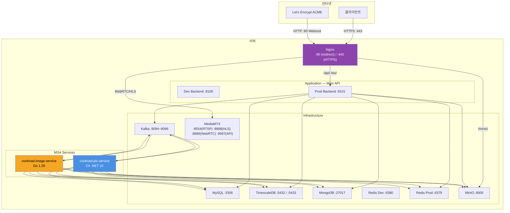

# 🚀 배포 가이드 — Production IoT Backend

[← README](../README.md)

**Version**: 4.4.0 | **Last Updated**: 2026-03-19

---

## 📋 목차

1. [인프라 개요](#1-인프라-개요)
2. [Docker Compose 환경 구성](#2-docker-compose-환경-구성)
3. [MSA 서비스 배포](#3-msa-서비스-배포)
4. [환경변수 설정](#4-환경변수-설정)
5. [데이터베이스 마이그레이션](#5-데이터베이스-마이그레이션)
6. [Nginx 구성](#6-nginx-구성)
7. [SSL/TLS 설정](#7-ssltls-설정)
8. [Health Check](#8-health-check)
9. [Graceful Shutdown](#9-graceful-shutdown)
10. [문제 해결](#10-문제-해결)

---

## 1. 인프라 개요



---

## 2. Docker Compose 환경 구성

### 3-파일 오버라이드 구조

```
docker-compose.yml          # 베이스 — 공통 서비스 정의
docker-compose.dev.yml      # 개발 오버라이드 (port 8100, Redis :6380, TimescaleDB :5433)
docker-compose.prod.yml     # 프로덕션 오버라이드 (port 8101, Redis :6379, TimescaleDB :5432)
```

### Main API 실행

```bash
# 개발
docker compose -f docker-compose.yml -f docker-compose.dev.yml up -d

# 프로덕션
docker compose -f docker-compose.yml -f docker-compose.prod.yml up -d

# 로그
docker compose logs -f backend
```

### 전체 스택 실행 (Main API + MSA 서비스)

```bash
# 개발 — Main API + Image Service
docker compose \
  -f docker-compose.yml \
  -f docker-compose.dev.yml \
  -f ../coolroad-image-service/docker-compose.dev.yml \
  up -d

# 프로덕션 — 전체 스택
docker compose \
  -f docker-compose.yml \
  -f docker-compose.prod.yml \
  -f ../coolroad-image-service/docker-compose.prod.yml \
  -f ../coolroad-plc-service/docker-compose.prod.yml \
  up -d
```

---

## 3. MSA 서비스 배포

### coolroad-image-service (Go)

```bash
# 리포지토리 클론
git clone <image-service-repo> coolroad-image-service
cd coolroad-image-service

# 환경변수 (Main API .env 공유)
cp ../<main-backend>/.env .env

# 로컬 빌드 (CGO 필요 — librdkafka 의존)
CGO_ENABLED=1 go build -tags musl -o image-service .
./image-service

# Docker 실행
# 개발
docker compose -f docker-compose.dev.yml up --build

# 프로덕션
docker compose -f docker-compose.prod.yml up -d --build
```

**환경변수 (Image Service 전용)**

| 변수 | 설명 | Dev 기본값 | Prod 기본값 |
|------|------|-----------|-----------|
| `WORKER_CONCURRENCY` | 동시 캡처 Worker 수 | 2 | 3 |
| `QUEUE_SIZE` | Job Queue 버퍼 크기 | 30 | 100 |
| `FFMPEG_TIMEOUT` | ffmpeg 캡처 타임아웃 (초) | 10 | 8 |

> 나머지 `LOCAL_HOST`, `DB_SECURITY`, `MYSQL_PORT`, `MONGODB_PORT`, `MINIO_PORT` 등은 Main API `.env` 공유.

---

### coolroad-plc-service (C# .NET 10)

```bash
# 리포지토리 클론
git clone <plc-service-repo> coolroad-plc-service
cd coolroad-plc-service

# 로컬 실행 (FAKE PLC — 개발)
docker compose up

# 프로덕션 (REAL PLC)
docker compose -f docker-compose.prod.yml up -d
```

**환경변수 (PLC Service 전용)**

| 변수 | 설명 | Dev 기본값 |
|------|------|-----------|
| `PlcService__Environment` | 환경 구분 | `development` |
| `PlcService__PlcType` | PLC 모드 (`REAL` / `FAKE`) | `FAKE` |
| `PlcService__KafkaBrokers` | Kafka 브로커 주소 | `localhost:9094,...` |
| `PlcService__MySqlConnectionString` | MySQL 연결 문자열 | `Server=localhost;...` |
| `PlcService__TimescaleDbConnectionString` | TimescaleDB 연결 문자열 | `Host=localhost;...` |
| `PlcService__DefaultSprayDuration` | 기본 분사 시간 (분) | `3` |
| `PlcService__MaxPlcQueueSize` | Modbus 명령 큐 최대 크기 | `50` |

**프로덕션 전환 시 체크리스트**

```bash
# 1. FAKE → REAL 전환 전 확인
PlcService__PlcType=REAL

# 2. 실제 PLC IP 주소 설정 확인
# DB site_data.plcaddress 에 실제 IP 입력 여부

# 3. Modbus TCP 포트 접근 확인
telnet <PLC_IP> 502

# 4. Kafka 브로커 연결 확인
kafka-console-consumer --bootstrap-server localhost:9094 \
  --topic sendmsg_plcapi_dev --from-beginning
```

---

### 병렬 운영 (마이그레이션 기간)

신규 MSA 서비스 배포 시 기존 TypeScript 코드와 병렬 운영 후 교체한다.

```bash
# Consumer Group 분리 확인
# TypeScript: consumer group = "plc-ts-consumer"
# C#:         consumer group = "plc-consumer" (prod) / "plc-consumer-dev" (dev)
# → 동일 메시지를 두 서비스가 동시 처리하지 않음
```

---

## 4. 환경변수 설정

```env
# ─── JWT ───
JWT_SECRET=<32자 이상 랜덤 시크릿>
JWT_SECRET_DEV=dev-secret-key
JWT_TOKEN_EXPIRE=24h

# ─── MFA ───
MFA_SECRET=<MFA 암호화 시크릿>
MFA_SECRET_DEV=dev-mfa-secret

# ─── 서버 ───
DNS_HOST=<도메인>
LOCAL_HOST=127.0.0.1
APPLICATION_PORT=8101
APPLICATION_PORT_DEV=8100
USE_SSL=1          # 1: HTTPS, 0: HTTP

# ─── MySQL ───
MYSQL_PORT=3306
DB_SECURITY=user:password

# ─── TimescaleDB (v4.0.0 신규) ───
TIMESCALEDB_PORT=5432
TIMESCALEDB_PORT_DEV=5433
TIMESCALEDB_SECURITY=user:password

# ─── MongoDB ───
MONGODB_PORT=27017

# ─── Redis ───
REDIS_PORT=6379
REDIS_PORT_DEV=6380

# ─── MinIO ───
MINIO_PORT=9000
MINIO_ACCESSKEY=<액세스키>
MINIO_SECRETKEY=<시크릿키>
MINIO_BUCKETNAME=coolingroad
MINIO_BUCKETNAME_DEV=coolingroad-dev

# ─── SMTP ───
SMTP_ID=<이메일>
SMTP_PASSWORD=<앱 비밀번호>
SMTP_HOST=smtp.gmail.com
SMTP_KEY=<SMTP 키>

# ─── Ollama (AI) ───
OLLAMA_PORT=11434

# ─── CCTV MediaMTX ───
MEDIAMTX_API_PORT=9997
MEDIAMTX_METRICS_PORT=9998
MEDIAMTX_WEBRTC_PORT=8889
MEDIAMTX_HLS_PORT=8888
MEDIAMTX_PUBLIC_URL_EXTERNAL=https://<도메인>/stream
MEDIAMTX_PUBLIC_HLS_URL_EXTERNAL=https://<도메인>/stream-hls
MEDIAMTX_INTERNAL_NETWORKS=192.168.,172.22.

# ─── CORS ───
CORS_ORIGINS=https://<도메인>
```

---

## 5. 데이터베이스 마이그레이션

### MySQL (Drizzle ORM)

```bash
# 개발
bunx drizzle-kit push:mysql --config [개발 설정 파일]

# 프로덕션
bunx drizzle-kit push:mysql --config [프로덕션 설정 파일]
```

### TimescaleDB (v4.0.0 — 수동 설정 필요)

Drizzle 마이그레이션으로 테이블은 자동 생성되지만, hypertable/압축/보존 정책은 수동 적용이 필요하다.

```bash
# 개발
bunx drizzle-kit push:pg --config [TimescaleDB 개발 설정 파일]

# 프로덕션
bunx drizzle-kit push:pg --config [TimescaleDB 프로덕션 설정 파일]
```

```sql
-- TimescaleDB 수동 초기 설정 (마이그레이션 후 1회 실행)

-- 1. 확장 활성화
CREATE EXTENSION IF NOT EXISTS timescaledb;

-- 2. hypertable 변환
SELECT create_hypertable('site_weather_sensor', 'time',
    chunk_time_interval => INTERVAL '1 month');
SELECT create_hypertable('kma_weather_data', 'time',
    chunk_time_interval => INTERVAL '1 month');

-- 3. 인덱스
CREATE INDEX idx_weather_sensor_site_time
    ON site_weather_sensor (site_id, "time" DESC);
CREATE INDEX idx_kma_weather_site_time
    ON kma_weather_data (site_id, "time" DESC);

-- 4. 압축 정책 (6개월 이후 자동 압축)
ALTER TABLE site_weather_sensor SET (
    timescaledb.compress,
    timescaledb.compress_segmentby = 'site_id',
    timescaledb.compress_orderby = 'time DESC');
ALTER TABLE kma_weather_data SET (
    timescaledb.compress,
    timescaledb.compress_segmentby = 'site_id',
    timescaledb.compress_orderby = 'time DESC');
SELECT add_compression_policy('site_weather_sensor', INTERVAL '6 months');
SELECT add_compression_policy('kma_weather_data', INTERVAL '6 months');

-- 5. 보존 정책 (10년 TTL)
SELECT add_retention_policy('site_weather_sensor', INTERVAL '10 years');
SELECT add_retention_policy('kma_weather_data', INTERVAL '10 years');
```

---

## 6. Nginx 구성

```nginx
# /etc/nginx/sites-available/coolingroad

server {
    listen 443 ssl http2;
    server_name <도메인>;

    # SSL
    ssl_certificate     /etc/letsencrypt/live/<도메인>/fullchain.pem;
    ssl_certificate_key /etc/letsencrypt/live/<도메인>/privkey.pem;
    ssl_protocols       TLSv1.2 TLSv1.3;

    # HSTS
    add_header Strict-Transport-Security "max-age=31536000; includeSubDomains" always;

    # API + WebSocket
    location /api/ {
        proxy_pass http://localhost:8101;
        proxy_set_header Host $host;
        proxy_set_header X-Real-IP $remote_addr;
        proxy_set_header X-Forwarded-For $proxy_add_x_forwarded_for;
    }

    location /ws/ {
        proxy_pass http://localhost:8101;
        proxy_http_version 1.1;
        proxy_set_header Upgrade $http_upgrade;
        proxy_set_header Connection "Upgrade";
    }

    # CCTV WebRTC (MediaMTX)
    location /stream/ {
        proxy_pass http://localhost:8889/;
    }

    # CCTV HLS (MediaMTX)
    location /stream-hls/ {
        proxy_pass http://localhost:8888/;
    }

    # MinIO 이미지 (24시간 캐싱)
    location /minio/ {
        proxy_pass http://localhost:9000/;
        proxy_cache_valid 200 24h;
        add_header Cache-Control "public, max-age=86400";
    }

    # SPA 정적 서빙
    location / {
        proxy_pass http://localhost:8101;
    }
}

# HTTP → HTTPS 리다이렉트
server {
    listen 80;
    server_name <도메인>;
    return 301 https://$host$request_uri;
}
```

### Rate Limiting 설정 (12개 Zone)

```nginx
# /etc/nginx/nginx.conf — http 블록 내

# 인증 관련 (엄격)
limit_req_zone $binary_remote_addr zone=auth_signin:10m rate=5r/m;
limit_req_zone $binary_remote_addr zone=auth_signup:10m rate=3r/m;

# PLC 제어 (중간)
limit_req_zone $binary_remote_addr zone=spray_control:10m rate=10r/m;

# 일반 API
limit_req_zone $binary_remote_addr zone=api_general:10m rate=60r/m;

# WebSocket
limit_req_zone $binary_remote_addr zone=websocket:10m rate=10r/s;
```

---

## 7. SSL/TLS 설정

### Certbot Webroot 방식 (Nginx 중단 없이 갱신)

```bash
# 초기 인증서 발급
certbot certonly --webroot \
  -w /var/www/certbot \
  -d <도메인>

# 자동 갱신 설정 (cron)
0 */12 * * * certbot renew --quiet && nginx -s reload
```

Webroot 방식은 Nginx 중단 없이 인증서를 갱신한다. 12시간 주기로 실행해 만료 30일 전부터 자동 갱신된다.

---

## 8. Health Check

```bash
# Main API (localhost에서만 접근 가능)
curl http://localhost:8101/health

# 예상 응답
{
  "status": "ok",
  "mysql": true,
  "timescaledb": true,
  "mongodb": true,
  "redis": true,
  "kafka": true
}
```

**MSA 서비스 상태 확인**

```bash
# Kafka Consumer Group 확인
kafka-consumer-groups --bootstrap-server localhost:9094 \
  --describe --group plc-consumer

# Image Service — Docker 상태
docker compose -f coolroad-image-service/docker-compose.prod.yml ps

# PLC Service — Docker 상태
docker compose -f coolroad-plc-service/docker-compose.prod.yml ps

# MongoDB — PLC/Image 에러 로그 확인
mongosh smartroad
db.exception_log.find().sort({timestamp:-1}).limit(5)
```

---

## 9. Graceful Shutdown

Main API는 SIGTERM 수신 시 다음 순서로 종료된다.

```
1. 신규 요청 수신 중단
2. 진행 중인 요청 완료 대기 (최대 30초)
3. Kafka Producer flush + disconnect
4. Kafka Consumer unsubscribe
5. DB 연결 종료 (MySQL, TimescaleDB, MongoDB, Redis)
6. 프로세스 종료
```

MSA 서비스(C# PLC, Go Image)도 각각 `SIGTERM` 핸들러로 Kafka 연결을 안전하게 닫은 후 종료한다.

---

## 10. 문제 해결

### Kafka 연결 실패

```bash
# 브로커 연결 확인
curl http://localhost:8101/health  # kafka: false 확인

# Kafka 클러스터 상태
kafka-topics --bootstrap-server localhost:9094 --list

# Consumer Group lag 확인
kafka-consumer-groups --bootstrap-server localhost:9094 \
  --describe --all-groups
```

### MySQL 연결 실패

```bash
mysql -u <user> -p -h 127.0.0.1 -P 3306
# 연결 안 되면 Docker 컨테이너 상태 확인
docker compose ps mysql
```

### TimescaleDB hypertable 미적용

```sql
-- 적용 여부 확인
SELECT hypertable_name FROM timescaledb_information.hypertables;
-- 결과에 site_weather_sensor, kma_weather_data 없으면 수동 설정 재실행
```

### PLC Service — Modbus 연결 안 됨

```bash
# PLC IP 접근 확인
telnet <PLC_IP> 502

# PLC Service 로그
docker logs coolroad-plc-service --tail 50

# MongoDB에 연결 에러 기록 확인
mongosh smartroad
db.exception_log.find({source: "PLC 서비스"}).sort({timestamp:-1}).limit(10)
```

### Image Service — 이미지 캡처 안 됨

```bash
# Image Service 로그
docker logs coolroad-image-service --tail 50

# Kafka takepicture 토픽 메시지 확인
kafka-console-consumer \
  --bootstrap-server localhost:9094 \
  --topic takepicture_cctvcam \
  --from-beginning \
  --max-messages 5

# MongoDB — 에러 로그
db.exception_log.find({source: "ImageService"}).sort({timestamp:-1}).limit(10)
```

### 포트 충돌

```bash
lsof -i :8101   # Main API 프로덕션
lsof -i :8100   # Main API 개발
lsof -i :9094   # Kafka
kill -9 <PID>
```

---

**Last Updated**: 2026-03-19 | **Version**: 4.4.0
