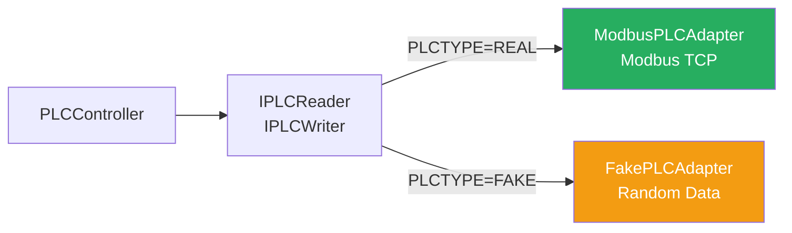
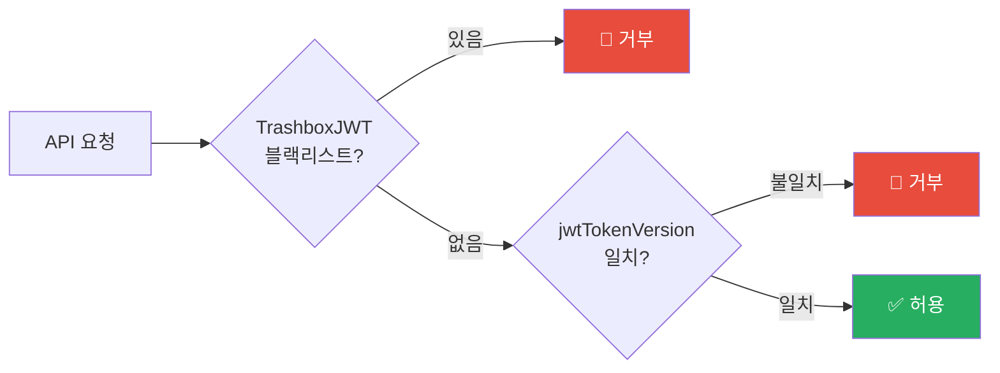

# 설계 결정 과정 — Production IoT Backend

[← README](../README.md)

---

## 📋 목차

1. [결정 요약](#결정-요약)
2. [문제 정의](#문제-정의)
3. [핵심 설계 결정](#핵심-설계-결정)
4. [의도적으로 하지 않은 것들](#의도적으로-하지-않은-것들)
5. [코드 리뷰로 발견한 설계 취약점](#코드-리뷰로-발견한-설계-취약점)
6. [다른 포트폴리오와의 원칙 연결](#다른-포트폴리오와의-원칙-연결)

---

## 결정 요약

| # | 결정 | 핵심 이유 | 포기한 것 |
|---|------|-----------|----------|
| 1 | PLC Adapter Pattern | 하드웨어 의존성 격리 | 직접 호출의 단순함 |
| 2 | Kafka 0.3초 벌크 전송 | 네트워크 오버헤드 90% 감소 | 즉시 전송의 단순함 |
| 3 | Polyglot Persistence | 저장소별 강점 극대화 | 단일 DB 운영 단순함 |
| 4 | JWT 이중 무효화 | PLC 제어 환경의 단일 장애점 제거 | 구현 복잡도 |
| 5 | Nginx Rate Limiting | 백엔드 도달 전 차단 | 백엔드 내 제어 용이성 |
| 6 | Cursor 기반 페이지네이션 | 대용량 성능 보장 | Offset의 단순함 |
| 7 | Semaphore 동시성 제어 | FFmpeg 리소스 폭증 방지 | 무제한 병렬 처리 |

---

## 문제 정의

### IoT 백엔드가 일반 웹 백엔드와 다른 점

```
🚨 하드웨어 장비(PLC)와의 통신 — 연결이 끊기면 장비가 멈춤
🚨 실시간 센서 데이터 — 초당 수십 개의 측정값 수신
🚨 명령 중복 방지 — 살수 장비가 두 번 작동하면 피해 발생
🚨 역할별 권한 — 운영자/유지보수/일반사용자의 접근 범위가 명확히 달라야 함
🚨 장비 고장 코드 — 현장 고장 상태를 실시간으로 파악해야 함
🚨 CCTV 이미지 캡처 — FFmpeg 동시 실행 시 서버 메모리 폭증 가능
```

---

## 핵심 설계 결정

### 1. PLC Adapter Pattern — 하드웨어 격리

**배경**: 개발 환경에 실제 PLC 장비가 없고, 하드웨어 의존 코드가 비즈니스 로직에 섞이는 문제.



```typescript
interface IPLCReader {
    readCoils(modbus: ModbusRTU): Promise<boolean[] | undefined>
    readHoldingRegisters(modbus: ModbusRTU): Promise<number[] | undefined>
}
interface IPLCWriter {
    connect(modbus: ModbusRTU, address: string, port: number): Promise<boolean>
    writeCoils(modbus: ModbusRTU, data: boolean[]): Promise<void>
}
```

**효과**:
- 개발 중 ENV 하나로 전환 가능
- PLC 통신 프로토콜 변경 시 Adapter만 교체
- 단위 테스트 시 Mock 주입 용이

---

### 2. Kafka 벌크 전송 — 처리량과 신뢰성

**배경**: 여러 컨트롤러에서 동시에 Kafka 메시지 발행 → 즉시 전송 시 네트워크 요청 폭증.

```typescript
// Before: 컨트롤러마다 개별 전송
await producer.send({ topic, messages: [oneMessage] })

// After: 버퍼에 쌓고 0.3초마다 자동 플러시
await kafkaHelper.enqueue(topic, message)
```

**`try-finally` 패턴**: 예외 발생 시에도 `process` 플래그가 `true`로 고착되면 이후 모든 메시지 전송이 막히는 버그를 사전 방지.

```typescript
private async flushBuffer() {
    if (this.process) return
    this.process = true
    try {
        // 배치 처리
    } finally {
        this.process = false  // 예외 발생 시에도 반드시 실행
    }
}
```

**DLQ**: 전송 실패 시 MySQL에 `PENDING` 상태로 저장 → `errorMessage + errorStack` 기록 → 수동 재처리 가능.

---

### 3. JWT 이중 무효화

**배경**: 로그아웃 후 기존 JWT가 만료 전까지 여전히 유효한 문제. PLC 제어 API에서 치명적.



- `TrashboxJWT` (MongoDB): 로그아웃 시 즉시 블랙리스트 등록
- `jwtTokenVersion` (MySQL): 새 로그인 시 증가 → 기존 기기 세션 자동 만료
- **단일 세션 정책**: PLC 제어처럼 민감한 작업에서의 동시 접근을 구조로 방지

---

### 4. Cursor 기반 페이지네이션

**배경**: 살수 이력, 날씨 데이터, 센서 데이터가 누적되면서 Offset 페이징 성능 폭락 예상.

```
1,000,000 rows 기준 50,000번째 페이지 조회:

Offset:  SELECT ... LIMIT 20 OFFSET 1000000  →  2.5초
Cursor:  SELECT ... WHERE id <= :cursor LIMIT 21  →  0.03초
개선:    83배 빠름
```

**`limit+1` 패턴**: 요청보다 1개 더 가져와서 마지막 row 존재 여부로 `hasmore` 판단 → 추가 COUNT 쿼리 없음.

---

### 5. Semaphore — FFmpeg 동시성 제어

**배경**: 여러 사이트에서 동시에 CCTV 이미지 캡처 → FFmpeg 프로세스 N개 동시 생성 → 메모리/CPU 폭증.

```typescript
class Semaphore {
    async acquire<T>(task: () => Promise<T>): Promise<T> {
        if (this.activeCount >= this.limit) {
            await new Promise<void>(resolve => this.queue.push(resolve))
        }
        this.activeCount++
        try {
            return await task()
        } finally {
            this.activeCount--
            this.queue.shift()?.()
        }
    }
}

// 사용: 최대 3개 동시 실행
private imageSemaphore = new Semaphore(3)
await this.imageSemaphore.acquire(() => captureFrameWebP(rtspUrl))
```

**이미지 파이프라인 최적화**: FFmpeg → PNG → Sharp(WebP) 2단계에서 FFmpeg → WebP 직접 인코딩 1단계로 전환 → 메모리 40% 감소, 처리 속도 30% 향상.

---

### 6. Nginx Rate Limiting — 백엔드 도달 전 차단

```
장점:
✓ 백엔드 서버 도달 전 차단 → 리소스 절약
✓ DDoS 기본 방어
✓ 엔드포인트별 다른 Rate 적용 가능
✓ 백엔드 코드에 Rate Limiting 로직 없음 (관심사 분리)
```

---

## 의도적으로 하지 않은 것들

| 비선택 | 이유 |
|--------|------|
| Offset 페이지네이션 | 대용량에서 83배 성능 차이 → Cursor 선택 |
| 단일 DB | 로그·캐시·정형 데이터를 한 DB로 → 최적화 불가 |
| 백엔드 Rate Limiting | 이미 도달한 후 차단 → 리소스 낭비 |
| 단일 JWT 무효화 | PLC 제어에서 로그아웃 후 재사용 허용 → 보안 위협 |
| 즉시 Kafka 전송 | 고부하 시 네트워크 폭증 → 0.3초 버퍼링 선택 |
| PLC 직접 호출 | 하드웨어 의존성이 비즈니스 로직에 침투 → Adapter 선택 |
| 무제한 FFmpeg 병렬 | 메모리 폭증 → Semaphore(3) 선택 |
| MSA 즉시 분리 | 규모 대비 운영 복잡도 과다 → Modular Monolith |

---

## 코드 리뷰로 발견한 설계 취약점

### RBAC 완전 우회 버그 (v3.5.0 — Critical)

```typescript
// ❌ Before: async 키워드 → Promise 반환 → !Promise 항상 false → 역할 체크 항상 통과
private async checkRole(payload, roles?) {
    if (!roles) return true
    return roles.includes(payload.role)
}

// ✅ After: async 제거 → boolean 직접 반환
private checkRole(payload, roles?) {
    if (!roles) return true
    return roles.includes(payload.role)
}
```

**영향**: 이 버그가 존재하는 동안 모든 RBAC 체크가 우회됨. 코드 리뷰 없이는 기능 테스트로 발견 불가.

### 인증 우회 (v3.6.7 — Critical)

```typescript
// ❌ Before: SQL WHERE 절에 평문 비밀번호 비교
const user = await repo.readByCondition(t => and(
    eq(t.admin_id, adminid),
    eq(t.admin_password_hash, password)  // 평문!
))

// ✅ After: bcrypt 해시 비교
const user = await repo.readByCondition(t => eq(t.admin_id, adminid))
const valid = await Bun.password.verify(password, user.admin_password_hash)
```

---

## 다른 포트폴리오와의 원칙 연결

| 원칙 | Production IoT Backend | portpolio_main (게임 서버) | portpolio_coindataapi |
|------|------------------------|--------------------------|----------------------|
| **외부 격리** | PLC 장애 시 서비스 유지 | DB 장애 시 게임 진행 | 거래소 장애 시 캐시 |
| **Adapter Pattern** | IPLCReader/Writer | — | IExchangeKlineManager |
| **비동기 처리** | Kafka Bulk + DLQ | Kafka Fire-and-Forget | WebSocket → Cache |
| **멱등성** | Redis + MySQL 이중 체크 | Idempotency Key | — |
| **Polyglot** | MySQL·MongoDB·Redis·MinIO | Redis·MongoDB·MySQL | In-Memory + Redis |

---

[← README](../README.md)

**Last Updated**: 2026-03-04