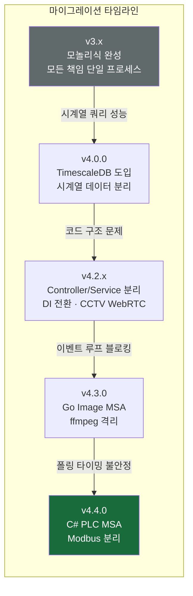
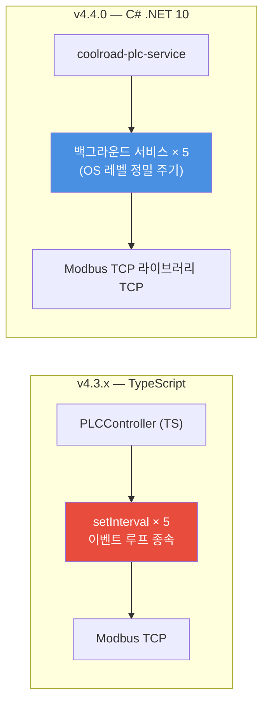
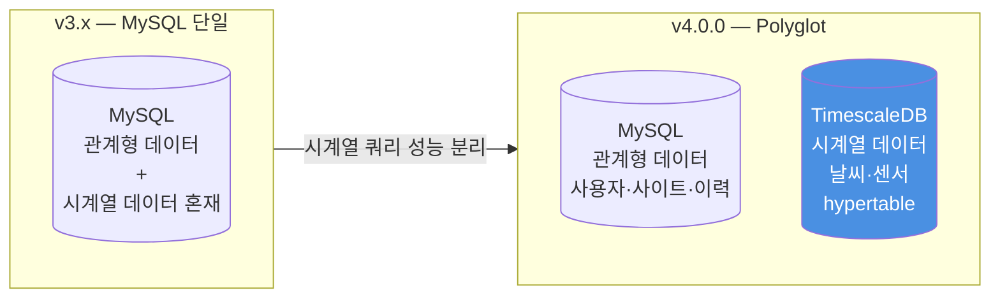

# 🔄 마이그레이션 결정 기록 — Legacy Architecture

[← README](../README.md)

**Last Updated**: 2026-03-19 | **Version**: 4.4.0

> 이 문서는 현재 코드에서 교체된 패턴들을 단순히 나열하는 것이 아니라,  
> **"왜 교체했는가"** — 실제 문제와 결정 과정을 기록한다.  
> 각 항목은 하나의 설계 판단이다.

> 📌 현재 아키텍처 → [ARCHITECTURE.md](./ARCHITECTURE.md)

---

## 전환 타임라인



---

## 1. TypeScript PLC → C# MSA (v4.4.0)

**교체 전**: TypeScript PLC Controller + 5개 setInterval  
**교체 후**: `coolroad-plc-service` C# .NET 10 백그라운드 서비스

### 실제 문제

Node.js의 `setInterval`은 이벤트 루프 상태에 타이밍이 종속된다. PLC Coil은 5초, Register 센서는 60초 주기로 읽어야 하는데, 이벤트 루프가 바쁜 상황(이미지 캡처 처리 중)에 폴링 타이밍이 밀렸다. 산업 시스템에서 정밀한 주기 실행은 운영 신뢰성과 직결된다.

### 결정 근거

C# .NET 10의 `주기 타이머`는 OS 레벨에서 정밀한 주기 실행을 보장한다. NModbus는 C# Modbus TCP 생태계에서 가장 성숙한 라이브러리다. `백그라운드 서비스` 패턴은 5개 Worker를 독립 수명주기로 관리한다.



| 항목 | TypeScript (교체) | C# .NET 10 (현재) |
|------|-----------------|-----------------|
| 주기 실행 | setInterval — 이벤트 루프 종속 | 주기 타이머 — OS 레벨 정밀 |
| Modbus TCP | 제한적 생태계 | Modbus TCP 라이브러리 — 성숙한 라이브러리 |
| 동시성 | 싱글 스레드 + async | 멀티스레드 + async/await |
| DI 컨테이너 | tsyringe (외부) | .NET 내장 DI (내장) |

**제거된 파일**: PLC 컨트롤러 모듈 (~78줄), PLC 서비스 모듈 (~903줄), PLC Modbus 어댑터 모듈 (~72줄), PLC 명령 모듈 (~82줄)

---

## 2. ffmpeg 직접 호출 → Go Worker Pool (v4.3.0)

**교체 전**: PLC Service 내 `captureImage()` + `Semaphore(3)`  
**교체 후**: `coolroad-image-service` Go goroutine Worker Pool + Kafka

### 실제 문제

분사 이벤트마다 ffmpeg 서브프로세스를 TypeScript 코드에서 직접 실행했다. ffmpeg은 CPU 바운드 작업이므로 Node.js 이벤트 루프를 점유한다. 분사 1회당 이미지 캡처 3~5회 → API 전체 응답이 캡처 완료까지 지연됐다.

```typescript
// ❌ 교체 전 — 이벤트 루프 블로킹
private imageSemaphore = new Semaphore(3);

async captureImage(rtspUrl: string) {
    await this.imageSemaphore.acquire(async () => {
        const webpBuffer = await captureFrameWebP(rtspUrl); // ffmpeg subprocess
        await this.minio.upload(webpBuffer, ...);
        await this.repoImageLog.create(...);
    });
}
```

```typescript
// ✅ 교체 후 — Fire-and-Forget
async publishTakePicture(siteId: number, rtspAddr: string) {
    await this.kafkaProducer.enqueue(KAFKA_TOPICS.TAKEPICTURE_CCTVCAM, {
        value: JSON.stringify(takePictureMessage)
    }); // 즉시 반환, Go 서비스가 비동기 처리
}
```

### 결정 근거

Go의 goroutine은 OS 스레드를 직접 활용하므로 CPU 바운드 작업이 메인 서비스 이벤트 루프와 완전히 분리된다. Kafka를 통한 Fire-and-Forget으로 PLC Service가 이미지 완료를 기다리지 않아도 된다.

**전환 효과**: Node.js 이벤트 루프 블로킹 해소, 메인 서비스 메모리 사용량 감소, 독립 배포·스케일링 가능.

---

## 3. CCTV Nginx MJPEG → MediaMTX WebRTC (v4.2.0)

**교체 전**: nginx.conf에 카메라 IP 하드코딩  
**교체 후**: MediaMTX REST API 기반 동적 스트림 관리

### 실제 문제

카메라가 추가될 때마다 nginx.conf를 수정하고 Nginx를 재시작해야 했다. 인증이 없어 카메라 URL이 노출될 수 있었다. MJPEG는 프레임 단위 JPEG 전송으로 대역폭이 비효율적이었다.

```nginx
# ❌ 교체 전 — 하드코딩 + 인증 없음
location /api/cctv/1 {
    proxy_pass http://[카메라IP]/ISAPI/Streaming/channels/101/httpPreview;
}
location /api/cctv/2 {
    proxy_pass http://[카메라IP]/ISAPI/Streaming/channels/101/httpPreview;
}
```

### 결정 근거

MediaMTX는 REST API로 스트림을 동적 등록·삭제한다. JWT + 사이트 소유권 검증 후 스트림 URL을 발급하는 인증 게이트웨이를 구현했다. `sourceOnDemand`로 시청자가 없을 때 카메라 연결을 자동 해제해 리소스를 절약한다.

| 항목 | 이전 (MJPEG) | 현재 (MediaMTX WebRTC) |
|------|------------|----------------------|
| 카메라 추가 | nginx.conf 수정 + 재시작 | REST API 호출 |
| 인증 | 없음 | JWT + 소유권 검증 |
| 리소스 | 항상 연결 유지 | sourceOnDemand |
| 프로토콜 | MJPEG | WebRTC + HLS 폴백 |

---

## 4. Controller + Service 동일 파일 → 파일 분리 + DI (v4.2.1)

**교체 전**: Controller가 Service를 직접 포함, Repository를 `new`로 생성  
**교체 후**: Controller/Service 파일 분리 + `@singleton()` DI 등록

### 실제 문제

```typescript
// ❌ 교체 전 — 동일 파일 1000줄+, Repository 직접 생성
@singleton()
export class 인증 컨트롤러 extends 베이스 컨트롤러 {
    private service: 인증 서비스
    constructor() {
        this.service = new 인증 서비스(
            new 사용자 레포지토리(mysql, ...),  // 인스턴스 A
        )
    }
}
class 관리자 서비스 {
    constructor() {
        this.repouser = new 사용자 레포지토리(mysql, ...)  // 인스턴스 B — 캐시 미스!
    }
}
```

`사용자 레포지토리`가 서비스마다 별도 인스턴스로 생성되면서 Redis 캐시가 서비스 간에 공유되지 않아 캐시 미스가 발생했다.

```typescript
// ✅ 교체 후 — DI 싱글턴 공유
@singleton()
export class 사용자 레포지토리 extends MySQL 베이스 레포지토리<...> {
    constructor(
        @inject(MySQL 연결 모듈) mysql: MySQL 연결 모듈,
        @inject(Redis 캐시 매니저) private cache: Redis 캐시 매니저,
    ) { super(mysql, ...) }
}
// 모든 Service가 동일한 사용자 레포지토리 인스턴스 공유
```

**전환 범위**: 10개 모듈 Controller/Service 파일 분리 + Repository 15개 `@singleton()` DI 등록 완료.

---

## 5. MySQL 단일 DB → TimescaleDB 시계열 분리 (v4.0.0)

**교체 전**: MySQL에 날씨·센서 시계열 데이터 저장  
**교체 후**: TimescaleDB hypertable로 이관

### 실제 문제

날씨(`kma_weather_data`)와 센서(`site_weather_sensor`) 데이터가 매분 수집된다. MySQL에서 시간 범위 조건 쿼리(최근 24시간, 특정 기간 등)를 실행할 때 인덱스 효율이 떨어졌다. 데이터가 쌓일수록 조회 성능이 저하될 구조였다.

### 결정 근거

TimescaleDB hypertable은 시간 기준으로 청크를 자동 분할한다. 시간 범위 조건 쿼리가 해당 청크만 조회하므로 전체 테이블 스캔을 피한다. 6개월 이후 자동 압축, 10년 보존 후 자동 삭제를 DB 레벨에서 관리한다.



**Repository 이중 추상 계층**: `MySQL 베이스 레포지토리`와 `TimescaleDB 베이스 레포지토리`를 분리해 동일한 CRUD 인터페이스를 MySQL/TimescaleDB 양쪽에서 제공한다.

---

## 6. onRequest 보일러플레이트 → 팩토리 메서드 (v4.2.3)

**교체 전**: 6개 컨트롤러 × 11개 라우트 그룹에서 동일 패턴 반복 (6줄/그룹)  
**교체 후**: `베이스 컨트롤러.interceptRequest()` / `logResponse()` 팩토리 2줄

```typescript
// ❌ 교체 전 — 44줄 보일러플레이트
const controller = new Elysia()
    .onRequest(({ request, store }) => {
        this.onRequestHandler(store, request, new URL(request.url))
    })
    .onAfterResponse(({ store, responseValue }) => {
        this.writeFullLog(store.log, responseValue, this.mongologger, "default")
    })

// ✅ 교체 후 — 2줄
const controller = new Elysia()
    .onRequest(this.interceptRequest(app))
    .onAfterResponse(this.logResponse(this.mongologger))
```

---

## 7. 클라이언트 IP 감지 — 프록시 헤더만 의존 → 소켓 IP 폴백 (v4.2.3)

**문제**: Nginx 미경유 직접 연결 시 클라이언트 IP가 `"unknown"` → CCTV 스트리밍 외부 URL 오반환 (BUG-69)

```typescript
// ❌ 교체 전 — unknown 처리 없음
const getClientIp = (): string => {
    const forwarded = header.get("x-forwarded-for");
    if (forwarded) return forwarded.split(",")[0].trim();
    return header.get("x-real-ip") || header.get("cf-connecting-ip") || "unknown";
    // "unknown"은 내부망 판정 실패 → 외부 URL 반환 → 연결 불가
};

// ✅ 교체 후 — Bun server.requestIP() 소켓 IP 폴백
const getClientIp = (): string => {
    const forwarded = header.get("x-forwarded-for");
    if (forwarded) return forwarded.split(",")[0].trim();
    const realIp = header.get("x-real-ip");
    if (realIp) return realIp;
    if (socketIp) return socketIp;  // Bun server.requestIP()
    return "unknown";
};

// 안전장치: unknown/loopback → 내부망 간주
const isInternalNetwork = (ip: string): boolean => {
    if (ip === "unknown" || ip === "::1" || ip === "127.0.0.1") return true;
    return INTERNAL_NETWORK_PREFIXES.some(prefix => ip.startsWith(prefix));
};
```

---

## 8. v3.5.2 이미지 캡처 파이프라인 최적화 (sharp 제거)

**교체 전**: RTSP → PNG → sharp → WebP (중간 버퍼 존재)  
**교체 후**: RTSP → ffmpeg 직접 WebP 출력 (중간 버퍼 없음)

`sharp` 라이브러리 의존성 제거. ffmpeg `-vcodec libwebp -lossless 0 -q:v 90` 옵션으로 중간 PNG 버퍼 없이 직접 WebP 출력. 메모리 사용량 감소.

> ⚠️ v4.3.0에서 이미지 캡처 전체가 Go MSA로 이관됨. 이미지 처리 모듈의 `captureFrameWebP()`는 아바타 이미지 처리에만 잔존.

---

## 9. DB default 시간 — 서버 기동 시 고정 → DB 서버 동적 값 (v3.5.2)

```typescript
// ❌ 교체 전 — 서버 기동 시점 고정값
created_at: timestamp().default(new Date())  // 서버 재시작 전까지 동일값!

// ✅ 교체 후 — INSERT 시점 DB 서버 동적값
created_at: timestamp().default(sql`CURRENT_TIMESTAMP`)
```

영향 테이블 10개 전체 적용. 서버 재시작 없이 모든 INSERT에 올바른 생성 시각이 기록된다.

---

## 10. v4.0.3 코드 구조 분석 — ARCH 이슈 목록과 해결 현황

v4.0.3 시점 심층 분석으로 식별된 아키텍처 이슈와 해결 상태.

| 이슈 | 문제 내용 | 상태 |
|------|---------|------|
| ARCH-1 | Controller + Service 동일 파일 동거 | ✅ v4.2.1 해결 |
| ARCH-2 | Repository `new` 직접 생성 (DI 일관성 깨짐) | ✅ v4.2.1 해결 |
| ARCH-3 | Repository DI 미등록 (캐시 공유 안 됨) | ✅ v4.2.2 해결 |
| ARCH-4 | 인증 보일러플레이트 30+ 엔드포인트 반복 | 🔄 부분 개선 |
| ARCH-5 | getUserOwnedSites 요청당 3~5회 반복 | ✅ Redis SET 인덱스 해결 |
| ARCH-7 | SetSiteSettings 트랜잭션 미적용 | 📋 계획 |
| ARCH-8 | PLC startSpray 250줄 단일 메서드 | ✅ v4.4.0 C# MSA 분리 |
| ARCH-9 | 날씨 조회 3개 메서드 80% 동일 패턴 | 📋 계획 |

---

## Critical 버그 수정 이력

운영 중 코드 리뷰로 발견·수정한 주요 보안/기능 버그.

| 버전 | ID | 분류 | 내용 |
|------|-----|------|------|
| v3.5.0 | — | Critical | RBAC 우회 — async checkRole() Promise가 항상 truthy |
| v3.6.7 | BUG-11 | Critical | 평문 비밀번호 SQL WHERE 비교 |
| v4.2.1 | BUG-58 | Critical | jwt_token_version mutation 경쟁 조건 |
| v4.2.1 | BUG-59 | Critical | MFA setup — 타인 TOTP 시크릿 생성 가능 |
| v3.9.4 | BUG-41 | Critical | 자동 분사 조건 자기비교 (항상 분사 트리거) |
| v4.2.3 | BUG-69 | Medium | 클라이언트 IP "unknown" → CCTV 외부 URL 오반환 |
| v3.9.2 | BUG-34 | Medium | 이메일 미인증 계정에 JWT 발급 |

---

**참고**: 현재 아키텍처 → [ARCHITECTURE.md](./ARCHITECTURE.md) | 변경 이력 → [CHANGELOG.md](../CHANGELOG.md)

**Last Updated**: 2026-03-19
