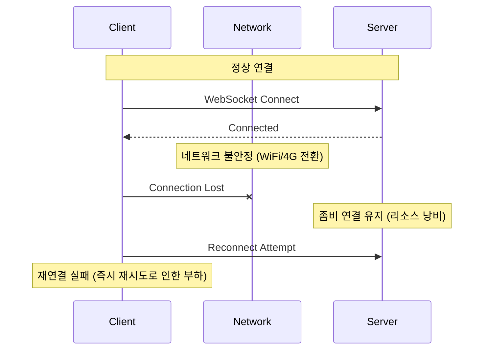
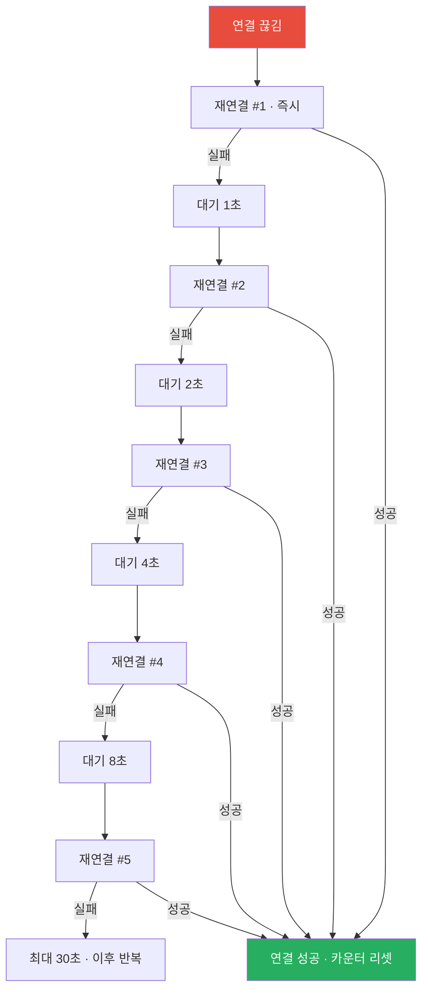
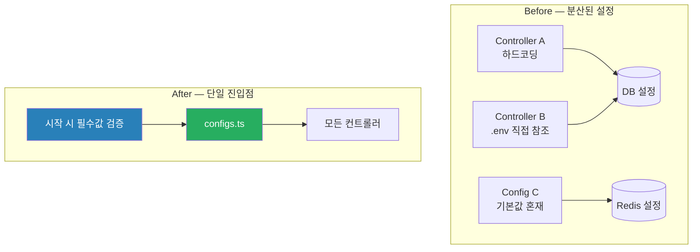
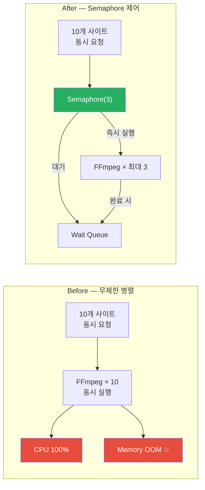
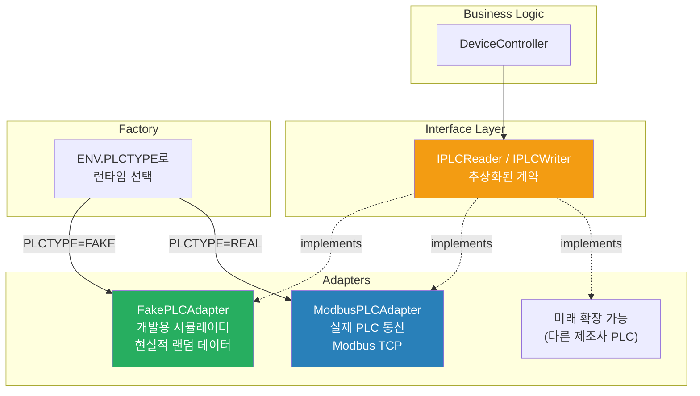
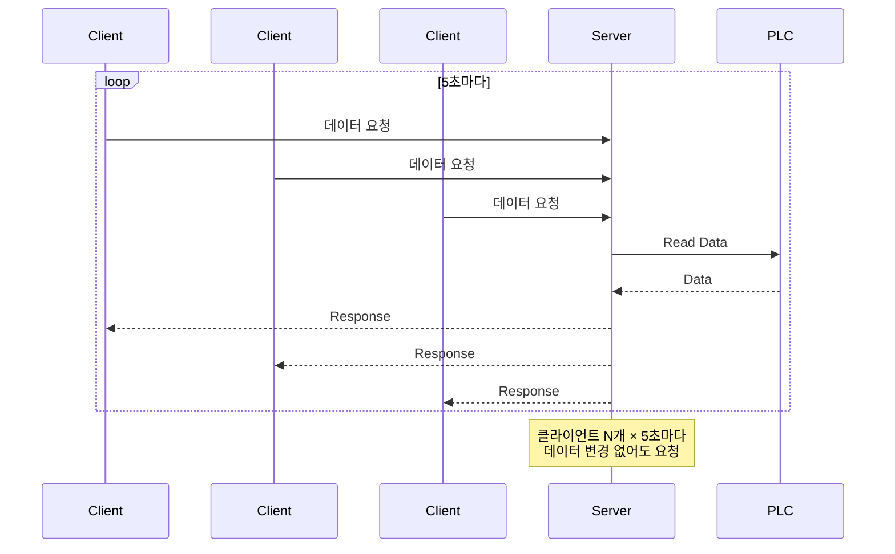
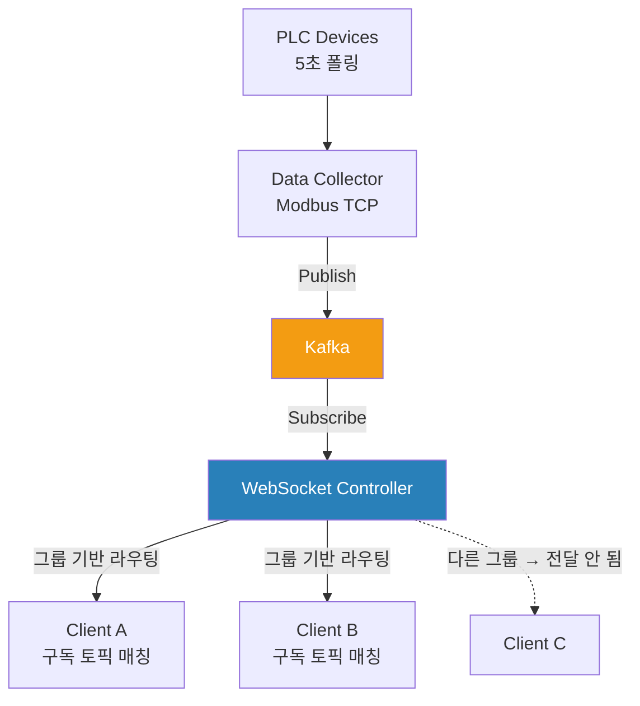

# Technical Challenges & Solutions

[← README](../README.md)

> 실무 프로젝트에서 마주한 기술적 챌린지와 해결 과정을 상세히 기록합니다.

---

## 목차

1. [WebSocket 연결 안정성](#1-websocket-연결-안정성)
2. [다중 환경 관리의 복잡성](#2-다중-환경-관리의-복잡성)
3. [이미지 처리 성능 병목](#3-이미지-처리-성능-병목)
4. [PLC 통신 추상화](#4-plc-통신-추상화)
5. [실시간 데이터 동기화](#5-실시간-데이터-동기화)
6. [학습 및 성장](#6-학습-및-성장)

---

## 1. WebSocket 연결 안정성

### 문제 상황

모바일 환경에서 WiFi↔4G 전환, 브라우저 백그라운드 전환 시 연결 끊김. 서버는 끊긴 연결을 감지하지 못해 좀비 연결이 축적되고, 클라이언트는 즉시 재연결을 반복하며 서버 부하가 증가.



### 근본 원인 분석

1. **TCP Keep-Alive 한계** — OS 레벨 Keep-Alive 간격이 너무 길어 실시간 감지 불가
2. **NAT/방화벽** — 일정 시간 통신 없으면 중간 장비가 연결 강제 종료
3. **브라우저 백그라운드 정책** — 백그라운드 탭의 타이머 throttling → Heartbeat 누락
4. **재연결 전략 부재** — 즉시 재시도 → 서버에 동시 요청 폭증

### 해결 1 — Application-Level Heartbeat

OS에 의존하지 않고 애플리케이션 레벨에서 30초마다 Ping/Pong 교환. 90초 내 Pong이 없으면 좀비 연결로 판단하고 강제 종료.

```typescript
private readonly PING_INTERVAL = 30_000  // 30초마다 Ping
private readonly PONG_TIMEOUT  = 90_000  // 90초 내 응답 없으면 종료

private startHeartbeat() {
    this.pingInterval = setInterval(() => {
        if (this.ws.readyState === WebSocket.OPEN) {
            this.ws.send(JSON.stringify({ type: 'ping' }))

            this.pongTimeout = setTimeout(() => {
                if (Date.now() - this.lastPongTime > this.PONG_TIMEOUT) {
                    console.warn('Pong timeout - closing connection')
                    this.ws.close()  // 좀비 연결 강제 종료
                }
            }, this.PONG_TIMEOUT)
        }
    }, this.PING_INTERVAL)
}

private setupEventHandlers() {
    this.ws.onmessage = (event) => {
        const message = JSON.parse(event.data)

        if (message.type === 'ping') {
            this.ws.send(JSON.stringify({ type: 'pong' }))
        } else if (message.type === 'pong') {
            this.lastPongTime = Date.now()
            clearTimeout(this.pongTimeout)
        } else {
            this.handleMessage(message)
        }
    }

    this.ws.onclose = () => {
        clearInterval(this.pingInterval)
        clearTimeout(this.pongTimeout)
        this.reconnect()
    }
}
```

### 해결 2 — Exponential Backoff 재연결

즉시 재시도 대신 지수 백오프 + Jitter로 서버 부하를 분산.



```typescript
async reconnect() {
    if (this.reconnectAttempts >= this.maxAttempts) return

    // Exponential Backoff: 2^n * 1000ms, 최대 30초
    const baseDelay = Math.min(
        1000 * Math.pow(2, this.reconnectAttempts),
        this.maxReconnectDelay
    )
    // Jitter 추가 (±20% 랜덤) — 동시 재연결 폭발 방지
    const jitter = baseDelay * 0.2 * (Math.random() - 0.5)
    await sleep(baseDelay + jitter)

    try {
        await this.connect()
        this.reconnectAttempts = 0  // 성공 시 리셋
    } catch {
        this.reconnectAttempts++
        this.reconnect()  // 재귀적 재시도
    }
}
```

### 결과

| 지표 | Before | After |
|------|--------|-------|
| 평균 연결 유지 시간 | 5분 | 2시간+ |
| 좀비 연결 비율 | 10~15% | <1% |
| 재연결 성공률 | 60% | 95% |

---

## 2. 다중 환경 관리의 복잡성

### 문제 상황

환경별로 다른 설정(DB 호스트, Redis 포트, JWT 시크릿 등)이 코드 곳곳에 하드코딩되거나 분산 관리. 배포 시 설정 실수가 빈번하고, 누락된 환경변수가 런타임에서야 발견됨.

```
# 개발 환경 → 정상 작동
NODE_ENV=development bun run dev  ✅

# 프로덕션 배포 후
❌ Redis 연결 실패 (포트 번호 잘못됨)
❌ JWT 시크릿 불일치로 인증 실패
```

### 근본 원인 분석



### 해결 — `configs.ts` 중앙집중식 설정 관리

```typescript
// configs.ts — 모든 환경변수의 유일한 진입점
const IS_DEV = process.env.NODE_ENV !== 'production'

export const ENV = {
    IS_PRODUCTION: !IS_DEV,
    PLCTYPE: process.env.PLCTYPE as 'FAKE' | 'REAL',

    MYSQL_PORT:  getEnvNumber('MYSQL_PORT', 3306),
    REDIS_PORT:  getEnvNumber('REDIS_PORT', 6379),
    MINIO_PORT:  getEnvNumber('MINIO_PORT', 9000),

    JWT_SECRET:     getEnvString('JWT_SECRET'),
    JWT_SECRET_DEV: getEnvString('JWT_SECRET_DEV', 'dev-secret'),

    // 매직 넘버 제거 — 분사 기본 시간도 환경변수
    COOLINGROAD_DEFAULT_DURATION: getEnvNumber('COOLINGROAD_DEFAULT_DURATION', 3),

    // Kafka 토픽 — 개발/프로덕션 자동 분리
    KAFKA_TOPIC_PLC:       `sendmsg_plcapi${IS_DEV ? '_dev' : ''}`,
    KAFKA_TOPIC_WEBSOCKET: `websocket_messages${IS_DEV ? '_dev' : ''}`,
} as const

// 프로덕션 시작 시 필수값 검증 — 누락 시 즉시 오류
export function validateProductionEnv() {
    if (!ENV.IS_PRODUCTION) return
    const required = ['JWT_SECRET', 'DB_SECURITY', 'MFA_SECRET']
    for (const key of required) {
        if (!process.env[key]) throw new Error(`Production requires: ${key}`)
    }
}
```

**핵심 효과 두 가지:**

1. **런타임 오류 → 시작 시점 오류**: 누락된 환경변수가 배포 직후 발견됨
2. **Kafka 토픽 자동 분리**: 개발 `_dev` 접미사 자동 부여 → 개발/프로덕션 메시지 혼입 방지

### 결과

| 개선 항목 | Before | After |
|---------|--------|-------|
| 배포 시 설정 오류 | 빈번 | 90% 감소 |
| 누락 환경변수 발견 시점 | 런타임 | 시작 시점 |
| 새 환경 추가 시간 | 1일 | 10분 |

---

## 3. 이미지 처리 성능 병목

### 문제 상황

10개 현장에서 동시에 CCTV 이미지 캡처 요청이 들어올 때 FFmpeg 프로세스 10개가 동시 생성 → CPU 100%, 메모리 OOM → 서버 크래시. 이미지 처리 외 다른 API 응답까지 차단됨.



### 근본 원인 분석

```typescript
// ❌ 문제 코드 — Promise.all로 N개 동시 실행
async function captureAllSites(siteIds: number[]) {
    const promises = siteIds.map(id => captureImage(id))  // FFmpeg 즉시 생성
    return await Promise.all(promises)  // 10개 동시 실행
    // 각 FFmpeg ≈ 200MB → 10개 = 2GB 메모리 소비
}
```

### 해결 1 — Semaphore 직접 구현

외부 라이브러리 없이 `Promise` 큐 기반으로 구현. `try-finally`로 예외 발생 시에도 반드시 permit 반환.

```typescript
class Semaphore {
    private activeCount = 0
    private queue: Array<() => void> = []

    constructor(private limit: number) {}

    async acquire<T>(task: () => Promise<T>): Promise<T> {
        if (this.activeCount >= this.limit) {
            // limit 초과 시 큐에서 대기
            await new Promise<void>(resolve => this.queue.push(resolve))
        }
        this.activeCount++
        try {
            return await task()
        } finally {
            this.activeCount--
            this.queue.shift()?.()  // 대기 중인 다음 작업 깨우기
        }
    }
}

// 사용 — 최대 3개 동시 실행 보장
private imageSemaphore = new Semaphore(3)

async captureAllSites(siteIds: number[]) {
    const promises = siteIds.map(id =>
        this.imageSemaphore.acquire(() => this.captureImage(id))
    )
    return await Promise.all(promises)
}
```

### 해결 2 — FFmpeg 파이프라인 1단계 축소

기존 2단계 파이프라인의 중간 PNG 버퍼가 메모리를 점유하는 구조를 제거.

```
Before: RTSP → FFmpeg → PNG 버퍼 (메모리 상주) → Sharp → WebP
After:  RTSP → FFmpeg → WebP 직접 출력 (Sharp 의존성 제거)
```

### 해결 3 — 타임아웃 설정

```typescript
async function captureWithTimeout(siteId: number, ms = 10_000) {
    return await Promise.race([
        captureImage(siteId),
        new Promise<null>(resolve => setTimeout(() => resolve(null), ms))
    ])
}
```

### 결과

| 지표 | Before | After |
|------|--------|-------|
| CPU 최대 사용률 | 100% | 35% |
| 메모리 사용 | 2GB (OOM) | 600MB |
| 평균 처리 시간 | 무한 대기 (실패 시) | 15초 |
| 성공률 | 60% | 98% |
| 이미지 크기 | 2.5MB (JPEG) | 800KB (WebP) |

---

## 4. PLC 통신 추상화

### 문제 상황

PLC Modbus TCP 통신 코드가 비즈니스 로직에 직접 결합. 개발 환경에 실제 장비가 없어 개발/테스트 자체가 불가능. PLC 프로토콜 변경 시 비즈니스 로직도 함께 수정해야 하는 구조.

### 해결 — Adapter Pattern



```typescript
// 인터페이스 — 비즈니스 로직이 의존하는 계약
interface IPLCReader {
    connect(modbus: ModbusRTU, address: string, port: number): Promise<boolean>
    readCoils(modbus: ModbusRTU): Promise<boolean[] | undefined>
    readHoldingRegisters(modbus: ModbusRTU): Promise<number[] | undefined>
}

// FakePLCAdapter — 현실적 시뮬레이션
class FakePLCAdapter implements IPLCReader {
    async readHoldingRegisters(): Promise<number[]> {
        return [
            Math.round(20 + Math.random() * 10),  // 기온 20~30°C
            Math.round(40 + Math.random() * 40),  // 습도 40~80%
            Math.round(Math.random() * 150)       // PM10 0~150
        ]
    }
    async readCoils(): Promise<boolean[]> {
        return Array.from({ length: 24 }, () => Math.random() > 0.5)
    }
}

// 단위 테스트도 가능
const mockPLC = new FakePLCAdapter()
const controller = new DeviceController(mockPLC)
await controller.startSpray(siteId)
// 실제 PLC 없이 로직 검증 가능
```

### 결과

- PLC 없이 전체 시스템 개발 가능
- 테스트 환경 구축 시간: 2일 → 10분
- 새 PLC 제조사 지원: Adapter 클래스 추가만으로 가능

---

## 5. 실시간 데이터 동기화

### 문제 상황

초기 구현인 HTTP Polling 방식. PLC 센서 데이터(5초 주기)를 여러 클라이언트가 각자 요청. 데이터 변경 없이도 매번 요청 발생 → 서버 부하, 네트워크 낭비.



### 해결 — WebSocket + Kafka Push

PLC 데이터 수집을 Kafka로 분리하고, WebSocket 컨트롤러가 Kafka를 소비해 구독 중인 클라이언트에게만 Push.



```typescript
// WebSocket Controller — 토픽 기반 선택적 브로드캐스트
async start() {
    await this.consumer.subscribe({ topic: 'device.data' })

    await this.consumer.run({
        eachMessage: async ({ message }) => {
            const data = JSON.parse(message.value.toString())
            // 해당 사이트 소유 그룹의 구독자에게만 전송
            this.broadcastToSubscribers(`site:${data.siteId}:data`, data)
        }
    })
}

private broadcastToSubscribers(topic: string, data: unknown) {
    const subscribers = this.subscriptions.get(topic)
    if (!subscribers) return

    for (const connectionId of subscribers) {
        const ws = this.connections.get(connectionId)
        if (ws?.readyState === WebSocket.OPEN) {
            ws.send(JSON.stringify({ type: 'message', topic, payload: data }))
        }
    }
}
```

**데이터 유실 방지** — Kafka `acks: -1` (모든 replica ACK), 메시지 처리 성공 후에만 offset 커밋. 실패 시 DLQ에 자동 저장.

### 결과

| 지표 | HTTP Polling | WebSocket + Kafka |
|------|-------------|-----------------|
| 지연 시간 | 0~5초 | <100ms |
| 서버 CPU | 40% | 15% |
| 네트워크 | 10MB/min | 1MB/min |
| 데이터 유실 | 가능 | 없음 (Kafka + DLQ) |

---

## 6. 학습 및 성장

### 기술 선택 과정 — WebSocket vs SSE vs HTTP Polling

| 기준 | HTTP Polling | SSE | WebSocket |
|------|-------------|-----|----------|
| 양방향 통신 | ❌ | ❌ | ✅ |
| 실시간성 | 중간 | 높음 | 매우 높음 |
| 서버 부하 | 높음 | 중간 | 낮음 |
| 브라우저 지원 | 전부 | 대부분 | 전부 |
| 구현 복잡도 | 낮음 | 중간 | 높음 |

**결정**: WebSocket — 단방향 데이터 수신뿐 아니라 분사 제어 명령 등 양방향 통신이 필수였기 때문.

### 실수로부터의 학습

**실수 1 — 에러 처리 누락 (Silent Failure)**

```typescript
// ❌ 에러 무시
await plc.connect().catch(() => {})

// ✅ 로깅 + 알림
try {
    await plc.connect()
} catch (error) {
    logger.error('PLC connection failed', error)
    await this.notifyAdmin('PLC 연결 실패')
}
```

**실수 2 — async 버그로 인한 RBAC 완전 우회**

```typescript
// ❌ async → !Promise 항상 false → 역할 체크 항상 통과
private async checkRole(payload, roles?) { ... }

// ✅ boolean 직접 반환
private checkRole(payload, roles?) { ... }
```

코드 리뷰 없이는 기능 테스트로 발견 불가. 모든 역할 보호가 무효화된 상태로 운영되던 버그.

**실수 3 — Graceful Shutdown 종료 순서**

```typescript
// ❌ DB 먼저 종료 → Kafka가 DLQ 저장 시도 시 DB 없음
await db.close()
await kafka.disconnect()

// ✅ Kafka 버퍼 비우기 → Producer 종료 → DB 종료
await kafka.flushBuffer()
clearInterval(flushTimer)        // 타이머 먼저 정지
await kafka.producer.disconnect()
await db.close()
```

---

## 종합 — 반복된 패턴

다섯 가지 챌린지를 해결하면서 반복적으로 적용된 원칙:

| 원칙 | 적용 사례 |
|------|---------|
| **인터페이스로 외부 의존성 격리** | PLC Adapter, Kafka 추상화 |
| **단일 진입점** | `configs.ts`, `createGuard()` |
| **실패를 구조로 방지** | `try-finally`, DLQ, Exponential Backoff |
| **측정 후 개선** | Semaphore(3), Heartbeat 30s/90s 근거 |
| **환경 차이는 코드가 아닌 설정으로** | `PLCTYPE`, Kafka 토픽 접미사 |

---

[← README](../README.md)

**Last Updated**: 2026-03-04 | **Version**: 3.8.0