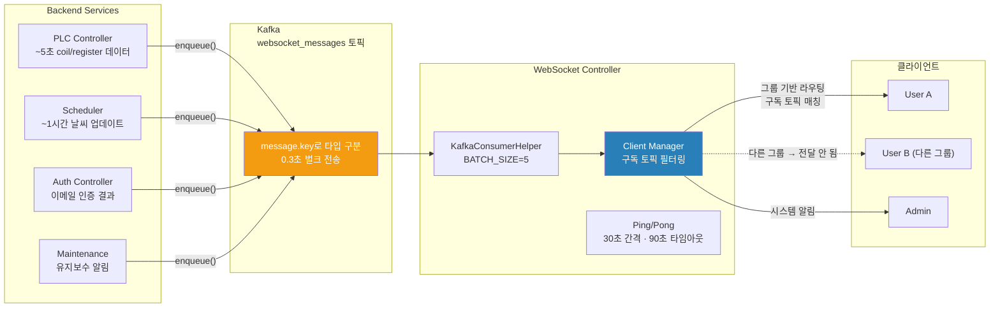

# WebSocket 프론트엔드 통합 가이드

[← README](../README.md)

**Version**: 3.8.0 | **Last Updated**: 2026-03-04

---

## 📋 목차

1. [아키텍처 개요](#아키텍처-개요)
2. [연결 관리](#연결-관리)
3. [토픽 구독 전략](#토픽-구독-전략)
4. [메시지 처리](#메시지-처리)
5. [재연결 전략](#재연결-전략)
6. [역할별 구독 토픽](#역할별-구독-토픽)
7. [메시지 타입 상세](#메시지-타입-상세)

---

## 아키텍처 개요



**핵심 설계**: 메시지는 Kafka를 통해 발행 → WebSocket Controller가 소비 → 사이트 소유 그룹 기반으로 해당 사용자에게만 전달. 다른 그룹의 사용자에게는 전달되지 않음.

---

## 연결 관리

### 연결 URL

| 환경 | 방식 |
|------|------|
| 개발 | `ws://` — 쿼리 파라미터로 userId, role 전달 |
| 프로덕션 | `wss://` — SSL/TLS |

### 기본 연결 코드

```typescript
class WebSocketClient {
    private ws: WebSocket | null = null
    private reconnectAttempts = 0
    private maxReconnect = 5
    private reconnectDelay = 1000

    connect(userId: string, role: string) {
        const url = `ws://localhost:8100/ws/v1/?userId=${userId}&role=${role}`
        this.ws = new WebSocket(url)

        this.ws.onopen = () => {
            this.reconnectAttempts = 0
            this.subscribeTopics()  // 연결 직후 구독 등록
        }

        this.ws.onmessage = (event) => {
            this.handleMessage(JSON.parse(event.data))
        }

        this.ws.onclose = (event) => {
            if (event.code !== 1000) {
                this.attemptReconnect(userId, role)
            }
        }
    }

    private send(data: object) {
        if (this.ws?.readyState === WebSocket.OPEN) {
            this.ws.send(JSON.stringify(data))
        }
    }
}
```

### Ping/Pong Keepalive

서버가 30초마다 Ping 전송 → 90초 내 응답 없으면 연결 강제 종료.

```typescript
this.ws.onmessage = (event) => {
    const msg = JSON.parse(event.data)
    if (msg.type === 'ping') {
        this.send({ type: 'pong' })  // 반드시 즉시 응답
        return
    }
    this.handleMessage(msg)
}
```

---

## 토픽 구독 전략

### 연결 직후 공통 구독

```typescript
private subscribeTopics() {
    this.send({
        type: 'subscribe',
        topics: [
            'ws.spray.status',
            'ws.weather.update',
            'ws.plc.connection',
            'ws.system.alert',
            'ws.system.notification',
        ]
    })
}
```

### 페이지 진입/이탈 시 동적 구독

```typescript
// 대시보드 진입 — 센서/코일 데이터 구독 시작
function onDashboardEnter() {
    send({ type: 'subscribe', topics: ['ws.plc.register.data', 'ws.plc.coil.data'] })
}

// 대시보드 이탈 — 구독 해제 (리소스 절약)
function onDashboardLeave() {
    send({ type: 'unsubscribe', topics: ['ws.plc.register.data', 'ws.plc.coil.data'] })
}
```

### 회원가입 직후 이메일 인증 대기

```typescript
function onAfterSignup() {
    send({ type: 'subscribe', topics: ['ws.email.verification'] })
}
```

---

## 메시지 처리

### 메시지 디스패처 패턴

```typescript
private handleMessage(msg: WebSocketMessage) {
    switch (msg.type) {
        case 'ping':
            this.send({ type: 'pong' })
            break
        case 'ack':
            console.log('구독 완료:', msg.payload)
            break
        case 'message':
            // 환경 접미사 제거 후 라우팅 (_dev 자동 제거)
            const topic = msg.topic.replace(/_dev$/, '')
            this.dispatchToTopic(topic, msg.payload)
            break
        case 'error':
            console.error('WebSocket 에러:', msg.error)
            break
        case 'connect':
            console.log('연결 성공')
            break
    }
}

private dispatchToTopic(topic: string, payload: any) {
    switch (topic) {
        case 'ws.spray.status':
            this.onSprayStatusUpdate(payload)
            break
        case 'ws.weather.update':
            this.onWeatherUpdate(payload)
            break
        case 'ws.plc.connection':
            this.onPLCConnectionChange(payload)
            break
        case 'ws.plc.register.data':
            this.onSensorDataUpdate(payload)
            break
        case 'ws.plc.coil.data':
            this.onEquipmentStatusUpdate(payload)
            break
        case 'ws.email.verification':
            this.onEmailVerification(payload)
            break
        case 'ws.maintenance.alert':
            this.onMaintenanceAlert(payload)
            break
        case 'ws.system.alert':
            this.onSystemAlert(payload)
            break
        case 'ws.system.notification':
            this.onSystemNotification(payload)
            break
        case 'ws.stt.response':
            this.onSTTResponse(payload)
            break
    }
}
```

---

## 재연결 전략

지수 백오프(Exponential Backoff) 재연결:

```typescript
private attemptReconnect(userId: string, role: string) {
    if (this.reconnectAttempts >= this.maxReconnect) {
        console.error('WebSocket 재연결 실패 — 최대 시도 횟수 초과')
        return
    }
    this.reconnectAttempts++
    const delay = this.reconnectDelay * Math.pow(2, this.reconnectAttempts - 1)
    setTimeout(() => this.connect(userId, role), delay)
}
```

| 시도 | 지연 시간 |
|------|---------|
| 1차 | 1초 |
| 2차 | 2초 |
| 3차 | 4초 |
| 4차 | 8초 |
| 5차 | 16초 |

---

## 역할별 구독 토픽

### USER (일반 사용자)

| 토픽 | 필수 여부 | 설명 |
|------|---------|------|
| `ws.spray.status` | ✅ 필수 | 분사 상태 실시간 |
| `ws.weather.update` | ✅ 필수 | 날씨 데이터 |
| `ws.plc.connection` | ✅ 필수 | PLC 연결 상태 |
| `ws.plc.register.data` | 대시보드 | 현장 센서 수치 |
| `ws.plc.coil.data` | 대시보드 | 장비 ON/OFF + 고장코드 |
| `ws.system.notification` | ✅ 필수 | 시스템 공지 |
| `ws.email.verification` | 가입 시 | 이메일 인증 결과 |
| `ws.stt.response` | STT 시 | 음성 명령 결과 |

### ORGANIZE (관리자)

| 토픽 | 필수 여부 |
|------|---------|
| `ws.spray.status` | ✅ |
| `ws.weather.update` | ✅ |
| `ws.plc.connection` | ✅ |
| `ws.maintenance.alert` | ✅ |
| `ws.system.alert` | ✅ |
| `ws.system.notification` | ✅ |

### MAINTENANCE (유지보수)

| 토픽 | 필수 여부 |
|------|---------|
| `ws.plc.connection` | ✅ |
| `ws.plc.coil.data` | ✅ (고장 감지) |
| `ws.system.alert` | ✅ |
| `ws.maintenance.alert` | ✅ |

---

## 메시지 타입 상세

### Kafka Key → WebSocket 토픽 매핑

| Kafka Key | WebSocket 토픽 | 수신 빈도 |
|-----------|--------------|---------|
| `plc_coil_data` | `ws.plc.coil.data` | ~5초 |
| `plc_register_data` | `ws.plc.register.data` | ~1분 |
| `spray_status` | `ws.spray.status` | 이벤트 |
| `weather_update` | `ws.weather.update` | ~1시간 |
| `plc_connection` | `ws.plc.connection` | 이벤트 |
| `maintenance_alert` | `ws.maintenance.alert` | 이벤트 |
| `system_alert` | `ws.system.alert` | 이벤트 |
| `system_notification` | `ws.system.notification` | 이벤트 |
| `email_verification` | `ws.email.verification` | 이벤트 |
| `mfa_verification` | `ws.mfa.verification` | 이벤트 |
| `stt_response` | `ws.stt.response` | 이벤트 |

### 토픽별 포함 데이터 항목

| 토픽 | 주요 데이터 항목 |
|------|--------------|
| `ws.plc.coil.data` | 사이트 ID, 장비 ON/OFF 상태 (펌프·밸브 등 24개 코일), 고장코드 비트 플래그, 타임스탬프 |
| `ws.plc.register.data` | 사이트 ID, 기온·습도·도로면온도·미세먼지(PM10/PM2.5)·수압, 타임스탬프 |
| `ws.spray.status` | 사이트 ID, 분사 상태(시작/중지/에러), 결정 방식(수동/자동설정/AI), 타임스탬프 |
| `ws.weather.update` | 사이트 ID, 기온·습도·강수량·풍속·날씨상태, 타임스탬프 |
| `ws.maintenance.alert` | 사이트 ID, 유지보수 이력 ID, 작업 내용 요약, 타임스탬프 |
| `ws.email.verification` | 사용자 ID, 인증 결과(성공/실패/만료) |

### 고장코드 비트 플래그

`ws.plc.coil.data`의 `malfunction` 필드는 11가지 고장 유형을 비트 연산으로 표현합니다.

- `0` = 정상
- `0` 이외 = 하나 이상의 고장 발생
- 여러 고장이 동시 발생 시 각 비트가 OR 합산됨
- 고장 유형: 펌프(2종), 센서 통신(4종), 센서 데이터(4종), 침수 감지(1종)

### 라우팅 방식

발신 서비스가 메시지마다 라우팅 대상을 지정:

- **특정 사용자에게만**: 이메일 인증 결과 등 개인 이벤트
- **전체 브로드캐스트**: 시스템 공지
- **토픽 구독자에게**: 날씨·센서 등 그룹 이벤트


---

[← README](../README.md)

**Last Updated**: 2026-03-04 | **Version**: 3.8.0